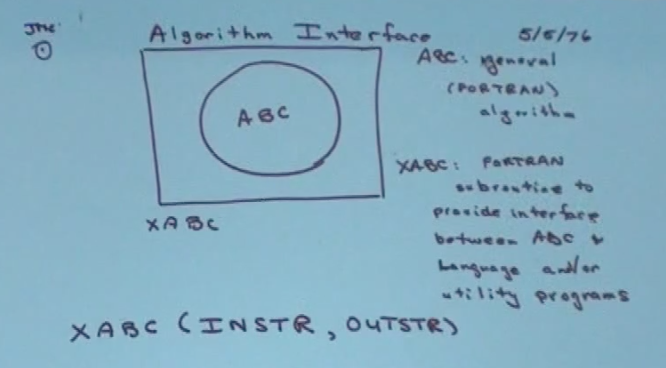
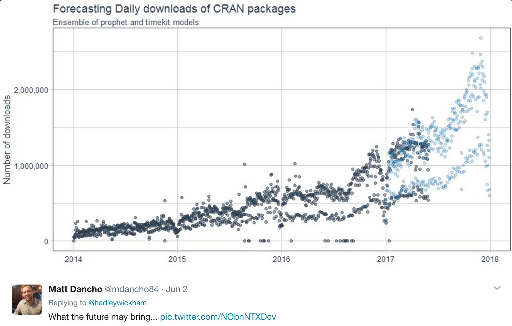
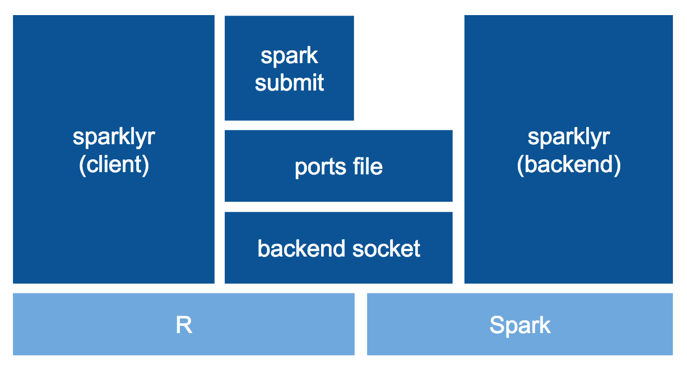
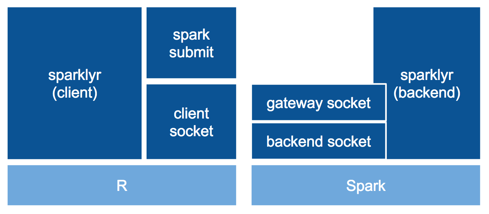
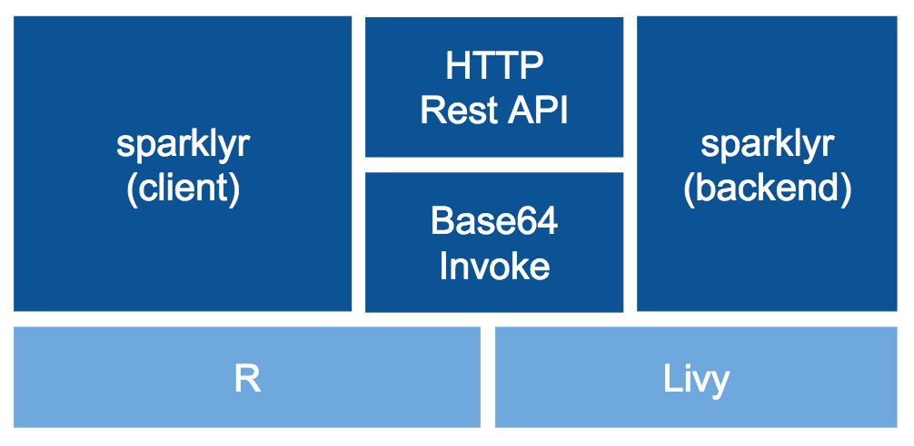
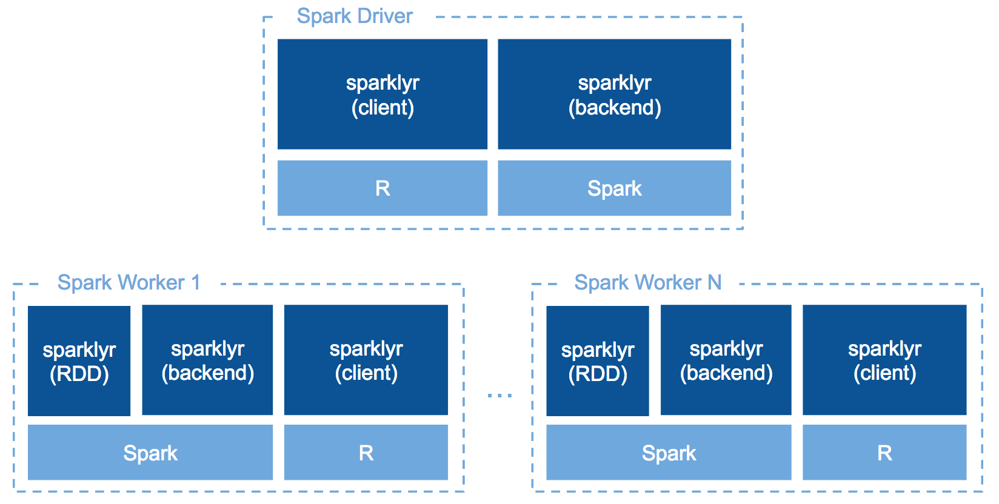

## Schedule

**2:00-2:30** sparklyr: Recap and Updates

**2:40-3:10** sparklyr: Architecture and Use Cases

# Recap

"This session will start with a recap of what sparklyr is, and how it can be used to analyze, visualize and perform machine learning in Spark from R"

```{r eval=F}
options(rsparkling.sparklingwater.version = "1.6.8")

library(rsparkling)
library(sparklyr)
library(dplyr)
library(h2o)

sc <- spark_connect(master = "local")
flights_tbl <- copy_to(sc, nycflights13::flights, "flights")
```

## S - Language for Stats Computing

Designed at Bell Laboratories by John Chambers, where computing was done
by calling Fortran subroutines.



## S - Language for Stats Computing

> "S is great but serious data analysis will always be done in Fortran" - Bell Labs Management


## R - Modern S

R community is noted for its active package contributions. CRAN R's package 
manager with ~10K packages.



## R - Design Principles

  

1. Everything that exists is an <span class="highlighted">**object**</span>
2. Everything that happens is a <span class="highlighted">**function**</span> call
3. R is built on <span class="highlighted">**interfaces**</span> to many (R and non-R) algorithms

## sparklyr - R interface for Spark

```{r eval=F}
library(sparklyr)                       # Load sparklyr
```

```{r eval=F}
spark_install()                         # Install Apache Spark
```

```{r eval=F}
sc <- spark_connect(master = "local")   # Connect to local instance
```

```{r eval=F, messages=F}
library(dplyr)                          # Data Manipulation Grammar
mtcars_tbl <- copy_to(sc, mtcars)       # Copy mtcars into Spark
count(mtcars_tbl)                       # Count records
```

```{r eval=F}
ml_linear_regression(mtcars_tbl,        # Perform linear regression
  response = "mpg",                     # Response vector
  features = c("wt", "cyl"))            # Features for the model fit
```

```{r eval=F}
library(DBI)                            # R Database Interface
dbGetQuery(sc, "SELECT * FROM mtcars")  # Run SQL query in Spark
```

```{r eval=F}
invoke(spark_context(sc), "version")    # Run sc.version in Scala
```

```{r eval=F}
compile_package_jars()                  # Compile Scala code
```

# Updates

You’ll then get a detailed update on new sparklyr features.

## sparklyr 0.4

### Kickoff: **April, 2016**
### Announced: **June, 2016**
### Released: **September, 2016**
### Cloudera Certified: **October, 2016**
### New Features: **Install, connection, backend, data,
DataFrame, DBI, dplyr, MLlib, extensions**

## sparklyr 0.5

### Released: **January 2017**
### Minor: **0.5.2, 0.5.3, 0.5.4 and 0.5.5**
### New Connections: **Gateway, Livy and Databricks**
### Improvements: **MLlib, DataFrame, compatibility and dplyr**

## sparklyr 0.6 (devel)

### Released: **Soon**
### New Features: **Distributed R**
### Improvements: **Data, dplyr, databases, DataFrames, MLlib,
broom, compatibility, connections, extensions and backend**

## spark-install
> Cross-platform installer for Apache Spark.

```{r eval=F}
library(sparkinstall)
spark_install(version = "1.6.2")    # Install Spark from R
```

```{python eval=F, }
from spark_install import *
spark_install(version = "1.6.2")    # Install Spark from Python
```

"This project provides a **cross-platform installer for Apache Spark** designed to use system resources efficiently under a common API. This initial version commes with support for **R and Python** that arose from a collaboration between **RStudio** and **Microsoft**" - [github.com/rstudio/spark-install](https://github.com/rstudio/spark-install)

# Architecture

After sparklyr 0.4 was released to CRAN last year, RStudio released 0.5, which implements new connections, features and architecture changes worth reviewing.

## Backend
### sparklyr 0.4



## Gateway
### sparklyr 0.5



[Replace ports file with gateway socket](https://github.com/rstudio/sparklyr/pull/238)

## Livy
### sparklyr 0.5



```{scala eval=F}
var sparklyrRetVar_0 = LivyUtils.invokeFromBase64(
  "AAAAHm9yZy5hcGFjaGUuc3BhcmsuU3BhcmtDb250" +
  "ZXh0AAAAAAEAAAAMZ2V0T3JDcmVhdGUAAAAAAA=="
)
```

[Implement Livy connections](https://github.com/rstudio/sparklyr/pull/258)

## Worker
### sparklyr 0.6



[Implement R Workers](https://github.com/rstudio/sparklyr/pull/258)

# Use Cases

We will wrap up with a discussion of uses cases relevant in the R ecosystem. The uses cases will demonstrate how to model data using popular frameworks in the R ecosystem that in seamless interactions between Spark and R using sparklyr.

## Analysis with SQL and dplyr

```{r eval=F}
delay <- flights_tbl %>% 
  group_by(tailnum) %>%
  summarise(count = n(), dist = mean(distance), delay = mean(arr_delay)) %>%
  filter(count > 20, dist < 2000, !is.na(delay)) %>%
  collect

# plot delays
library(ggplot2)
ggplot(delay, aes(dist, delay)) +
  geom_point(aes(size = count), alpha = 1/2) +
  geom_smooth() +
  scale_size_area(max_size = 2)
```

```{r eval=F}
library(DBI)
dbGetQuery(sc, "SELECT * FROM flights LIMIT 100")
```

## Machine Learning with mllib

```{r eval=F}
# transform our data set, and then partition into 'training', 'test'
partitions <- mtcars_tbl %>%
  filter(hp >= 100) %>%
  mutate(cyl8 = cyl == 8) %>%
  sdf_partition(training = 0.5, test = 0.5, seed = 1099)

# fit a linear model to the training dataset
partitions$training %>%
  ml_linear_regression(response = "mpg", features = c("wt", "cyl"))
```

## Machine Learning with rsparkling
### Extension by **H2O (Navdeep Gill)**

```{r eval=F}
library(rsparkling)
library(sparklyr)
library(dplyr)
library(h2o)

sc <- spark_connect(master = "local")
```

```{r eval=F}
mtcars_h2o <- as_h2o_frame(sc, mtcars_tbl,
                           strict_version_check = FALSE)

h2o.glm(x = c("wt", "cyl"), 
        y = "mpg",
        training_frame = mtcars_h2o,
        lambda_search = TRUE)
```

```{r eval=F}
h2o_flow(sc, strict_version_check = FALSE)
```

## GraphFrames with sparklygraphs
### Extension by **Kevin Kuo**

```{r eval=F}
spark_disconnect(sc)
```

```{r eval=F}
library(sparklygraphs)
library(sparklyr)
library(dplyr)

sc <- spark_connect(master = "local", version = "2.1.0")
highschool_tbl <- copy_to(sc, ggraph::highschool, "highschool")

# create a table with unique vertices using dplyr
vertices_tbl <- sdf_bind_rows(
  highschool_tbl %>% distinct(from) %>% transmute(id = from),
  highschool_tbl %>% distinct(to) %>% transmute(id = to)
)

# create a table with <source, destination> edges
edges_tbl <- highschool_tbl %>% transmute(src = from, dst = to)

# calculate PageRank over the highschool dataset
gf_graphframe(vertices_tbl, edges_tbl) %>%
  gf_pagerank(reset_prob = 0.15, max_iter = 10L, source_id = "1")
```

## Distributed Execution
### sparklyr **0.6**

```{r eval=F}
spark_apply(highschool_tbl, function(x) {
  x + rgamma(1, 2)
})
```

# Thank you!

## Questions?
@javierluraschi

javier@rstudio.com

```{r eval=F}
spark_disconnect(sc)
```
