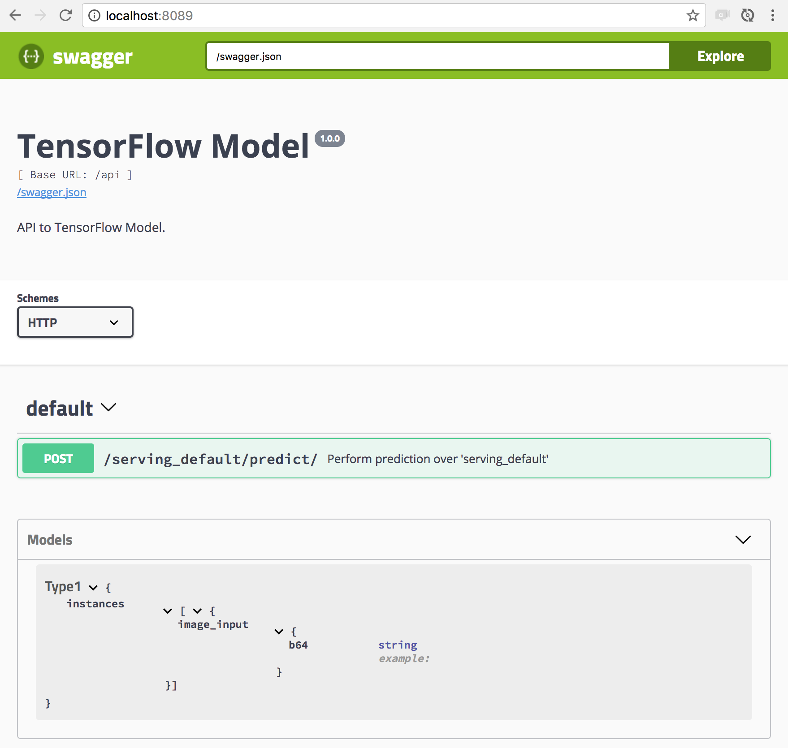

class: rstudio-slide, left, rstudio-overview

```{r setup, include=FALSE}
options(htmltools.dir.version = FALSE)
```

# The R Project for Statistical Computing

> R is a free software environment for statistical computing and graphics.

.rstats-interface[].rstats-cran[]

---
class: rstudio-slide, left

# Apache Spark

.sparklyr-code[
```{r eval=FALSE}
library(sparklyr)                           # R interface to Apache Spark
spark_install()                             # Install Apache Spark
```
]
.sparklyr-code[
```{r eval=FALSE}
sc <- spark_connect(master="local")         # Connect to local instance
```
]
.sparklyr-code[
```{r eval=FALSE}
library(dplyr)                              # Data Manipulation Grammar
mtcars_tbl <- copy_to(sc, mtcars)           # Copy data Spark
mtcars_tbl %>% summarize(n = n())           # Count records
```
]
.sparklyr-code[
```{r eval=FALSE}
mtcars_tbl %>% ml_linear_regression(        # Perform linear regression
  response = "mpg",                         # Response vector
  features = c("wt", "cyl"))                # Features for the model fit
```
]
.sparklyr-code[
```{r eval=FALSE}
spark_apply(mtcars_tbl, I)                  # Run R code in Spark
```
]

---
class: rstudio-slide, left

# TensorFlow

- **Train** and **Export** models with [tensorflow](https://tensorflow.rstudio.com)
- **Test** deployments with [tfdeploy](https://github.com/rstudio/tfdeploy).
- **Deploy** with [cloudml](https://github.com/rstudio/cloudml) and [rsconnect](https://github.com/rstudio/rsconnect).
- **Predict** models from any platform!

.tensorflow-overview-image[

]

---
class: rstudio-slide, left

# Train

**Train** models with [tensorflow.rstudio.com](https://tensorflow.rstudio.com)


---
class: rstudio-slide, left, tfdeploy-code-image

# Export

Use `export_savedmodel()` across Keras, Estimators and the Core API.

.pull-left[
```{r eval=FALSE}
# Keras API
export_savedmodel(model, "mnist")

# Estimator API
export_savedmodel(model, "mtcars")

# Core API
input  <- list(images = x),
output <- list(scores = y)
export_savedmodel(sess, "mnist", input, output)
```
]
.pull-right[

]

---
class: rstudio-slide, left, tfdeploy-code-image

# Test

- Install `tfdeploy` from [github.com/rstudio/tfdeploy](https://github.com/rstudio/tfdeploy)
- Run `serve_savedmodel()` to serve and test your model:

.pull-left[
```{r eval=FALSE}
# Install tfdeploy from GitHub
devtools::install_github("rstudio/tfdeploy")

# Run local server with model
serve_savedmodel("<model-name>")
```
]

.pull-right[

]

---
class: rstudio-slide, left, tfdeploy-code-image

# Deploy

Deploy models to [TensorFlow Serving](https://github.com/tensorflow/serving), [CloudML](https://tensorflow.rstudio.com/tools/cloudml/articles/getting_started.html) or [RStudio Connect](https://www.rstudio.com/products/connect/).

.pull-left[
```{r eval=FALSE}
# Deploy to CloudML
library(cloudml)
cloudml_deploy("keras-mnist", "rstudio-conf")
```

```{r eval=FALSE}
# Deploy to RStudio Connect
library(rsconnect)
deployTFModel("keras-mnist")
```
]

.pull-right[

]

---
class: rstudio-slide, left

# Predict (REST)

Predict using **any programming language**.

```{bash eval=FALSE}
curl -d @examples/digit-zero.json http://localhost:3939/content/2/predict
```

.thin-block[


]

---
class: rstudio-slide, left, tfdeploy-code-image

# Predict (JavaScript)

TensorFlow predictions in JavaScript with [kerasjs](https://gist.github.com/rstudio/kerasjs):

.pull-left[
```{r eval=F}
# Install kerasjs from GitHub
devtools::install_github("rstudio/kerasjs")

# Train and Export model from Keras as HDF5
# or use an existing model
model_path <- system.file(
  "models/keras-mnist.hdf5",
  package = "kerasjs"
)

# Convert model to JavaScript and Preview
kerasjs_convert(model_path)
```
]
.pull-right[
.mnist-digits[

]
]

---
class: rstudio-slide, left, tfdeploy-code-image

# Predict (Spark)

[TensorFlow predictions in Spark with sparklyr](https://gist.github.com/javierluraschi/aaf0ef91fcd9e368478bae7e4c883e85):

.pull-left[
```{r eval=F}
mtcars_tbl %>% spark_apply(function(df) {
  instances <- unname(apply(df, 1, function(e) 
    list(cyl = e[2], disp = e[3])
  ))
  
  results <- tfdeploy::predict_savedmodel(
    instances,
    "tfestimators-mtcars.tar",
    signature_name = "predict"
  )

  unname(unlist(results))
})
```
]

.pull-right[

]

---
class: rstudio-slide, left,

# Thanks!

<br>
[rstudio.com](https://rstudio.com)

[spark.rstudio.com](https://spark.rstudio.com)

[tensorflow.rstudio.com](https://tensorflow.rstudio.com)

<br>
.twitter-right[
@javierluraschi
]
