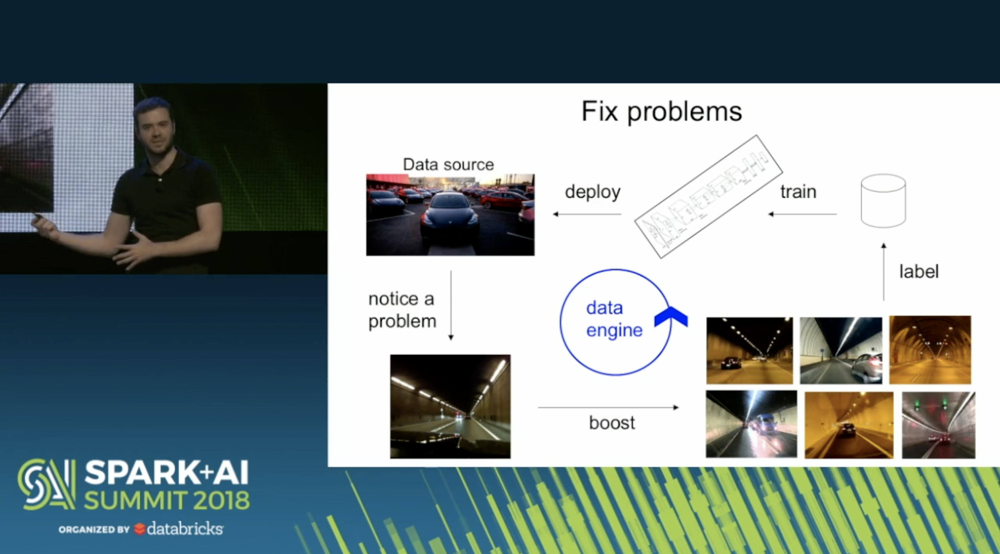
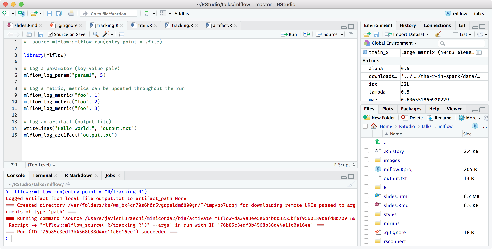
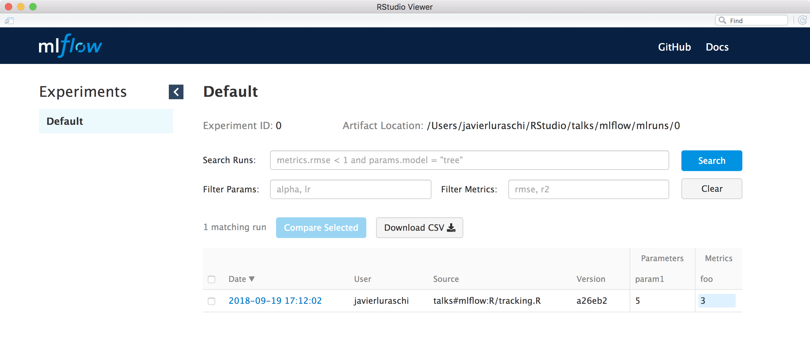

```{r setup, include = FALSE}
knitr::opts_chunk$set(eval = FALSE)
knitr::opts_chunk$set(warning = FALSE)

library(ggplot2)
library(dplyr)
library(mlflow)
```

## Overview

- What is MLflow?
- What is R?
- MLflow with R

# What is MLflow?

## Background

Spark Summit from Andrej Karpathy at Tesla

> The toolchain for the (software) 2.0 tack does not exist.



## MLflow

> "Helps teams manage their machine learning lifecycle."

> - <div class="highlight">**Tracking**</div>: Track experiments to record and compare params and results.
> - <div class="highlight">**Projects**</div>: Reuse and reproduce code to share or transfer to production.
> - <div class="highlight">**Models**</div>: Manage and deploy models from across libraries and platforms.

# What is R?

## R Language

> R is a programming language and free software environment for statistical computing and graphics.

```{r eval=TRUE, echo = FALSE, fig.cap = 'Interface language diagram by John Chambers - Rick Becker useR 2016.', fig.align = 'center', out.width=500, out.height=300}
knitr::include_graphics("../../the-r-in-spark/images/01-intro-s-algorithm-interface.png")
```

## R Community

Provides a rich package archive provided in [CRAN](https://cran.r-project.org/) and [Bioconductor](https://www.bioconductor.org/): [dplyr](https://CRAN.R-project.org/package=dplyr) to manipulate data, [cluster](https://CRAN.R-project.org/package=cluster) to analyze clusters,  [ggplot2](https://CRAN.R-project.org/package=ggplot2) to visualize data, etc.

```{r eval=TRUE, message=FALSE, echo=FALSE, fig.cap='Daily downloads of CRAN packages.', fig.align='center'}
downloads_csv <- "../../the-r-in-spark/data/01-intro-r-cran-downloads.csv"
if (!file.exists(downloads_csv)) {
  downloads <- cranlogs::cran_downloads(from = "2014-01-01", to = "2018-01-01")
  readr::write_csv(downloads, downloads_csv)
}

cran_downloads <- readr::read_csv(downloads_csv)

ggplot(cran_downloads, aes(date, count)) + 
  geom_point(colour="black", pch = 21, size = 1) +
  scale_x_date() +
  xlab("") +
  ylab("") +
  theme_light()
```

## R Language

Language features I would highlighting:

<div style="text-align: left"> 
2.1.1 Vectors

2.1.4 Expression objects

2.1.8 Promise objects

2.1.9 Dot-dot-dot

3.1.4 Operators
</div>

> [cran.r-project.org/doc/manuals/R-lang.html](https://cran.r-project.org/doc/manuals/R-lang.html)

## Use Case

Select the `cyl` and `hp` columns and add 2 and 20:

```{r eval=TRUE}
mtcars
```

## How to NOT write R code

This is how I would have written R code as a software engineer before knowing R:

```{r}
# Select columns subset
data = data.frame(mtcars$cyl, mtcars$hp)
colnames(data) = c("cyl", "hp")

# Transform each row
for (idx in 1:nrow(data)) {
  data$cyl[idx] = data$cyl[idx] + 2
}

# One column at a time to use the CPU cache efficiently
for (idx in 1:nrow(data)) {
  data$hp[idx] = data$hp[idx] + 20
}
```

## 2.1.1 Vectors

Everything is a vector in R:

```{r}
# Select columns subset
data = data.frame(mtcars$cyl, mtcars$hp)
colnames(data) = c("cyl", "hp")

# Transform each row
data$cyl = data$cyl + 2

# One column at a time to use the CPU cache efficiently
data$hp = data$hp + 20
```

## 2.1.9 Dot-dot-dot

Dynamic parameters using the `...` parameter:

```{r}
# Select columns subset
data = data.frame(cyl = mtcars$cyl, hp = mtcars$hp)

# Transform each row
data$cyl = data$cyl + 2

# One column at a time to use the CPU cache efficiently
data$hp = data$hp + 20
```

## 2.1.4/2.1.8 Expression and Promise objects

One can lazily evaluate operations and operate over expressions:

```{r}
# Select columns subset
data = select(mtcars, cyl, hp)

# Transform each row
data = mutate(data, cyl = cyl + 2)

# One column at a time to use the CPU cache efficiently
data = mutate(data, hp = hp + 20)
```

## 3.1.4 Operators

Use `<-` for assignment, or the newer `%>%` pipe:

```{r}
data <- mtcars %>% 
  select(mtcars, cyl, hp) %>%
  mutate(data, cyl = cyl + 2) %>%
  mutate(data, hp = hp + 20)
```

## Linear Models

```{r}
lm(mpg ~ cyl + hp, mtcars) %>% plot()
```


# MLflow with R

## Principles

- Parity with Python API.
- Designed for the R user.

## Installing

> Install Anaconda or miniconda.

Today...

```{bash}
git clone https://github.com/mlflow/mlflow
```

```{r eval=FALSE}
devtools::install_github("mlflow/mlflow", subdir = "R/mlflow")

mlflow::mlflow_install()

reticulate::conda_install("r-mlflow", "<local github repo>", pip = TRUE)
```

Soon...

```{r eval=FALSE}
install.packages("mlflow")
mlflow::mlflow_install()
```

## Tracking - Implicit

Implicit MLflow run:

```{r}
library(mlflow)

# Log a parameter (key-value pair)
mlflow_log_param("param1", 5)

# Log a metric; metrics can be updated throughout the run
mlflow_log_metric("foo", 1)
mlflow_log_metric("foo", 2)
mlflow_log_metric("foo", 3)

# Log an artifact (output file)
writeLines("Hello world!", "output.txt")
mlflow_log_artifact("output.txt")
```

Run terminates when the R session finishes or by running:

```{r}
mlflow_end_run()
```

Useful when sourcing files.

## Tracking - Explicit

Explicit MLflow run:

```{r}
library(mlflow)

with(mlflow_start_run(), {
  # Log a parameter (key-value pair)
  mlflow_log_param("param1", 5)
  
  # Log a metric; metrics can be updated throughout the run
  mlflow_log_metric("foo", 1)
  mlflow_log_metric("foo", 2)
  mlflow_log_metric("foo", 3)
  
  # Log an artifact (output file)
  writeLines("Hello world!", "output.txt")
  mlflow_log_artifact("output.txt")
})
```

## Tracking - Sources

```{r}
mlflow_run("R/tracking.R")
```

Or adding the following to `tracking.R` in RStudio 1.2:

```{r}
# !source mlflow::mlflow_run(entry_point = .file)
```



## Tracking - UI

```{r}
mlflow_ui()
```



## Projects - Snapshots

Create dependencies snapshot:

```{r}
mlflow_snapshot()
```

Then restore snapshot:

```{r}
mlflow_restore_snapshot()
```


## Projects - Consuming

```{r}
mlflow_run(
  "train.R",
  "https://github.com/rstudio/mlflow-example",
  param_list = list(alpha = 0.2)
)
```
```
Elasticnet model (alpha=0.2, lambda=0.5):
  RMSE: 0.827574750159859
  MAE: 0.632070002076146
  R2: 0.227227498131926
```

Or from bash:

```{bash}
mlflow run --entry-point train.R https://github.com/rstudio/mlflow-example
```

## Models - Saving

```{r}
mlflow_save_model(model)
```

Generic functions are serialized with `crate`:

```{r}
column <- mlflow_log_param("column", 1)
model <- lm(
  Sepal.Width ~ x,
  data.frame(Sepal.Width = iris$Sepal.Width, x = iris[,column])
)

mlflow_save_model(
  crate(~ stats::predict(model, .x), model)
)
```

However, `mlflow_save_model()` can be extended by packages:

```{r}
#' @export
mlflow_save_flavor.tensorflow <- function(...) {}
mlflow_load_flavor.tensorflow <- function(...) {}
mlflow_predict_flavor.tensorflow <- function(...) {}
```

## Models - Predictions

```{r}
mlflow_rfunc_predict(
  "model",
  data = data.frame(x = c(0.3, 0.2))
)
```
```
       1        2 
3.400381 3.406570
```

Or from bash,

```{bash}
mlflow rfunc predic --model-path model --input-path data.csv
```

## Models - Serving

```{r}
mlflow_rfunc_serve("model")
```


```{bash}
mlflow rfunc serve model-path model
```

```{bash}
curl -X POST "http://127.0.0.1:8090/predict/" -H "accept: application/json" -H "Content-Type: application/json" -d '[{"x": [0.3, 0.2]}]'
```

## Future Work

Currently merged, various github issues pending:


## Thanks!

> github.com/mlflow/mlflow

> @javierluraschi

> javier@rstudio.com
