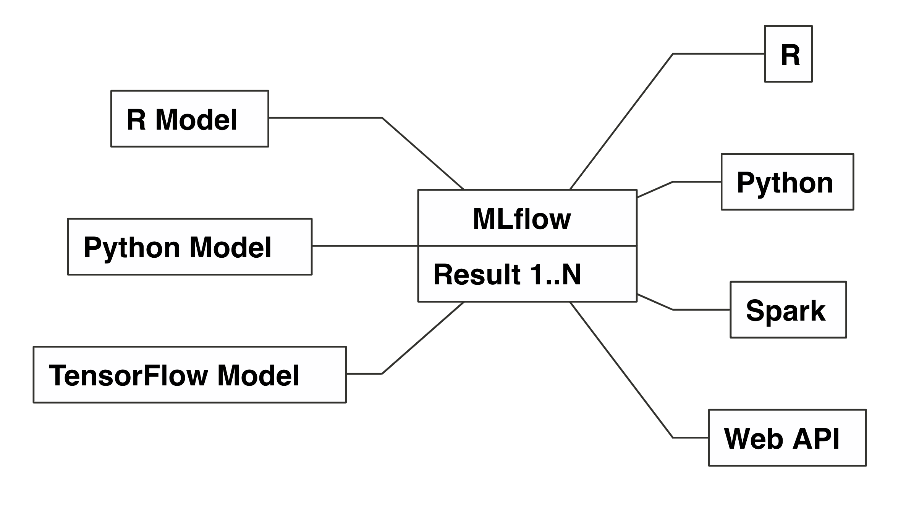
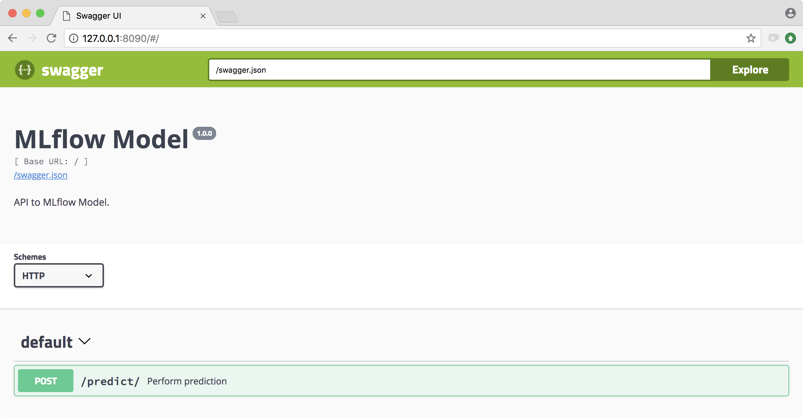

```{r setup, include = FALSE}
knitr::opts_chunk$set(eval = FALSE)
knitr::opts_chunk$set(warning = FALSE)

library(ggplot2)
library(dplyr)
library(mlflow)
library(r2d3)
```

## Overview

- What is MLflow?
- MLflow with R

# What is MLflow?

## Background

Spark Summit from Andrej Karpathy at Tesla

> The toolchain for the (software) 2.0 tack does not exist.


## Challenge

Different models need to be run across many runtimes each producing many results.

```{r echo=FALSE}
nomnoml::nomnoml("
[Spark|Result 1..N]
[R|Result 1..N]
[Python|Result 1..N]

[R Model] - [R]
[R Model] - [Python]
[R Model] - [Spark]
[R Model] - [Web API]
[Python Model] - [R]
[Python Model] - [Python]
[Python Model] - [Spark]
[Python Model] - [Web API]
[TensorFlow Model] - [R]
[TensorFlow Model] - [Python]
[TensorFlow Model] - [Spark]
[TensorFlow Model] - [Web API]
")
```


## Solution

MLflow can run models across runtimes tracking their results.

```{r echo=FALSE}
x <- nomnoml::nomnoml("
[MLflow|
Result 1..N]

[R Model] - [MLflow]
[Python Model] - [MLflow]
[TensorFlow Model] - [MLflow]
[MLflow] - [R]
[MLflow] - [Python]
[MLflow] - [Spark]
[MLflow] - [Web API]
")
```


## MLflow

> "Helps teams manage their machine learning lifecycle."

> - <div class="highlight">**Tracking**</div>: Track experiments to record and compare params and results.
> - <div class="highlight">**Projects**</div>: Reuse and reproduce code to share or transfer to production.
> - <div class="highlight">**Models**</div>: Manage and deploy models from across libraries and platforms.

# MLflow with R

## Principles

- Parity with Python API.
- Designed for the R user.

## Installing

> Install Anaconda or miniconda.

```{r eval=FALSE}
install.packages("mlflow")
mlflow::mlflow_install()
```

# Tracking

## Tracking - Implicit

Implicit MLflow run:

```{r}
library(mlflow)

# Log a parameter (key-value pair)
mlflow_log_param("param1", 5)

# Log a metric; metrics can be updated throughout the run
mlflow_log_metric("foo", 1)
mlflow_log_metric("foo", 2)
mlflow_log_metric("foo", 3)

# Log an artifact (output file)
writeLines("Hello world!", "output.txt")
mlflow_log_artifact("output.txt")
```

Run terminates when the R session finishes or by running:

```{r}
mlflow_end_run()
```

Useful when sourcing files.

## Tracking - Explicit

Explicit MLflow run:

```{r}
library(mlflow)

with(mlflow_start_run(), {
  # Log a parameter (key-value pair)
  mlflow_log_param("param1", 5)
  
  # Log a metric; metrics can be updated throughout the run
  mlflow_log_metric("foo", 1)
  mlflow_log_metric("foo", 2)
  mlflow_log_metric("foo", 3)
  
  # Log an artifact (output file)
  writeLines("Hello world!", "output.txt")
  mlflow_log_artifact("output.txt")
})
```

## Tracking - Sources

```{r}
mlflow_run("R/tracking.R")
```

Or adding the following to `tracking.R` in RStudio 1.2:

```{r}
# !source mlflow::mlflow_run(entry_point = .file)
```


## Tracking - UI

```{r}
mlflow_ui()
```


# Projects

## Projects - Snapshots

Create dependencies snapshot:

```{r}
mlflow_snapshot()
```

Then restore snapshot:

```{r}
mlflow_restore_snapshot()
```


## Projects - Consuming R from R

```{r}
mlflow_run(
  "train.R",
  "https://github.com/rstudio/mlflow-example",
  param_list = list(alpha = 0.2)
)
```
```
Elasticnet model (alpha=0.2, lambda=0.5):
  RMSE: 0.827574750159859
  MAE: 0.632070002076146
  R2: 0.227227498131926
```

## Projects - Consuming Python from R

```{r}
mlflow_run(
  uri = "https://github.com/mlflow/mlflow-example",
  param_list = list(alpha = 0.2)
)
```
```
Elasticnet model (alpha=0.200000, l1_ratio=0.100000):
  RMSE: 0.7836984021909766
  MAE: 0.6142020452688988
  R2: 0.20673590971167466
```

## Projects - Consuming R from Bash

Or from bash:

```{bash}
mlflow run --entry-point train.R https://github.com/rstudio/mlflow-example
```
```
Elasticnet model (alpha=0.5, lambda=0.5):
  RMSE: 0.828684594922867
  MAE: 0.627503954965052
  R2: 0.19208126758775
```

# Models

## R Models - Saving from R

```{r}
mlflow_save_model(model)
```

Generic functions can be serialized with [carrier::crate](https://cran.r-project.org/package=carrier):

```{r}
model <- lm(mpg ~ . -mpg, mtcars)

mlflow_save_model(
  crate(~ stats::predict(model, .x), model)
)
```

## Models - Predictions from R

```{r}
mlflow_rfunc_predict(
  "model",
  data = data.frame(cyl = 2, disp = 160, hp = 110, drat = 3.9, wt = 2.62,
                    qsec = 16.46, vs = 0, am = 1, gear = 4, carb = 4)
)
```
```
       1 
23.04527
```

## Models - Serving from R

```{r}
mlflow_rfunc_serve("model")
```



```{bash}
mlflow rfunc serve model-path model
```

```{bash}
curl -X POST "http://127.0.0.1:8090/predict/" -H "accept: application/json" -H "Content-Type: application/json" -d '[{"cyl":2,"disp":160,"hp":110,"drat":3.9,"wt":2.62,"qsec":16.46,"vs":0,"am":1,"gear":4,"carb":4}]'
```

## Models - Predict form Bash

Or from bash,

```{bash}
mlflow rfunc predic --model-path model --input-path data.csv
```

## Keras Models - Saving

However, `mlflow_save_model()` can be extended by packages:

```{r}
library(keras)

cars <- scale(mtcars)
model <- keras_model_sequential() %>%
  layer_dense(units = 8, activation = "relu", input_shape = ncol(mtcars) - 1) %>%
  layer_dense(units = 4, activation = "relu") %>%
  layer_dense(units = 1, activation = "relu") %>%
  compile(
    loss = "mse",
    optimizer = optimizer_rmsprop(),
    metrics = "mean_absolute_error"
  )

fit(model, cars[,-1], cars[,1], epochs = 10)
mlflow_save_model(model, "keras")
```

## Keras Models - Prediction

```{r}
mlflow_rfunc_predict(
  "keras",
  data = data.frame(cyl = 1, disp = 1, hp = 1, drat = 1, wt = 1,
                    qsec = 1, vs = 1, am = 1, gear = 1, carb = -1)
)
```
```
           [,1]
[1,] 0.02378437
```

## Keras Models - Serving

```{r}
mlflow_rfunc_serve("keras")
```

```
[{"cyl":1,"disp":1,"hp":1,"drat":1,"wt":1,"qsec":1,"vs":1,"am":1,"gear":1,"carb":-1}] 
```
```
{"predictions": [[0.0238]]}
```

## Models - Prediction in Spark

```{r}
library(sparklyr)
sc <- spark_connect(master = "local")
mtcars_tbl <- sdf_copy_to(sc, mtcars)
```

```{r}
model <- mlflow_load_model("model")
```

```{r}
mtcars_tbl %>% spark_apply(function(x, model) model(x), context = model)
```
```
# Source: spark<?> [?? x 1]
   result
 *  <dbl>
 1   22.6
 2   22.1
 3   26.3
 4   21.2
 5   17.7
```

```{r echo=FALSE}
spark_disconnect_all()
```

# Thanks!

## Resources

> mlflow.org

> github.com/mlflow/mlflow

> rpubs.com/jluraschi/mlflow-with-r-rusers-seattle

> @javierluraschi

> javier@rstudio.com
