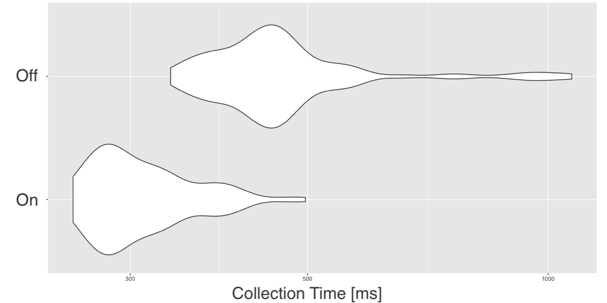
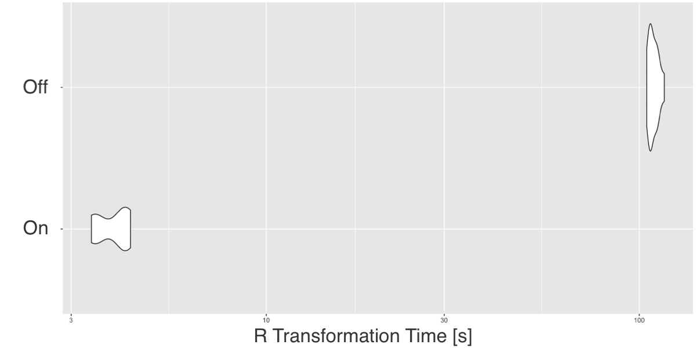

```{r setup, include=FALSE}
options(htmltools.dir.version = FALSE)
library(ggplot2)

thm <- theme_bw() + 
  theme(
    panel.background = element_rect(fill = "transparent", colour = NA), 
    plot.background = element_rect(fill = "transparent", colour = NA),
    legend.background = element_rect(fill = "transparent", colour = NA),
    legend.key = element_rect(fill = "transparent", colour = NA)
  )
theme_set(thm)

knitr::opts_chunk$set(eval = FALSE)
```

class: panel-wide-slide, left

# What to do when code is slow?

```{r}
mtcars %>% lm(mpg ~ wt + cyl, .)
```

--

```{r}
# Sample
mtcars %>% dplyr::sample_n(10) %>% lm(mpg ~ wt + cyl, .)
```

--

```{r}
# Profile
profvis::profvis(mtcars %>% lm(mpg ~ wt + cyl, .))
```

--

```{r}
# Scale Up
cloudml::cloudml_train("train.R")
```

--

```{r}
# Scale Out
sparklyr::ml_linear_regression(mtcars_tbl, mpg ~ wt + cyl)
```

---

class: panel-narrow-slide, left

# Scaling R with Spark

```{r}
library(sparklyr)                                    # R Interface to Apache Spark
spark_install()                                      # Install Apache Spark
sc <- spark_connect(master = "local")                # Connect to Spark cluster
```

--

```{r}
cars_tbl <- spark_read_csv(sc, "cars", "input/")     # Read data in Spark

summarize(cars_tbl, n = n())                         # Count records with dplyr
dbGetQuery(sc, "SELECT count(*) FROM cars")          # Count records with DBI
```

--

```{r}
ml_linear_regression(cars_tbl, mpg ~ wt + cyl)       # Perform linear regression
```

--

```{r}
pipeline <- ml_pipeline(sc) %>%                      # Define Spark pipeline
  ft_r_formula(mpg ~ wt + cyl) %>%                   # Add formula transformation
  ml_linear_regression()                             # Add model to pipeline

fitted <- ml_fit(pipeline, cars_tbl)                 # Fit pipeline
```

--

```{r}
spark_context(sc) %>% invoke("version")              # Extend sparklyr with Scala
spark_apply(cars_tbl, nrow)                          # Extend sparklyr with R
```

---

class: panel-narrow-slide, left

# So, what's new in Spark and R?

--

## - Realtime processing with structured streams.

--

## - [XGBoost](https://github.com/rstudio/sparkxgb) on Spark.

--

## - Faster operations with Apache Arrow.

---

class: panel-narrow-slide, left

# Spark Streams

```{r}
stream <- stream_read_csv(sc, "stream", "input/")    # Read stream in Spark
```

--

```{r}
summarize(stream, n = n())                           # Count records with dplyr
dbGetQuery(sc, "SELECT count(*) FROM stream")        # Count records with DBI
```

--

```{r}
ml_transform(fitted, stream)                         # Apply pipeline to stream
```

--

```{r}
spark_apply(stream, nrow)                            # Extend streams with R
```

---

class: panel-narrow-slide, left

# XGBoost on Spark

```{r}
devtools::install_github("kevinykuo/sparkxgb")
library(sparkxgb)
```

--

```{r}
iris_tbl <- sdf_copy_to(sc, iris)

xgb_model <- xgboost_classifier(
  iris_tbl, 
  Species ~ .,
  objective = "multi:softprob",
  num_class = 3,
  num_round = 50, 
  max_depth = 4
)

xgb_model %>%
  ml_predict(iris_tbl) %>%
  glimpse()
```

---

class: panel-narrow-slide, left

# Arrow on Spark

```{r}
devtools::install_github("apache/arrow", subdir = "r")

library(arrow)
library(sparklyr)
```
.pull-left[]
.pull-right[]

---

class: blank-slide, blue, center, middle

# Thank you!