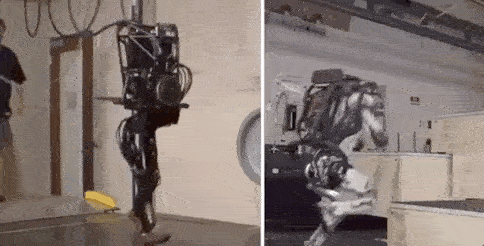
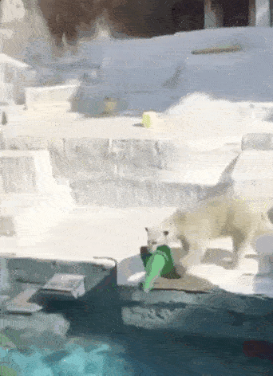
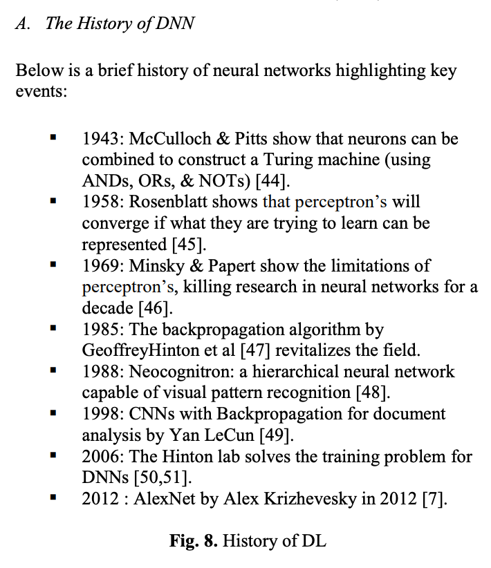
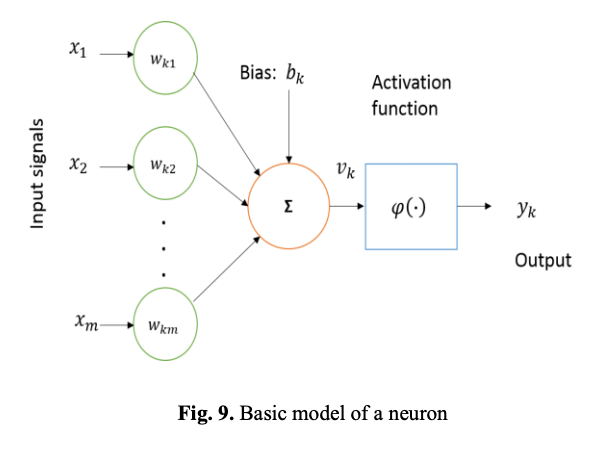
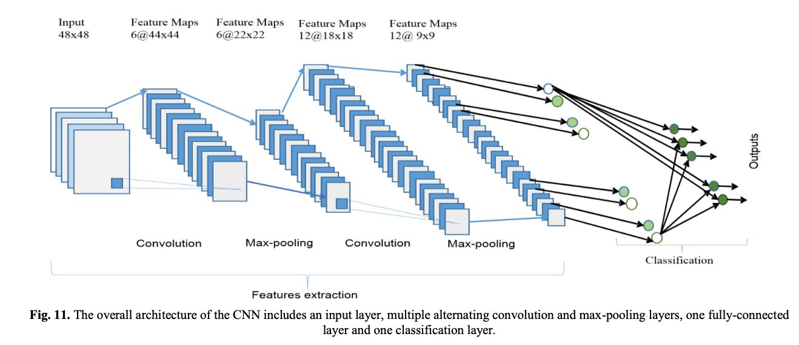
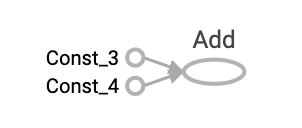
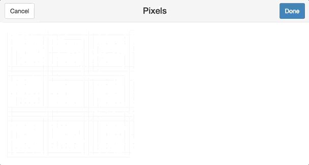
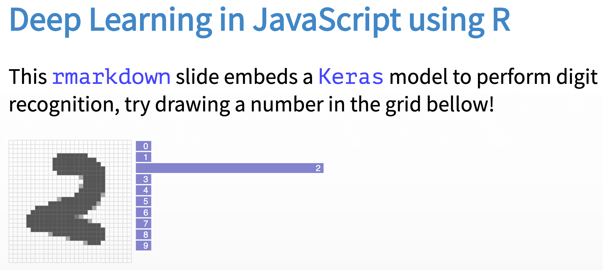

```{r setup, include=FALSE}
knitr::opts_chunk$set(eval = FALSE)
```

# Packages

## Packages

This talk will present packages to:

- **Scale** computing: What to do when code is slow?
- Perform non-standard **visualizations**, as in, beyond `ggplot2`.
- Train **deep learning** models, to classify images and beyond.
- **Interoperate** with other languages, like Python.

But first, lets talk about the lifecycle of a package...

## Lifecycle


```

```

## SpaceX

A private **aerospace manufacturer** and space transportation services company.


## Boston Robotics

An engineering and **robotics** design company founded in 1992 as a **spin-off** from the Massachusetts Institute of Technology.




## Polar Bear

A polar bear exploring technological advancements applicable to maritime transportation.




# Scaling

## What to do when code is slow?

```{r}
hpiR::seattle_sales %>% lm(sale_price ~ area + beds + age, .)
```

```{r}
# Sample
hpiR::seattle_sales %>% dplyr::sample_n(1000) %>% lm(sale_price ~ area + beds + age, .)
```

```{r}
# Profile
profvis::profvis(
  hpiR::seattle_sales %>% lm(sale_price ~ area + beds + age, .)
)
```

```{r}
# Scale Up
cloudml::cloudml_train("train.R")
```

```{r}
# Scale Out
copy_to(sc, hpiR::seattle_sales) %>%
  sparklyr::ml_linear_regression(mpg ~ wt + cyl)
```

## profvis


Visualize R profiling data.

```{r}
install.packages("profvis")
```

```{r}
library(ggplot2)

profvis::profvis({
  g <- ggplot(diamonds, aes(carat, price)) + geom_point(size = 1, alpha = 0.2)
  print(g)
})
```

## cloudml


R interface to Google Cloud Machine Learning Engine.

```{r}
install.packages("cloudml")
library(cloudml)
gcloud_install()
gcloud_init()
```

```
saveRDS(lm(sale_price ~ area + beds + age, hpiR::seattle_sales), "model.rds")
```

```{r}
cloudml_train("train.R")
job_collect("cloudml_2019_04_18_003956121")
readRDS("runs/cloudml_2019_04_18_003956121/model.rds")
```
```
Call:
lm(formula = sale_price ~ area + beds + age, data = hpiR::seattle_sales)

Coefficients:
(Intercept)         area         beds          age  
   166678.1      -1579.2     146588.3        216.7  
```

## sparklyr


R Interface to Apache Spark.

```{r}
spark_install()                                      # Install Apache Spark
sc <- spark_connect(master = "local")                # Connect to Spark cluster
```

```{r}
houses <- copy_to(sc, hpiR::seattle_sales)           # Copy data to Spark
dplyr::summarize(houses, n = n())                    # Count records with dplyr
```

```{r}
ml_linear_regression(houses, sale_price ~ area + beds + age)
```
```
Formula: sale_price ~ area + beds + age

Coefficients:
(Intercept)        area        beds         age 
166678.1295  -1579.1792 146588.2559    216.7374 
```

# Visualization

## r2d3

R Interface to D3 Visualizations.

```{r}
r2d3::r2d3(c(0.3, 0.6, 0.8, 0.95, 0.40, 0.20), "
var barHeight = Math.ceil(height / data.length);
svg.selectAll('rect').data(data).enter().append('rect')
    .attr('width', function(d) { return d * width; })
    .attr('height', barHeight)
    .attr('y', function(d, i) { return i * barHeight; })
    .attr('fill', 'steelblue');
")
```


## nomnoml

The **sassy** diagram renderer.


## nomnoml

The **sassy** diagram renderer.

```{r}
devtools::install_github("javierluraschi/nomnoml")
```
```{r}
nomnoml::nomnoml("[Import] -> [Understand]
                  [Understand | [Wrangle] -> [Visualize]
                                [Visualize] -> [Model]
                                [Model] -> [Wrangle]]
                  [Understand] -> [Communicate]")
```


## voxels

```{r}
devtools::install_github("javierluraschi/voxels")
```
```{r}
voxels::voxels(matrix(c(
    1, 0, 1, 0, 1, 1, 1, 0, 1, 0, 0, 0, 1, 0, 0, 0, 1, 1, 1,
    1, 0, 1, 0, 1, 0, 0, 0, 1, 0, 0, 0, 1, 0, 0, 0, 1, 0, 1,
    1, 1, 1, 0, 1, 1, 1, 0, 1, 0, 0, 0, 1, 0, 0, 0, 1, 0, 1,
    1, 0, 1, 0, 1, 0, 0, 0, 1, 0, 0, 0, 1, 0, 0, 0, 1, 0, 1,
    1, 0, 1, 0, 1, 1, 1, 0, 1, 1, 1, 0, 1, 1, 1, 0, 1, 1, 1
), nrow = 5, byrow = T))
```


# Deep Learning

## How does one classifies images?

<div style="display: inline-flex;"><div style="flex-flow: column; margin-left: 20px;"></div></div>

Many more applications: Speech recognition, natural language processing, self-driving cars, etc. See [arXiv:1803.01164](https://arxiv.org/abs/1803.01164).

## TensorFlow


```{r}
install.package("tensorflow")
```
```{r}
library(tensorflow)
add <- tf$add(tf$constant(1), tf$constant(1))

sess <- tf$Session()
tf$summary$FileWriter(file.path(".", "graph"), sess$graph)
sess$run(add)
```
```
[1] 2
```

```{r}
tensorboard("graph")
```


## keras


Deep Learning for humans.

```{r}
library(keras)
mnist <- dataset_mnist()
x_train <- array_reshape(mnist$train$x, c(nrow(mnist$train$x), 784)) / 255
x_test <- array_reshape(mnist$test$x, c(nrow(mnist$test$x), 784)) / 255
y_train <- to_categorical(mnist$train$y, 10)
y_test <- to_categorical(mnist$test$y, 10)

model <- keras_model_sequential() 
model %>% 
  layer_dense(units = 256, activation = 'relu', input_shape = c(784)) %>% 
  layer_dropout(rate = 0.4) %>% 
  layer_dense(units = 128, activation = 'relu') %>%
  layer_dropout(rate = 0.3) %>%
  layer_dense(units = 10, activation = 'softmax')

model %>% compile(loss = 'categorical_crossentropy', optimizer = optimizer_rmsprop(), metrics = c('accuracy'))
model %>% fit(x_train, y_train, epochs = 3, batch_size = 128, validation_split = 0.2)
model %>% evaluate(x_test, y_test)
```
```
$acc
[1] 0.9681
```

## pixels


Tools for Working with Pixels in R

```{r}
install.packages("pixels")
```
```{r}
library(pixels)
get_pixels()
```



## kerasjs


Run Keras models in the browser, with GPU support using WebGL.

```{r}
devtools::install_github("rstudio/kerasjs")
```

```{r}
library(kerasjs)
kerasjs_convert("path-to-model.hdf5")
```



[Show HN: Embedding Deep Learning models into your Slides using R](https://news.ycombinator.com/item?id=16304669)

## kartsim


Kart simulation for model training

```{r}
devtools::install_github("javierluraschi/kartsim")
```

```{r}
library(kartsim)
kartsim_play(circuit = 3)
```


# Interoperability

## How do I work with Python projects?

- **reticulate**: Call Python code from R.
- **feather**: Save and load data from R and Python.
- **arrow**: Share data in memory rom R and other languages.

## Feather

A **lightweight** binary columnar data **store** designed for maximum **speed**, based on Arrow's memory layout.

```{r}
library(feather)                                     # Import feather package

write_feather(mtcars, "cars.feather")                # Write feather file in R
read_feather("cars.feather")                         # Read feather file in R
```

```{python}
import feather                                       # Import feather package

df = feather.read_dataframe("cars.feather")          # Read feather file in Python
feather.write_dataframe(df, "cars.feather")          # Write feather file in Python
```

## Arrow

Apache Arrow is a **cross-language** development platform for **in-memory data**.

```{r}
devtools::install_github("apache/arrow", subdir = "r", ref = "apache-arrow-0.13.0")
```

The R arrow package supports feather, parquet, streams, and more.

```{r}
library(arrow)                                       # Import arrow package

read_feather("cars.feather")                         # Can still read feather file
read_parquet("cars.parquet")                         # Can also read parquet files

write_arrow(mtcars, raw())                           # Can efficiently serialize
```

# Thanks!

## Thanks!

- **github**: github.com/javierluraschi
- **twitter**: twitter.com/javierluraschi
- **linkedin**: linkedin.com/in/javierluraschi
