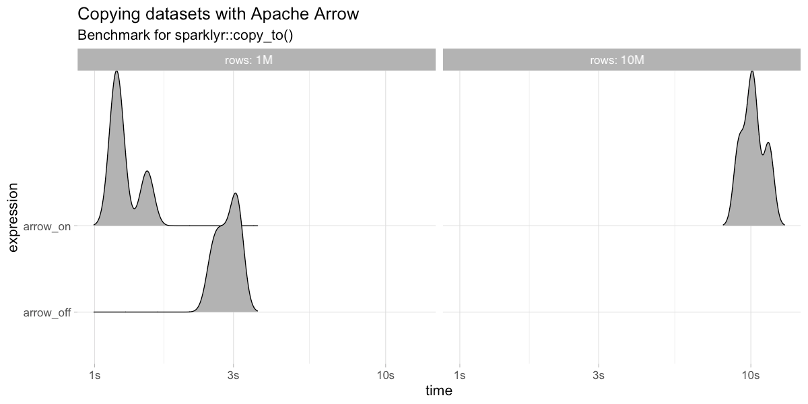
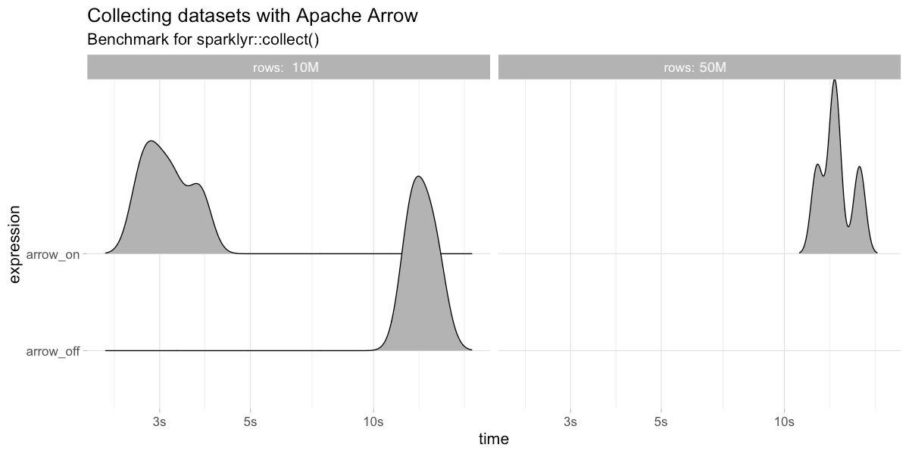
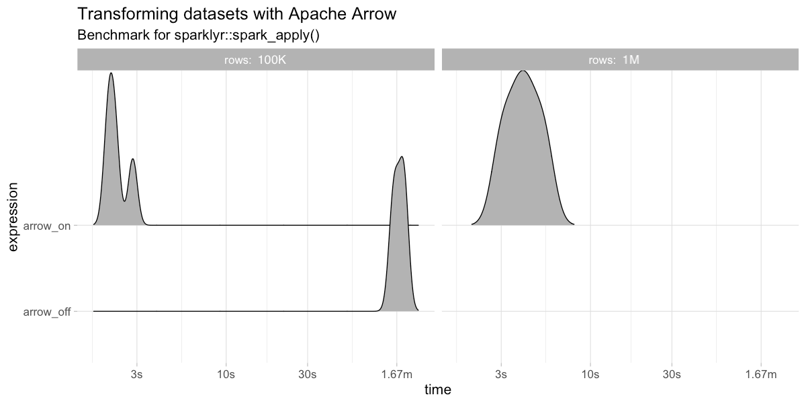

```{r setup, include=FALSE}
knitr::opts_chunk$set(eval = FALSE)
```

## Overview

- Intro to R
- R with Spark
- Intro to Arrow
- Arrow on Spark

# Intro to R

- R Language
- CRAN Packages

## R Language
## CRAN Packages

# R with Spark

- sparklyr 0.4
- sparklyr 0.5
- sparklyr 0.6
- sparklyr 0.7
- sparklyr 0.8
- sparklyr 0.9
- sparklyr 1.0

## sparklyr 0.4 - Initial Release

```{r}
library(sparklyr)                                    # R Interface to Apache Spark
spark_install()                                      # Install Apache Spark
sc <- spark_connect(master = "local")                # Connect to Spark cluster
```

```{r}
cars_tbl <- spark_read_csv(sc, "cars", "mtcars/")    # Read data in Spark

summarize(cars_tbl, n = n())                         # Count records with dplyr
dbGetQuery(sc, "SELECT count(*) FROM cars")          # Count records with DBI
```

```{r}
ml_linear_regression(cars_tbl, mpg ~ wt + cyl)       # Perform linear regression
```

```{r}
spark_context(sc) %>% invoke("version")              # Extend sparklyr with Scala
```

## sparklyr 0.5 - Connections

```{r}
sc <- spark_connect(method = "databricks")           # Connect to Databricks cluster
sc <- spark_connect(master = "http://livy-server")   # Connect through Apache Livy 
```

## sparklyr 0.6 - Distributed R

```{r}
spark_apply(cars_tbl, nrow)                          # Extend sparklyr with R
```

## sparklyr 0.7 - Pipelines

```{r}
pipeline <- ml_pipeline(sc) %>%                      # Define Spark pipeline
  ft_r_formula(mpg ~ wt + cyl) %>%                   # Add formula transformation
  ml_linear_regression()                             # Add model to pipeline

fitted <- ml_fit(pipeline, cars_tbl)                 # Fit pipeline
```

## sparklyr 0.8 - MLeap and Graphs

```{r}
library(mleap)                                       # Install MLeap package
install_maven()                                      # Install Maven
install_mleap()                                      # Install MLeap

transformed <- ml_transform(fitted, mtcars_tbl)      # Fit pipeline with dataset
ml_write_bundle(fitted, transformed, "model.zip")    # Export model with MLeap
```

```{r}
library(graphframes)

g <- gf_graphframe(edges = edges_tbl)
gf_pagerank(g, tol = 0.01)
```

## sparklyr 0.9 - Streams

```{r}
stream_read_text(sc, "s3a://your-s3-bucket/") %>%
  spark_apply(
    ~webreadr::read_s3(paste(c(.x$line, ""), collapse = "\n")),
    columns = lapply(webreadr::read_s3("\n"), class)
  ) %>%
  group_by(uri) %>%
  summarize(n = n()) %>%
  arrange(desc(n)) %>%
  stream_write_memory("urls_stream", mode = "complete")
```

## sparklyr 1.0 - Arrow

- **Arrow** enables faster and larger data transfers between Spark and R.
- **XGBoost** enables training gradient boosting models over distributed datasets.
- **Broom** converts Spark’s models into tidy formats that you know and love.
- **TFRecords** writes TensorFlow records from Spark to support deep learning workflows.

# Intro to Arrow

- What is Arrow?
- The Feather project
- The Ursa project
- The Arrow R package

## What is Arrow?

> Arrow is a cross-language development platform for in-memory data.

## The Feather project

## The Ursa project

## The Arrow R package

# Arrow on Spark

- Install
- Copy
- Collect
- Transform

## Install Arrow

```{r}
devtools::install_github(
  "apache/arrow",
  subdir = "r",
  ref = "apache-arrow-0.13"
)
```

Then use Arrow with Spark and R:

```{r}
library(arrow)
```

## Copy with Arrow

```{r}
bench::press(rows = c(10^6, 10^7), { bench::mark(
  arrow_on = {
    library(arrow)
    sparklyr_df <<- copy_to(sc, data.frame(y = 1:rows), overwrite = T) },
  arrow_off = if (rows <= 10^6) {
    if ("arrow" %in% .packages()) detach("package:arrow")
    sparklyr_df <<- copy_to(sc, data.frame(y = 1:rows), overwrite = T)
  } else NULL, iterations = 4, check = FALSE) })
```



## Collect with Arrow

```{r}
bench::press(rows = c(10^7, 5 * 10^7), { bench::mark(
  arrow_on = {
    library(arrow)
    collected <- sdf_len(sc, rows) %>% collect() },
  arrow_off = if (rows <= 10^7) {
    if ("arrow" %in% .packages()) detach("package:arrow")
    collected <- sdf_len(sc, rows) %>% collect()
  } else NULL, iterations = 4, check = FALSE) })
```



## Transform with Arrow

```{r}
bench::press(rows = c(10^5, 10^6), { bench::mark(
  arrow_on = {
    library(arrow)
    sdf_len(sc, rows) %>% spark_apply(~.x/2) %>% count() %>% collect() },
  arrow_off = if (rows <= 10^5) {
    if ("arrow" %in% .packages()) detach("package:arrow")
    sdf_len(sc, rows) %>% spark_apply(~.x/2) %>% count() %>% collect()
  } else NULL, iterations = 4, check = FALSE)})
```



# Thank you!

## Resources

### **Docs**: spark.rstudio.com
### **GitHub**: github.com/rstudio/sparklyr
### **Blog**: blog.rstudio.com/tags/sparklyr
### **R Help**: community.rstudio.com
### **Spark Help**: stackoverflow.com/tags/sparklyr
### **Issues**: github.com/rstudio/sparklyr/issues
### **Chat**: gitter.im/rstudio.sparklyr
