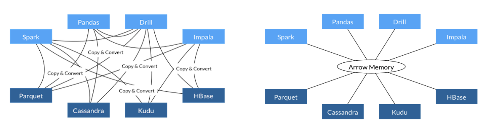
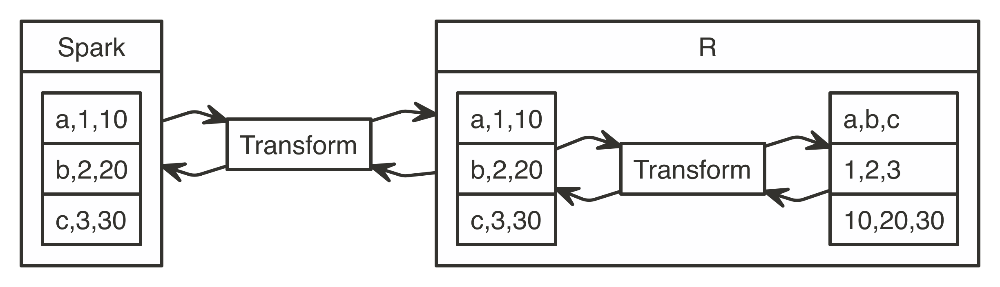

```{r setup, include=FALSE}
knitr::opts_chunk$set(eval = FALSE)
```

## Overview

- Intro to R
- R with Spark
- Intro to Arrow
- Arrow with R
- Arrow on Spark

# Intro to R

- R Language
- R Packages
- An R Package

## R Language

R is a programming language for statistical computing that is: **vectorized**, **columnar** and **flexible**.


## R Packages

**CRAN** is R's package manager, like NPM or Maven. Thousands of packages available and usage growing every year.


## An R package

One of many packages, **rayrender**: A raytracer for spheres, planes, and cubes.

<div class="flow-table">
<div class="flow-column flow-column-image"></div>
<div class="flow-column">
```{r}
library(rayrender)

sphere(y = -1001, radius = 1000) %>%
  add_object(sphere()) %>%
  render_scene()
```
</div></div>

# R with Spark

- sparklyr 0.4
- sparklyr 0.5
- sparklyr 0.6
- sparklyr 0.7
- sparklyr 0.8
- sparklyr 0.9
- sparklyr 1.0

## sparklyr 0.4 - Initial Release

Support to **install**, **connect**, **analyze**, **model** and **extend** Spark.

```{r}
spark_install()                                      # Install Apache Spark
sc <- spark_connect(master = "local")                # Connect to Spark cluster
```

```{r}
cars <- spark_read_csv(sc, "cars", "mtcars/")        # Read data in Spark

dplyr::summarize(cars, n = n())                      # Count records with dplyr
DBI::dbGetQuery(sc, "SELECT count(*) FROM cars")     # Count records with DBI
```

```{r}
ml_linear_regression(cars, mpg ~ wt + cyl)           # Perform linear regression
```

```{r}
spark_context(sc) %>% invoke("version")              # Extend sparklyr with Scala
```

## sparklyr 0.5 - Connections

Support for Apache **Livy**,

```{r}
sc <- spark_connect(master = "http://livy-server")   # Connect through Apache Livy 
```

**Databricks** connections,

```{r}
sc <- spark_connect(method = "databricks")           # Connect to Databricks cluster
```

`dplyr` improvements, and certified with **Cloudera**.

## sparklyr 0.6 - Distributed R

**Distribute R** computations to execute arbitrary R code over each **partition** using your favorite **R packages**,

```{r}
spark_apply(cars, ~broom::tidy(lm(mpg ~ cyl, .x)))   # Extend sparklyr with R
```
```
# Source: spark<?> [?? x 5]
  term        estimate std.error statistic  p.value
  <chr>          <dbl>     <dbl>     <dbl>    <dbl>
1 (Intercept)    37.9      2.07      18.3  8.37e-18
2 cyl            -2.88     0.322     -8.92 6.11e-10
```

and external data sources,

```{r}
spark_read_jdbc(sc, "person",  options = list(       # Read from JDBC source
  url = "jdbc:mysql://localhost:3306/",              # MySQL server URL
  dbtable = "person"))                               # Remote table name
```

## sparklyr 0.7 - Pipelines and Machine Learning

Provide a uniform set of high-level APIs to help create, tune, and **deploy** machine learning pipelines at **scale**,

```{r}
pipeline <- ml_pipeline(sc) %>%                      # Define Spark pipeline
  ft_r_formula(mpg ~ wt + cyl) %>%                   # Add formula transformation
  ml_linear_regression()                             # Add model to pipeline

fitted <- ml_fit(pipeline, cars)                     # Fit pipeline
```

and support for **all MLlib** algorithms.

## sparklyr 0.8 - MLeap and Graphs

MLeap allows you to use your Spark **pipelines** in any **Java** enabled device or service,

```{r}
library(mleap)                                       # Import MLeap package
install_maven()                                      # Install Maven
install_mleap()                                      # Install MLeap

transformed <- ml_transform(fitted, cars)            # Fit pipeline with dataset
ml_write_bundle(fitted, transformed, "model.zip")    # Export model with MLeap
```

graphframes provides an interface to the **GraphFrames** Spark package.

```{r}
library(graphframes)                                 # Import graphframes package

g <- gf_graphframe(edges = edges_tbl)                # Map to graphframe
gf_pagerank(g, tol = 0.01)                           # Compute pagerank
```

## sparklyr 0.9 - Streams

Spark **structured streams** provide parallel and fault-tolerant data processing,

```{r}
stream_read_text(sc, "s3a://your-s3-bucket/") %>%    # Define input stream
  spark_apply(~webreadr::read_s3(.x$line),) %>%      # Transform with R
  group_by(uri) %>%                                  # Group using dplyr
  summarize(n = n()) %>%                             # Count using dplyr
  arrange(desc(n)) %>%                               # Arrange using dplyr
  stream_write_memory("urls", mode = "complete")     # Define output stream
```

enables support for **Kubernetes** and to properly interrupt long-running operations.

```{r}
sc <- spark_connect(config = spark_config_kubernetes("k8s://hostname:8443"))
```

## sparklyr 1.0 - Arrow

- **Arrow** enables faster and larger data transfers between Spark and R.
- **XGBoost** enables training gradient boosting models over distributed datasets.

```{r}
library(sparkxgb)
dplyr::mutate(cars, eff = mpg > 20) %>%
  xgboost_classifier(eff ~ ., num_class = 2)
```

- **TFRecords** writes TensorFlow records from Spark to support deep learning workflows.

```{r}
library(sparktf)
cars %>% spark_write_tfrecord("tfrecord")
```

# Intro to Arrow

- What is Arrow?
- The Feather project
- The Arrow R package

## What is Arrow?

Apache Arrow is a **cross-language** development platform for **in-memory** data.



: Source: arrow.apache.org

## Memory Layout

**Columnar** memory layout allows applications to avoid **unnecessary IO** and accelerate analytical processing performance on modern CPUs and GPUs.


: Source: arrow.apache.org

# Arrow with R

- Feather package
- Arrow package

## Feather package

A **lightweight** binary columnar data **store** designed for maximum **speed**, based on Arrow's memory layout.

```{r}
library(feather)                                     # Import feather package

write_feather(mtcars, "cars.feather")                # Write feather file in R
read_feather("cars.feather")                         # Read feather file in R
```

```{python}
import feather                                       # Import feather package

df = feather.read_dataframe("cars.feather")          # Read feather file in Python
feather.write_dataframe(df, "cars.feather")          # Write feather file in Python
```

## Arrow package

Currently, install from GitHub:

```{r}
devtools::install_github("apache/arrow", subdir = "r", ref = "apache-arrow-0.13")
```

The R arrow package supports feather, parquet, streams, and more.

```{r}
library(arrow)                                       # Import arrow package

read_feather("cars.feather")                         # Can still read feather file
read_parquet("cars.parquet")                         # Can also read parquet files

write_arrow(mtcars, raw())                           # Can efficiently serialize
```
```
[1] 44 02 00 00 10 00 00 00 00 00 0a 00
```

# Arrow on Spark

- Copy
- Collect
- Transform
- Implementation
- Requirements

## Copy with Arrow

Copy **10x larger** datasets and 3x faster with Arrow and Spark.

```{r}
library(arrow)
copy_to(sc, data.frame(y = 1:10^6), overwrite = T)
```


## Collect with Arrow

Collect **5x larger** datasets and **3x faster** with Arrow and Spark.

```{r}
library(arrow)
sdf_len(sc, 10^7) %>% collect()
```


## Transform with Arrow

Transform datasets **40x faster** with R, Arrow and Spark.

```{r}
library(arrow)
sdf_len(sc, 10^5) %>% spark_apply(~.x/2) %>% count()
```


## Requirements

To use Arrow with Spark and R you'll need:

- A **Spark 2.3.0**+ cluster.
- **Arrow 0.13**+ instealled in every node, Arrow 0.11+ usable.
- **R 3.5**+, next version is likely to support R 3.1+.
- **sparklyr 1.0**+.

## Implementation

R transformations in Spark **without** and **with Arrow**:

```{r echo=FALSE}
nomnoml::nomnoml("
#direction: right
#.left: align=left
[Spark|[a,1,10|b,2,20|c,3,30]] -> [Transform]
[Transform] -> [R]
[R] -> [Transform]
[Transform] -> [Spark]
[R|[a,1,10|b,2,20|c,3,30] -> [Transform]
[Transform] -> [<left>a,b,c|1,2,3|10,20,30]
[a,b,c] -> [Transform]
[Transform] -> [a,1,10]]", png = "images/transform-architecture.png")
```
```{r echo=FALSE}
nomnoml::nomnoml("
#direction: right
#.left: align=left
[Spark|[Scala|[a,1,10|b,2,20|c,3,30]] -> [Arrow|[<left>a,b,c|1,2,3|10,20,30]]
[Arrow] -> [Scala]
] -> [R]
[R|[Arrow|[<left>a,b,c|1,2,3|10,20,30]]] -> [Spark]", png = "images/transform-architecture-arrow.png")
```



# Thank you!

## Resources

- **Docs**: spark.rstudio.com
- **GitHub**: github.com/rstudio/sparklyr
- **Blog**: blog.rstudio.com/tags/sparklyr
- **R Help**: community.rstudio.com
- **Spark Help**: stackoverflow.com/tags/sparklyr
- **Issues**: github.com/rstudio/sparklyr/issues
- **Chat**: gitter.im/rstudio.sparklyr
