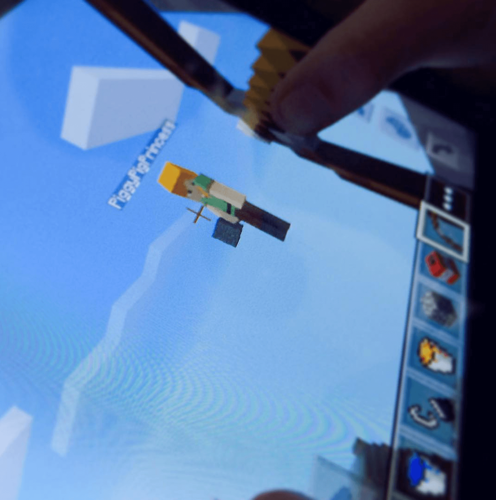
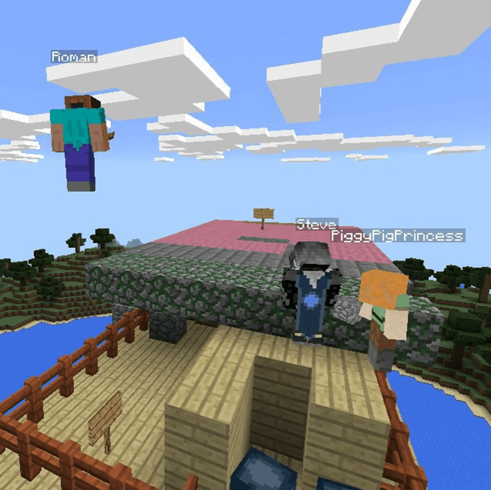
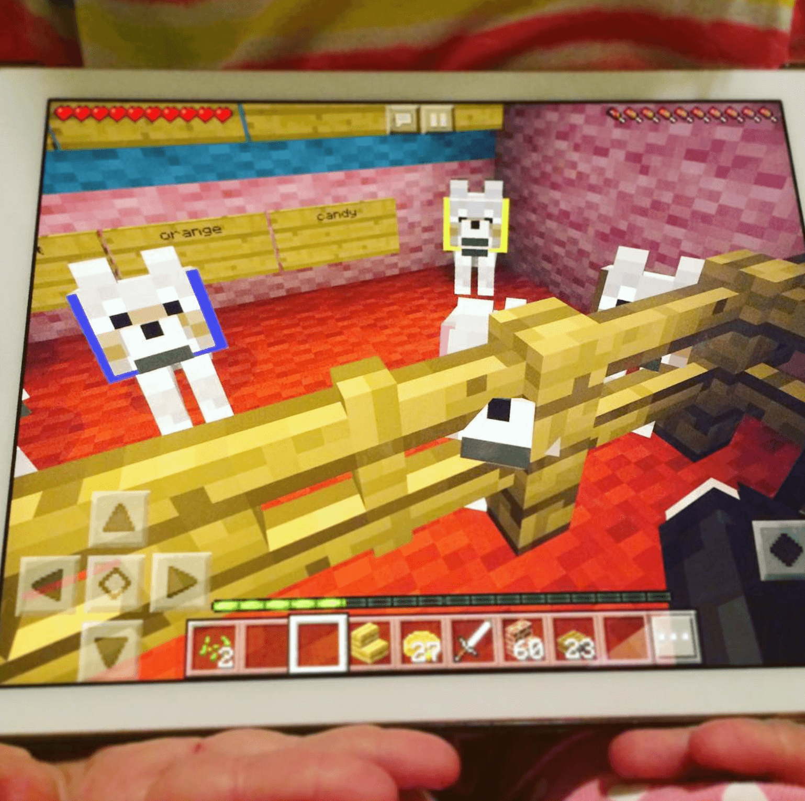

```{r setup, include=FALSE}
knitr::opts_chunk$set(echo = TRUE)
```

# Minecraft

## Toca Blocks

Like minecraft, but not really ¯\\_(ツ)_/¯.


## Minecraft (1/5)

I said, no pointing arrows at your sister!


## Minecraft (2/5)

Look we build a house!



## Minecraft (3/5)

Yay, let's have BDay -- Party


## Minecraft (4/5)

Worlds with unicorns and rainbows where anything can happen.


## Minecraft (5/5)

And maybe grow some skills? 



# Voxels

## Definition

Voxel: Volumetric pixel -- Read, cubes.

Piece of cake. Hcake hard can it be?

Just, add a cube for each voxel, right?

Why is my CPU on!?

Calm down: [0fps.net](https://0fps.net/2012/06/30/meshing-in-a-minecraft-game/)

## Brute Force

8*8*8*6 = 3072 quads -- Hey, look, that's me! 


## Culling

8*8*8*3 = 1536 quads -- Remove inner faced, better than nothing!


## Optimal

6 quads, that would be nice! Right?


## Greedy Math

Here is some fancy math...


## Greedy Hacks

```{js}
self.meshLongestSubset = function(pending) {
    var points = pending.list();

    for (var idx in points) {
      var longestX = self.longest(pending, points[idx], color, [1, 0, 0]);
      var longestY = self.longest(pending, points[idx], color, [0, 1, 0]);
      var longestZ = self.longest(pending, points[idx], color, [0, 0, 1]);
      
      var longest = max(longestX, longestY, longestZ);
      
      self.box(longest.start, longest.end, store.get(longest.start), longest.list);
    }
};
```

## Rendering

Our greedy algorithm gets us 8*6 = 48 quads, not bad!

```{r}
voxels::voxels(array(rep(1, 8*8*8), dim=c(8, 8, 8)), offset = c(-8, 0, -8), wireframe = T)
```

# RayRender


## Bricks

Using rayrender, [https://github.com/ryantimpe/brickr](https://github.com/ryantimpe/brickr).


## Interactive?

Could brickr this be interactive?


# Learning to Code

## Learning Python

"I can neither confirm nor deny my kids learned python"


## Learning R

```{r eval=FALSE}
voxels::voxels(array(c(
    1, 0, 1, 0, 1, 1, 1, 0, 1, 1, 1, 0, 1, 1, 1, 0, 1, 1, 1,
    1, 0, 1, 0, 1, 0, 0, 0, 1, 0, 0, 0, 1, 0, 0, 0, 1, 0, 1,
    1, 1, 1, 0, 1, 1, 1, 0, 1, 0, 0, 0, 1, 0, 0, 0, 1, 0, 1,
    1, 0, 1, 0, 1, 0, 0, 0, 1, 0, 0, 0, 1, 0, 0, 0, 1, 0, 1,
    1, 0, 1, 0, 1, 1, 1, 0, 1, 0, 0, 0, 1, 0, 0, 0, 1, 1, 1
), dim=c(19, 5, 1)), offset = c(-10, 0, 0))
```

## Perlin Noise (1/2)


## Perlin Noise (2/2)


## I'm lazy!

No worries, R has your back :)

```{r}
ambient::noise_perlin(c(5, 5, 1))
```

Wait, can I just pipe them together O_o!

## Maybe, maybe, maybe!

Yes, you can, cause R is pretty awesome!

```{r eval=FALSE}
ceiling(ambient::noise_perlin(c(8, 8, 8)) * 10) %>%
  voxels(offset = c(-10, 0, 0))
```
