```{r setup, echo=FALSE}
knitr::opts_chunk$set(eval = FALSE)
library(nomnoml)
```

# Welcome

## Intros

- Kevin Kuo @kevinykuo
- Javier Luraschi @javierluraschi

## Agenda

- Welcome!
- Introduction to Deep Learning
- Introduction to Tensorflow
- Introduction to Keras

## Local Installation

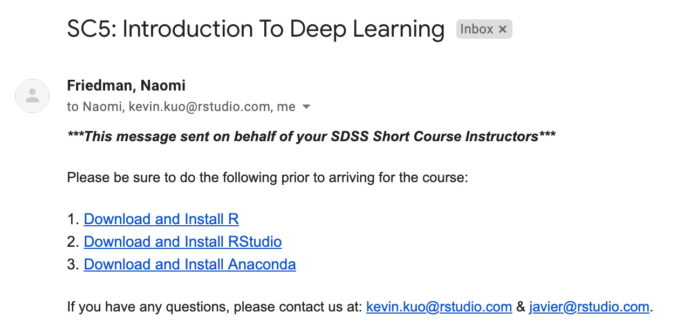

## Workshop Notebook

[github.com/javierluraschi/deeplearning-sdss-2019](https://github.com/javierluraschi/deeplearning-sdss-2019)

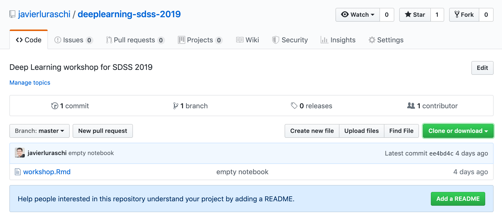

## Why Deep Learning?

Why should I care about Deep Learning?


## ImageNet

2012: [ImageNet classification with deep convolutional neural networks]()


## AlphaGo

2016: AlphaGo wins match against Lee Sedol ranked 9-dan, one of the best players at Go.

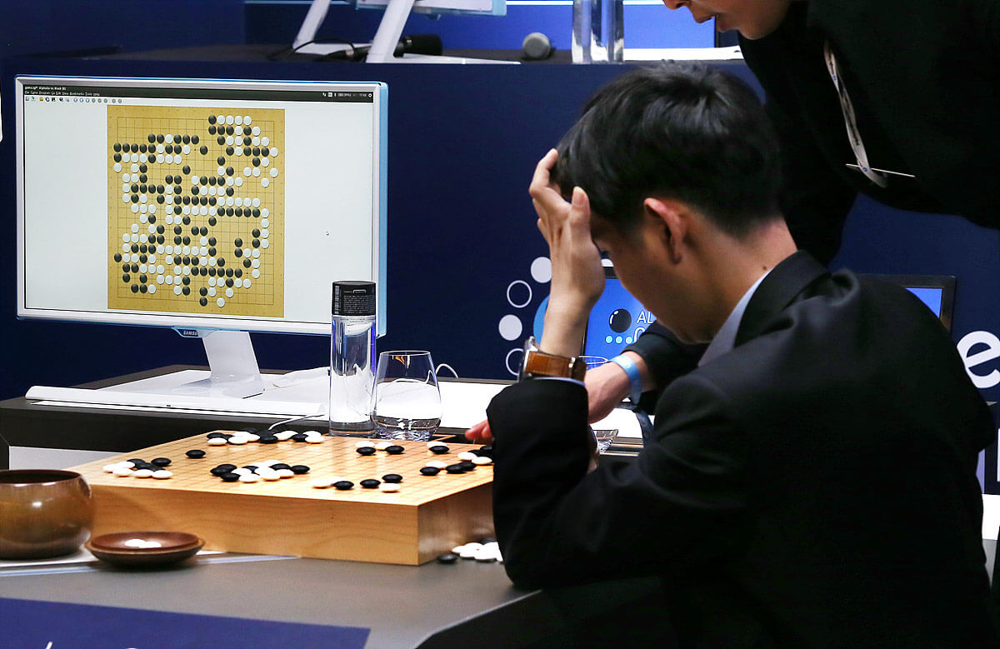

## Popularizing Deep Learning

2017: HBO's Sillicon Valley show "hot dog or not" episode.


## Dota

2018: OpenAI Five defeats top 99.95th percentile Dota players


## Tesla

2019: Tesla's autonomy day presents autonomous driving plan.

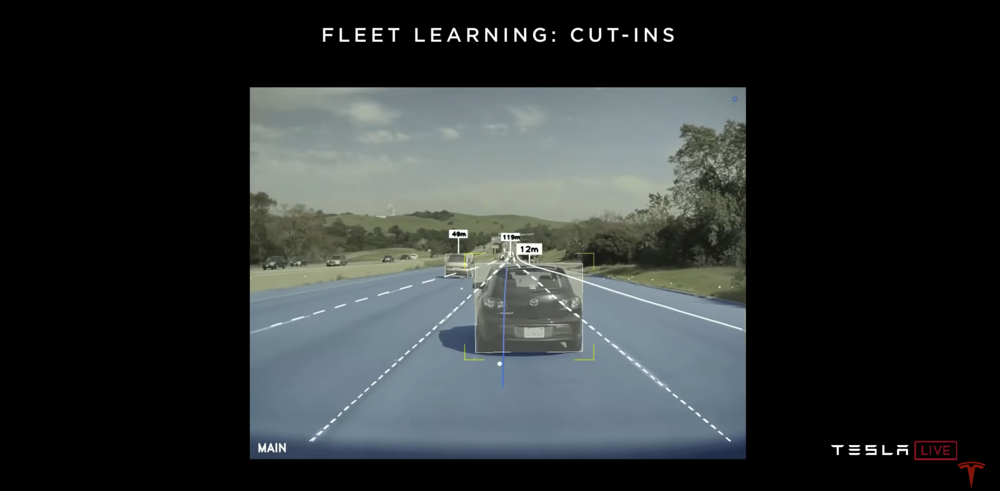

# Introduction to Deep Learning

## A Comprehensive Survey on Deep Learning Approaches


See [arXiv:1803.01164](https://arxiv.org/abs/1803.01164)

## [1943: McCulloch and Pitts](https://www.cs.cmu.edu/~./epxing/Class/10715/reading/McCulloch.and.Pitts.pdf)

McCulloch & Pitts show that neurons can be combined to construct a Turing machine (using ANDs, ORs, & NOTs).


## 1943: McCulloch and Pitts -- Turing Machines


## 1958: Rosenblatt -- The Perceptron

[The perceptron: A probabilistic model for information storage and organization in the brain](https://citeseerx.ist.psu.edu/viewdoc/download;jsessionid=4E9CF4E9BFB2696E709F82AE0555531A?doi=10.1.1.588.3775&rep=rep1&type=pdf)


## 1958: Rosenblatt -- The Perceptron

### Perceptron Diagram

```{nomnoml eval=TRUE, echo=FALSE, width='600px', height='200px'}
#lineWidth: 1
#fontSize: 8
#padding: 10 
#.fun: visual=ellipse 
#spacing: 20
[x1]->[w1]
[x2]->[w2]
[xN]->[wN]
[w1]->[<fun> Σ]
[w2]->[Σ]
[wN]->[Σ]
[b]->[Σ]
[<sum> Σ]->[<fun>T]
[T]->[<hidden>Next]
```

### Perceptron Model

$$
f(x) =
\begin{cases}
1 & \sum_{i=1}^m w_i x_i + b > 0\\
0 & \text{otherwise}
\end{cases}
$$

## 1958: Rosenblatt -- Perceptron (OR)

$$
f(x) =
\begin{cases}
1 & \sum_{i=1}^m w_i x_i + b > 0\\
0 & \text{otherwise}
\end{cases}
$$

```{r}
#             x1 x2                       r = A OR B 
x <- matrix(c(0, 0,                       #      0
              0, 1,                       #      1
              1, 0,                       #      1
              1, 1), ncol = 2, byrow = T) #      1

r <- c(0, 1, 1, 1)

b <- __
w <- c(__, __)

ifelse(x %*% w + b > 0, 1, 0) == r
```

## 1958: Rosenblatt -- Solution (OR)

$$
f(x) =
\begin{cases}
1 & \sum_{i=1}^m w_i x_i + b > 0\\
0 & \text{otherwise}
\end{cases}
$$

```{r}
#             x1 x2                       r = A OR B 
x <- matrix(c(0, 0,                       #      0
              0, 1,                       #      1
              1, 0,                       #      1
              1, 1), ncol = 2, byrow = T) #      1

r <- c(0, 1, 1, 1)

b <- 0
w <- c(0.5, 0.5)

ifelse(x %*% w + b > 0, 1, 0) == r
```

## 1958: Rosenblatt -- Perceptron (AND)

$$
f(x) =
\begin{cases}
1 & \sum_{i=1}^m w_i x_i + b > 0\\
0 & \text{otherwise}
\end{cases}
$$

```{r}
#             x1 x2                       r = A AND B 
x <- matrix(c(0, 0,                       #       0
              0, 1,                       #       0
              1, 0,                       #       0
              1, 1), ncol = 2, byrow = T) #       1

r <- c(0, 0, 0, 1)

b <- __
w <- c(__, __)

ifelse(x %*% w + b > 0, 1, 0) == r
```

## 1958: Rosenblatt -- Solution (AND)

$$
f(x) =
\begin{cases}
1 & \sum_{i=1}^m w_i x_i + b > 0\\
0 & \text{otherwise}
\end{cases}
$$

```{r}
#             x1 x2                       r = A AND B 
x <- matrix(c(0, 0,                       #       0
              0, 1,                       #       0
              1, 0,                       #       0
              1, 1), ncol = 2, byrow = T) #       1

r <- c(0, 0, 0, 1)

b <- -0.5
w <- c(0.5, 0.5)

ifelse(x %*% w + b > 0, 1, 0) == r
```

## 1958: Rosenblatt -- Demo

[Rosenblatt, with the image sensor of the Mark I Perceptron](https://blogs.umass.edu/comphon/2017/06/15/did-frank-rosenblatt-invent-deep-learning-in-1962/) (...) it learned to differentiate between right and left after fifty attempts.


## 1958: Rosenblatt -- Predictions

[Expected to walk, talk, see, write, reproduce itself and be conscious of its existence, although (...) it learned to differentiate between right and left after fifty attempts.](https://www.nytimes.com/1958/07/08/archives/new-navy-device-learns-by-doing-psychologist-shows-embryo-of.html)


## 1958: Rosenblatt -- [Principles of Neurodynamics 1/3](https://apps.dtic.mil/dtic/tr/fulltext/u2/256582.pdf)


## 1958: Rosenblatt -- [Principles of Neurodynamics 2/3](https://apps.dtic.mil/dtic/tr/fulltext/u2/256582.pdf)


## 1958: Rosenblatt -- [Principles of Neurodynamics 3/3](https://apps.dtic.mil/dtic/tr/fulltext/u2/256582.pdf)


## 1969: Minsky and Papert -- Book (1/3)


## 1969: Minsky and Papert -- Book (2/3)


## 1969: Minsky and Papert -- Exercise (XOR)

$$
f(x) =
\begin{cases}
1 & \sum_{i=1}^m w_i x_i + b > 0\\
0 & \text{otherwise}
\end{cases}
$$

```{r}
#             A  B                        r = A XOR B 
x <- matrix(c(0, 0,                       #       0
              0, 1,                       #       1
              1, 0,                       #       1
              1, 1), ncol = 2, byrow = T) #       0

r <- c(0, 1, 1, 0)

b <- __
w <- c(__, __)

ifelse(x %*% w + b > 0, 1, 0) == r
```

## 1969: Minsky and Papert -- Book (3/3)

[It ought to be possible to devise a training algorithm to optimize the weights in this using (...) we have not investigated this](https://www.quora.com/Why-did-Minsky-incorrectly-conjecture-the-inability-of-multi-layer-perceptrons-to-learn-non-linear-functions).


## 1969: Minsky and Papert -- Diagram (XOR)

Using multiple layered perceptrons should allow us to find a solution for the XOR table.

```{nomnoml eval=TRUE, echo=FALSE, width='800px', height='500px', fig.align='center'}
#lineWidth: 1
#fontSize: 8
#padding: 10 
#.fun: visual=ellipse 
#spacing: 20
[x]->[Perceptron(1)|
  
[x1]->[w1]
[x2]->[w2]
[xN]->[wN]
[w1]->[<fun> Σ]
[w2]->[Σ]
[wN]->[Σ]
[b]->[Σ]
[<sum> Σ]->[<fun>T]
        
]
[x]->[Perceptron(2) | 

[x1]->[w1]
[x2]->[w2]
[xN]->[wN]
[w1]->[<fun> Σ]
[w2]->[Σ]
[wN]->[Σ]
[b]->[Σ]
[<sum> Σ]->[<fun>T]

]
[Perceptron(1)]->[Perceptron(3) |

[b1]->[w1]
[b2]->[w2]
[w1]->[<fun> Σ]
[w2]->[Σ]
[b]->[Σ]
[<sum> Σ]->[<fun>T]
                    
]
[Perceptron(2)]->[Perceptron(3)]
[Perceptron(3)]->[<hidden>Next]
```

## 1969: Minsky and Papert -- Layered (XOR)

```{r}
#             A  B  (1 for bias)             r = A XOR B 
x <- matrix(c(0, 0, 1,                       #       0
              0, 1, 1,                       #       1
              1, 0, 1,                       #       1
              1, 1, 1), ncol = 3, byrow = T) #       0

r <- c(0, 1, 1, 0)

w <- matrix(c( ___,  ___,  ___,
               ___,  ___,  ___,
               ___,  ___,  ___), ncol = 3, byrow = T)
              
yh1 <- ifelse(x %*% w[1,] > 0, 1, 0)
yh2 <- ifelse(x %*% w[2,] > 0, 1, 0)

x3 <- matrix(c(yh1, yh2, c(1,1,1,1)), ncol = 3)
ifelse(x3 %*% w[3,] > 0, 1, 0) == r
```

## 1969: Minsky and Papert -- Solution (XOR)

```{r}
#             A  B  (1 for bias)             r = A XOR B 
x <- matrix(c(0, 0, 1,                       #       0
              0, 1, 1,                       #       1
              1, 0, 1,                       #       1
              1, 1, 1), ncol = 3, byrow = T) #       0
r <- c(0, 1, 1, 0)

w <- matrix(c(0.5, -0.5,  0.5,
              0.5, -0.5,  0.5,
              0.0,  1.0, -0.5), ncol = 3, byrow = T)
              
yh <- ifelse(x %*% w[,1:2] > 0, 1, 0)
x3 <- matrix(c(yh[,1], yh[,2], c(1,1,1,1)), ncol = 3)
ifelse(x3 %*% w[,3] > 0, 1, 0) == r
```

## 1985: Hinton -- Gradient Descent

[A Learning Algorithm for Boltzmann Machines](https://www.enterrasolutions.com/media/docs/2013/08/cogscibm.pdf)

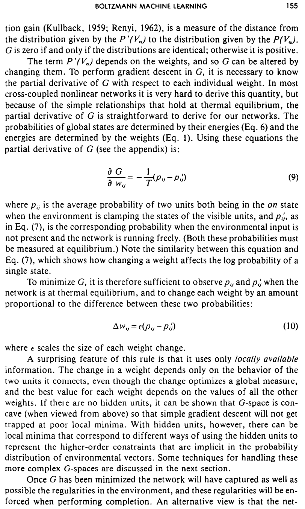

## 1985: Hinton -- [Gradient Descent Today](https://en.wikipedia.org/wiki/Gradient_descent)

A function decreases fastest if one goes from in the direction of the negative gradient.

$$
a_{n+1} = a_n - \gamma \nabla F(a_n)
$$

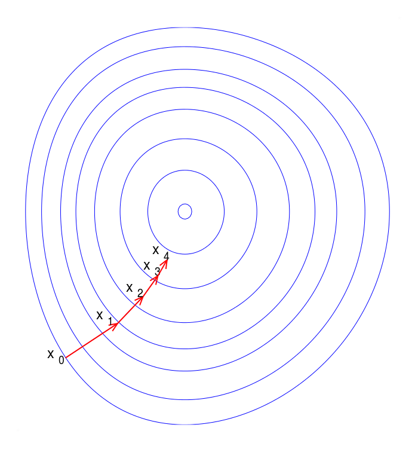

## 1985: Hinton -- Gradient Descent

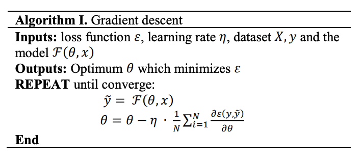

## 1985: Hinton -- Stochastic Gradient Descent

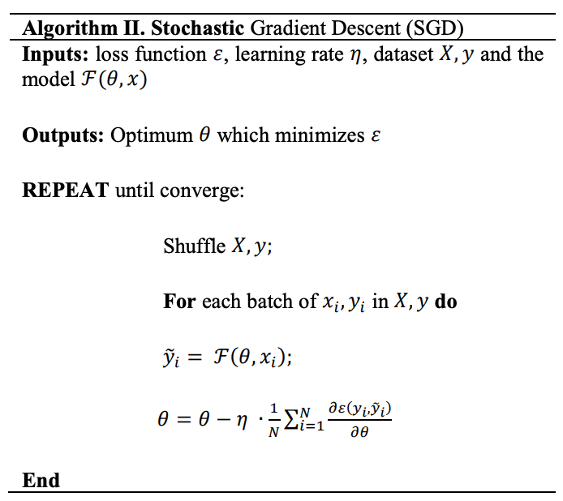

## 1985: Hinton -- Back-Propagation

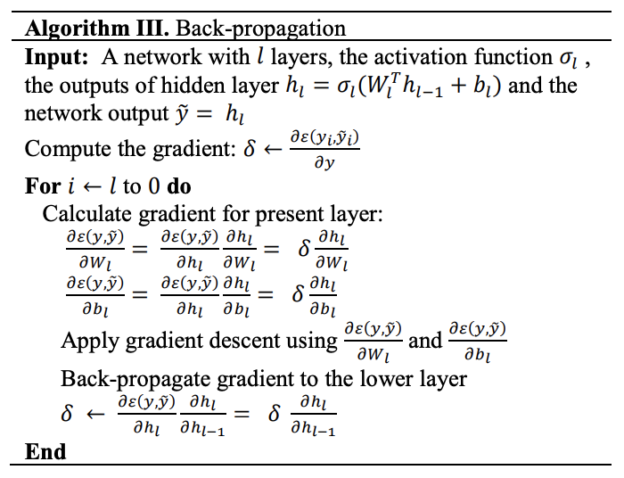

## 1985: Hinton -- Exercise (AND) -- Differentiable

Gradient descent requires differentiable functions,

$$
f(x) =
\begin{cases}
1 & \sum_{i=1}^m w_i x_i + b > 0\\
0 & \text{otherwise}
\end{cases}
$$

We use instead the ReLU, which is almost differentiable:

$$ max(0,\sum_{i=1}^m w_i x_i + b) $$

## 1985: Hinton -- Exercise (AND) -- Differentiate

Lets differentiate L2 over a perceptron with ReLU, where $\theta$ is the step function.

$$
(f(w_1, w_2, b) - y)^2 = (max(0,(w_1 x_1 + w_2 x_2 + b)) - y)^2
$$

$$
\frac{df(w_1, w_2, b)}{w_1} = 2 * (f(w_1, w_2, b) - y) * \theta({w_1 x_1 + w_2 x_2 + b}) * x_1 \\
\frac{df(w_1, w_2, b)}{w_2} = 2 * (f(w_1, w_2, b) - y) * \theta({w_1 x_1 + w_2 x_2 + b}) * x_2 \\
\frac{df(w_1, w_2, b)}{b} = 2 * (f(w_1, w_2, b) - y) * \theta({w_1 x_1 + w_2 x_2 + b}) 
$$
The we can iterate following the gradients direction,

$$
a_{n+1} = a_n - \gamma \nabla F(a_n)
$$

## 1985: Hinton -- Exercise (AND)

```{r}
w_1=0.1; w_2=0.2; b=0.3; learn=0.1;

#             A  B                        r = A AND B 
x <- matrix(c(0, 0,                       #       0
              0, 1,                       #       0
              1, 0,                       #       0
              1, 1), ncol = 2, byrow = T) #       1
r <- c(0, 0, 0, 1)

f <- function(w_1, w_2, b, x_1, x_2) w_1 * x_1 + w_2 * x_2 + b
step <- function(x) ifelse(x < 0, 0, 1)

for (i in 1:1000) {
  f_1 <- f(w_1, w_2, b, x[,1], x[,2])
  w_1 <- w_1 - ___
  w_2 <- w_2 - ___
  b <- b - ___
}

(f(w_1, w_2, b, x[,1], x[,2]) > 0.01) == as.logical(r)
```

## 1985: Hinton -- Solution (AND)

```{r}
w_1=0.1; w_2=0.2; b=0.3; learn=0.1;
x <- matrix(c(0, 0, 1, 1,
              0, 1, 0, 1), nrow = 4)
r <-        c(0, 0, 0, 1)

f <- function(w_1, w_2, b, x_1, x_2) w_1 * x_1 + w_2 * x_2 + b
step <- function(x) ifelse(x < 0, 0, 1)

for (i in 1:1000) {
  f_1 <- f(w_1, w_2, b, x[,1], x[,2])
  w_1 <- w_1 - sum(learn * (2 * (pmax(0, f_1) - r) * step(f_1) * x[,1]))
  w_2 <- w_2 - sum(learn * (2 * (pmax(0, f_1) - r) * step(f_1) * x[,2]))
  b <- b - sum(learn * (2 * (pmax(0, f_1) - r)) * step(f_1))
}

(f(w_1, w_2, b, x[,1], x[,2]) > 0.01) == as.logical(r)
```

## 1985: Hinton -- Applications

1989: [ALVINN: An Autonomous Land Vehicle in a Neural Network](https://papers.nips.cc/paper/95-alvinn-an-autonomous-land-vehicle-in-a-neural-network.pdf)

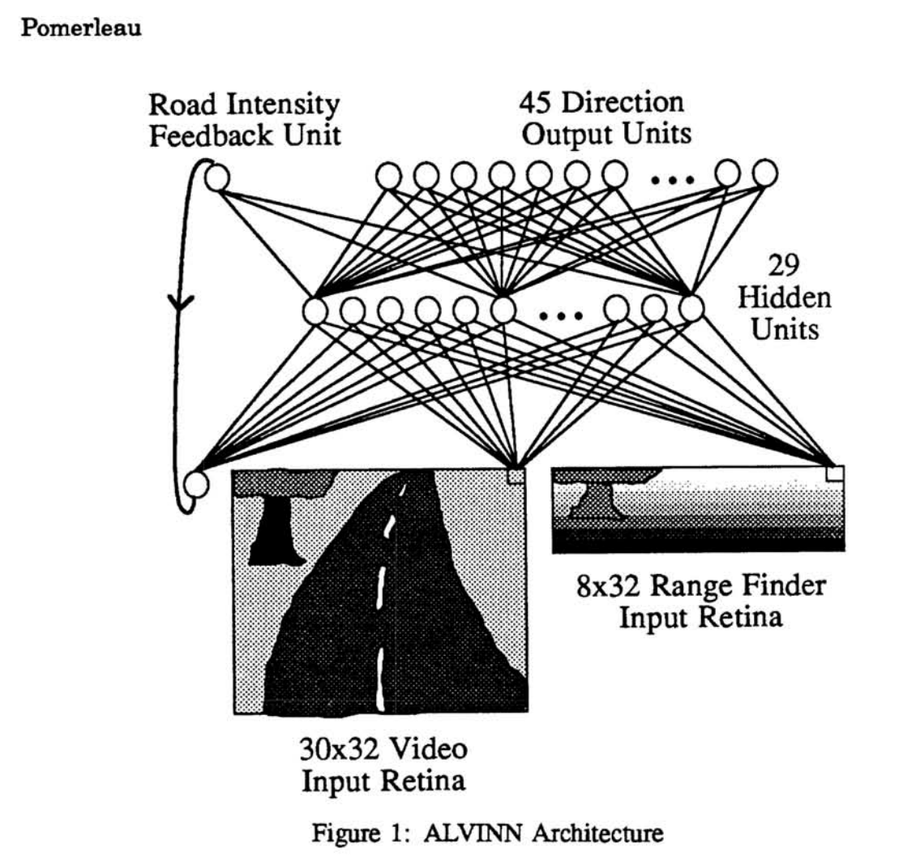

[https://www.youtube.com/watch?v=ntIczNQKfjQ](https://www.youtube.com/watch?v=ntIczNQKfjQ)

## 1985: Hinton -- Deep Networks

The [vanishing gradient problem](https://en.wikipedia.org/wiki/Vanishing_gradient_problem) is when the gradient will be vanishingly small, effectively preventing the weight from changing its value.

```{nomnoml eval=TRUE, echo=FALSE, width='800px', height='500px', fig.align='center'}
#spacing: 30
#padding: 14
#bendSize: 0.7
#.p: visual=ellipse 
[<hidden>x1]->[<p>P1]
[<hidden>x2]->[<p>P2]
[<hidden>x3]->[<p>P3]
[P1]->[<p>P4]
[P2]->[P4]
[P3]->[P4]
[P1]->[<p>P5]
[P2]->[P5]
[P3]->[P5]
[P4]->[<p>P6]
[P5]->[P6]
[P4]->[<p>P7]
[P5]->[P7]
[P6]->[<p>P8]
[P7]->[P8]
[P6]->[<p>P9]
[P7]->[P9]
[P8]->[<p>P10]
[P9]->[P10]
[P10]->[<hidden>x]
```

## 2006: Hinton -- Train One Layer

[A fast learning algorithm for deep belief nets](https://www.cs.toronto.edu/~hinton/absps/fastnc.pdf)

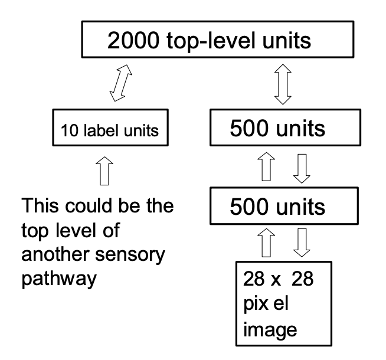

## 2006: Hinton -- Autoencoders

[Reducing the dimensionality of data with neural networks](https://www.cs.toronto.edu/~hinton/science.pdf)

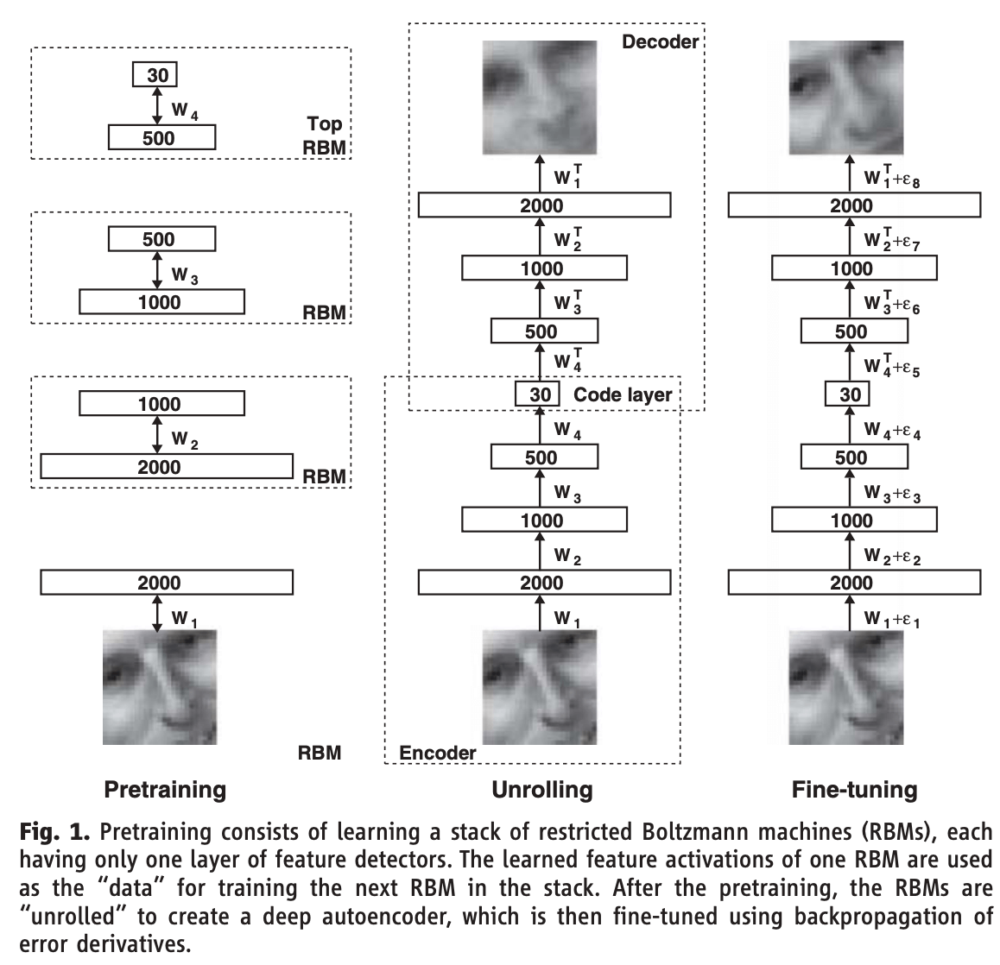

## 2006: Hinton -- Dimensionality

[Reducing the dimensionality of data with neural networks](https://www.cs.toronto.edu/~hinton/science.pdf)

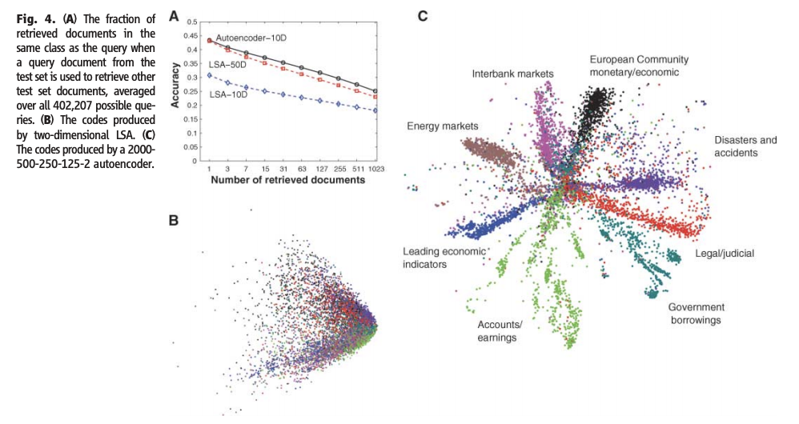

## 2012: AlexNet -- 

[ImageNet Classification with Deep Convolutional Neural Networks](https://papers.nips.cc/paper/4824-imagenet-classification-with-deep-convolutional-neural-networks.pdf)

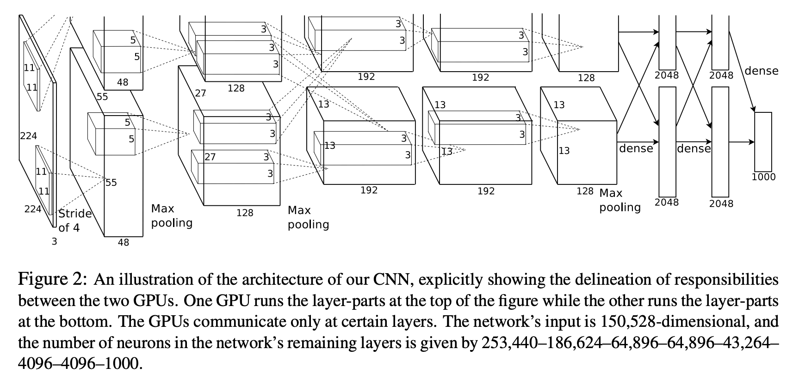

Used ReLU, dropout, augmentation, GPUs.

## 2016: Karpathy -- Computational Graphs

Computational graphs avoid manually computing gradients.

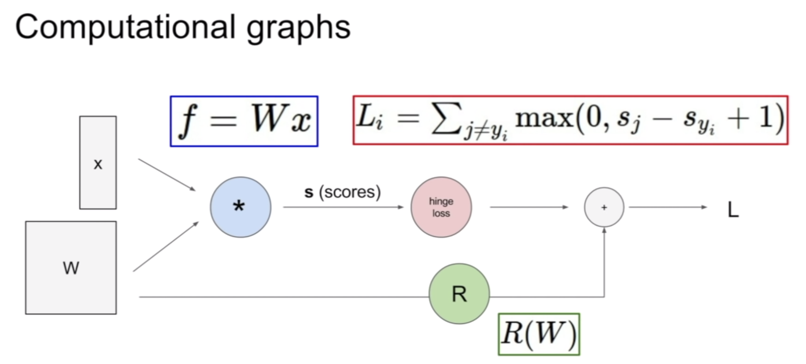

[CS231n Winter 2016: Lecture 4: Backpropagation, Neural Network](https://www.youtube.com/watch?v=i94OvYb6noo)

## 2016: Karpathy -- Simple Graph

Simple computational graph example.

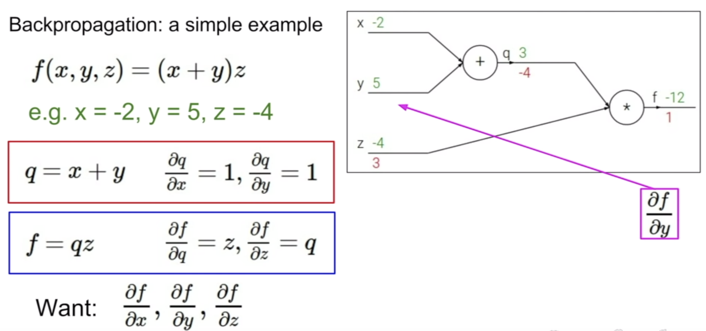

## 2016: Karpathy -- Complex Graph

Can then combine into very complex graphs using the chain rule:

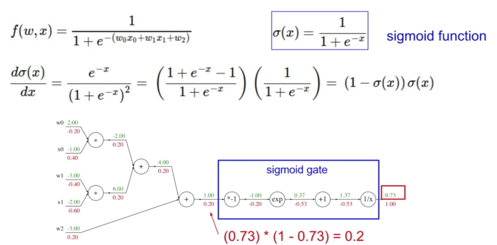

## 2016: Karpathy -- Exercise (Graph)

Define the computation graph for the sigmoid function.

$$ \sigma (x) =  \frac{1 }{1 + e^{-x} } $$

```{r}
graph <- list(
  forward = function(x) -1 * x,
  backward = function(x) -1,
  node = list(
    forward = ___,
    backward = ___,
    node = ___
  )
)
```

## 2016: Karpathy -- Solution (Graph)

```{r}
graph <- list(
  forward = function(x) -1 * x,
  backward = function(x) -1,
  node = list(
    forward = function(x) e ^ (-x),
    backward = function(x) - e ^ (-x),
    node = list(
      forward = function(x) x + 1,
      backward = function(x) 1,
      node = list(
        forward = function(x) 1 / x,
        backward = function(x) - 1 / x ^ 2
      )
    )
  )
)
```

# Introduction to Tensorflow

## What is TensorFlow?

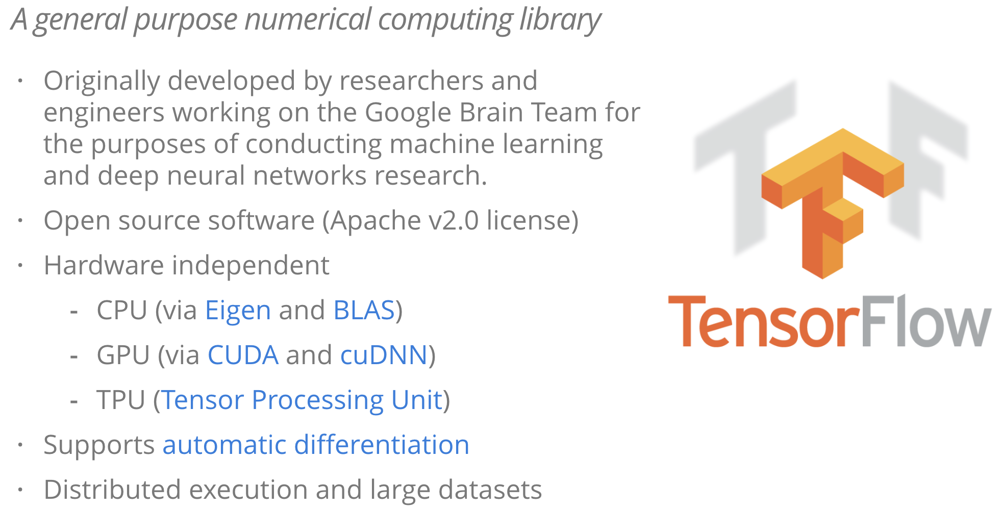

[Slides from JJ's rstudio::cong 2018 Keynote](https://beta.rstudioconnect.com/ml-with-tensorflow-and-r)

## Why should R users care?

- A new general purpose numerical computing library!
  - Hardware independent
  - Distributed execution
  - Large datasets
  - Automatic differentiation
- Very general built-in optimization algorithms (SGD, Adam) that don't require that all data is in RAM
- Robust foundation for machine learning and deep learning applications
- TensorFlow models can be deployed with a low-latency C++ runtime
- R has a lot to offer as an interface language for TensorFlow

## What is tensor "flow"?

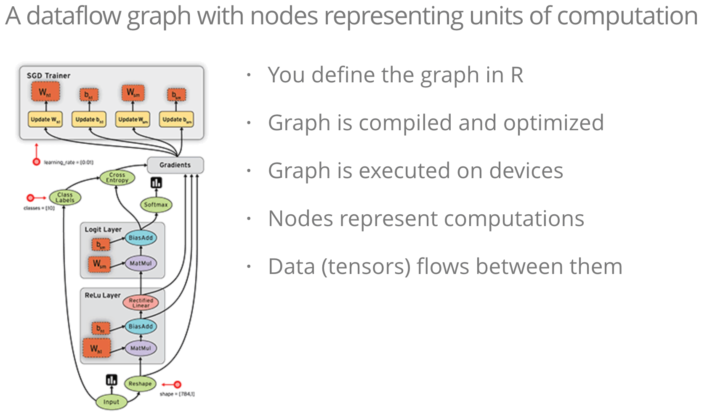

## Graph is generated from Code

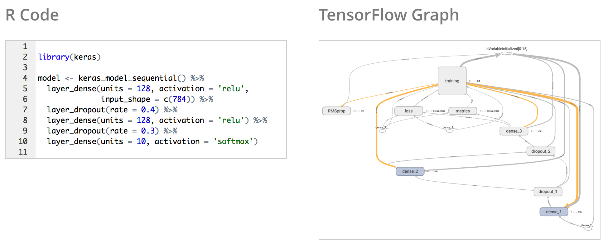

## What is deep learning?

A simple mechanism that, once scaled, ends up looking like magic

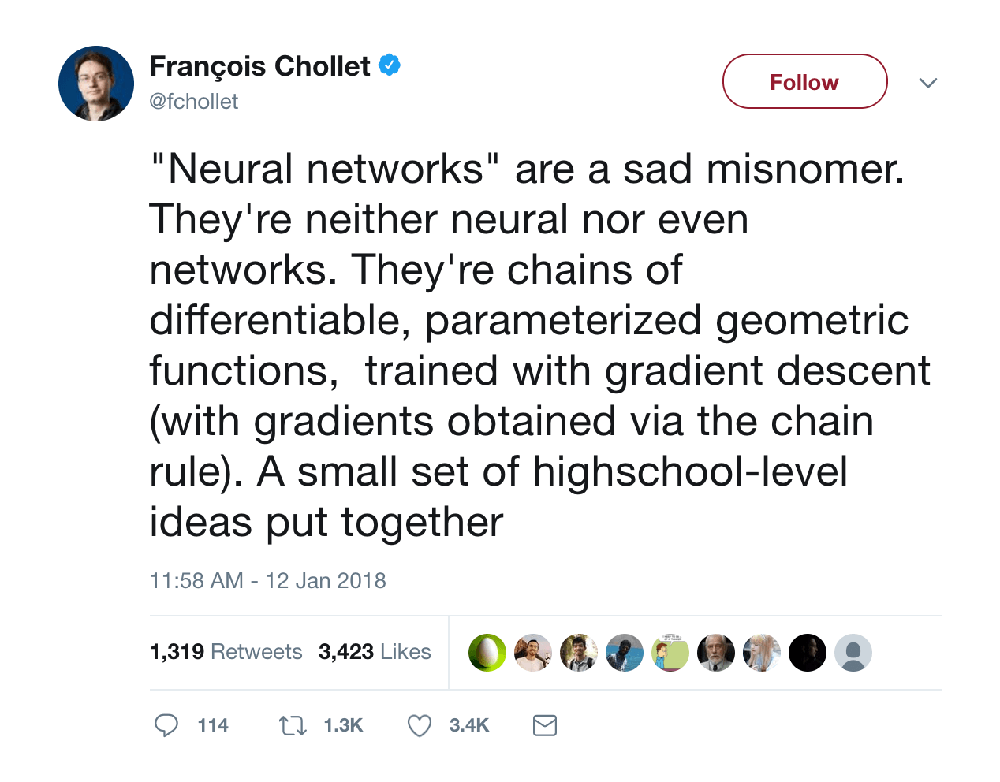

## Keras Adoption

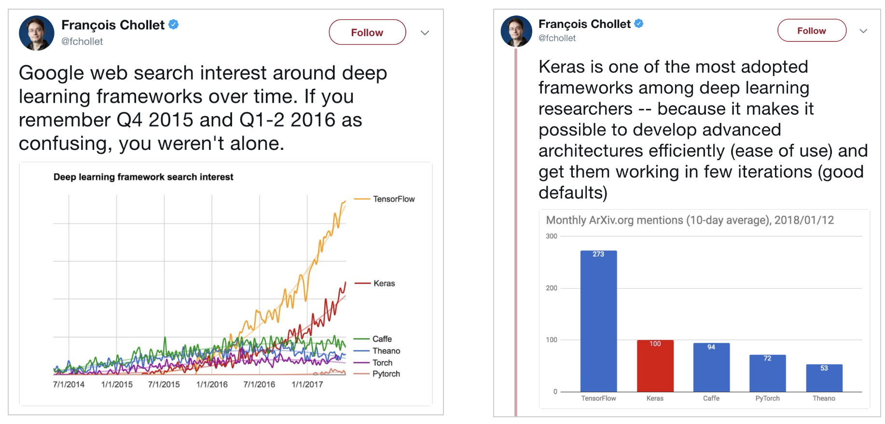

## Keras for R cheatsheet

[github.com/rstudio/cheatsheets/raw/master/keras.pdf](https://github.com/rstudio/cheatsheets/raw/master/keras.pdf)


# Introduction to Keras

## Installing Tensorflow -- Exercise 

```{r}
install.packages("tensorflow")
install_tensorflow()
```

What version you have installed?

## Installing Tensorflow -- Help!

If your local environment is not working...

[rstd.io/class](rstd.io/class)

Also, you can fint the version with,

```{r}
tensorflow::tf_version()
```
```
[1] ‘1.13’
```

## Installing Keras -- Exercise

```{r}
install.packages("keras")
install_keras()
```

## Kyphosis -- Packages

Load 'em packages!

```{r}
library(rpart)
library(rsample)
library(keras)
library(recipes)
library(tidyverse)
library(yardstick)
options(yardstick.event_first = FALSE)
```

## Kyphosis -- Quick View

Let's look at the data we're working with

```{r}
___(kyphosis)
```

## Kyphosis -- Quick View (Solution)

Let's look at the data we're working with

```{r}
glimpse(kyphosis)
```

## Kyphosis -- Split

We're going to predict whether kyphosis is present.

First, we'll perform an initial split into training/testing of the dataset.

```{r}
data_split <- initial_split(kyphosis, prop = 3/4, strata = ___)
training_data <- training(___)
testing_data <- testing(___)
```

## Kyphosis -- Split (Solution)

We're going to predict whether kyphosis is present.

First, we'll perform an initial split into training/testing of the dataset.

```{r}
data_split <- initial_split(kyphosis, prop = 3/4, strata = "Kyphosis")
training_data <- training(data_split)
testing_data <- testing(data_split)
```

## Kyphosis -- GLM

Let's build our favorite classification model!

```{r}
logreg <- glm(___, data = training_data,
              family = binomial("logit"))
```

## Kyphosis -- GLM (Solved)

Let's build our favorite classification model!

```{r}
logreg <- glm(Kyphosis ~ Age + Number + Start, data = training_data,
              family = binomial("logit"))
```

## Kyphosis -- Predictions

Create a data frame with the predictions.

```{r}
predicted <- testing_data %>% 
  ___(present = predict(___, testing_data, type = "response"))
```

## Kyphosis -- Predictions (Solved)

Create a data frame with the predictions.

```{r}
predicted <- testing_data %>% 
  mutate(present = predict(logreg, testing_data, type = "response"))
```

## Kyphosis -- Calculate AUC

Calculate AUC

```{r}
roc_auc(___)
```

## Kyphosis -- Calculate AUC (Solved)

Calculate AUC

```{r}
roc_auc(predicted, Kyphosis, present)
```
```
[1] 0.719
```

## Kyphosis -- "Neural net"

```{r}
model1 <- keras_model_sequential() %>% 
  layer_dense(___, input_shape = ___, activation = "softmax")

model1 %>% 
  compile(loss = "binary_crossentropy",
          optimizer = ___(lr = 0.001),
          metrics = "accuracy")

```

## Kyphosis -- "Neural net" (Solution)

"Neural net"

```{r}
model1 <- keras_model_sequential() %>% 
  layer_dense(2, input_shape = 3, activation = "softmax")

model1 %>% 
  compile(loss = "binary_crossentropy",
          optimizer = optimizer_adam(lr = 0.001),
          metrics = "accuracy")

```

## Kyphosis -- Data prep

Data prep

```{r}
x <- training_data %>% 
  select(Age, Number, Start) %>% 
  as.matrix()

# As categorical: Kyphosis - 1
y <- to_categorical(___)
```

## Kyphosis -- Data prep (Solution)

Data prep

```{r}
x <- training_data %>% 
  select(Age, Number, Start) %>% 
  as.matrix()
y <- training_data$Kyphosis %>% 
  as.integer() %>% 
  `-`(1) %>% 
  to_categorical()
```

## Kyphosis -- Fit the model

Fit the model

```{r}
model1 %>%  fit(___)
```

## Kyphosis -- Fit the model (Solution)

Fit the model

```{r}
model1 %>% 
  fit(x = x, y = y, batch_size = 32, epochs = 100, verbose = 0)
```

## Kyphosis -- Predictions and AUC

```{r}
predictions <- predict(model1, ___)
predicted <- testing_data %>% 
  mutate(present = predictions[,2])

roc_auc(predicted, Kyphosis, present)
```

## Kyphosis -- Predictions and AUC (Solution)

```{r}
predictions <- predict(model1, testing_data %>% 
                             select(Age, Number, Start) %>% 
                             as.matrix())
predicted <- testing_data %>% 
  mutate(present = predictions[,2])

roc_auc(predicted, Kyphosis, present)
```

Try adding more layers to make this perform better!

## Kyphosis -- Data Preprocessing

Neural nets are easier to train when the predictors have similar magnitudes, see last section from notebook.

## JJ's Keynote

[beta.rstudioconnect.com/ml-with-tensorflow-and-r](https://beta.rstudioconnect.com/ml-with-tensorflow-and-r)

