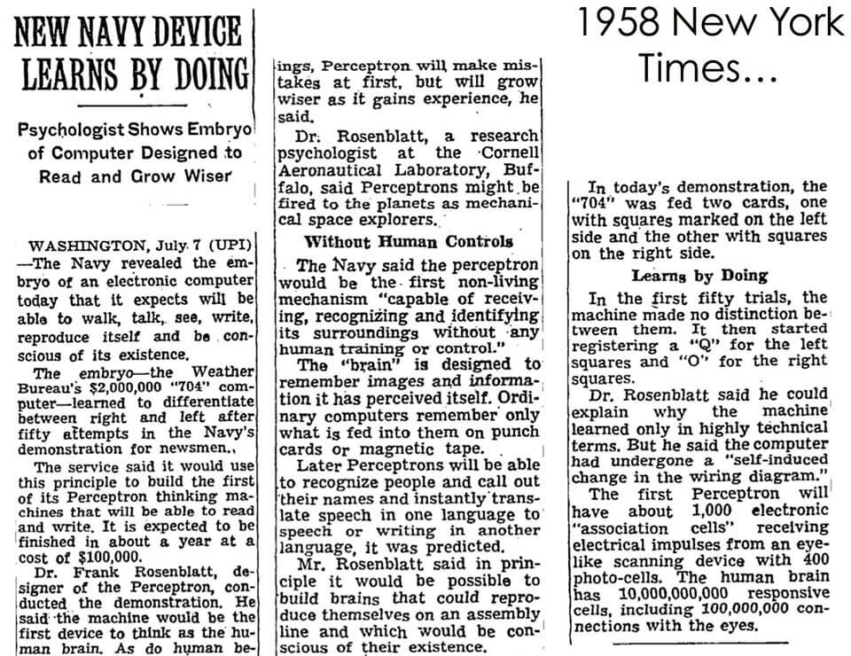

```{r setup, echo=FALSE}
knitr::opts_chunk$set(eval = FALSE)
```

# Agenda

## Agenda

- Introduction to Deep Learning
- Introduction to Tensorflow and Keras
- Hands-on with Keras
- Advanced Deep Learning Topics

# Introduction to Deep Learning

## A Comprehensive Survey on Deep Learning Approaches


See [arXiv:1803.01164](https://arxiv.org/abs/1803.01164)

## [1943: McCulloch and Pitts](https://www.cs.cmu.edu/~./epxing/Class/10715/reading/McCulloch.and.Pitts.pdf)

McCulloch & Pitts show that neurons can be combined to construct a Turing machine (using ANDs, ORs, & NOTs).


## 1943: McCulloch and Pitts -- Turing Machines


## 1958: Rosenblatt -- The Perceptron

[The perceptron: A probabilistic model for information storage and organization in the brain](https://citeseerx.ist.psu.edu/viewdoc/download;jsessionid=4E9CF4E9BFB2696E709F82AE0555531A?doi=10.1.1.588.3775&rep=rep1&type=pdf)


## 1958: Rosenblatt -- Exercise (OR)

$$
f(x) =
\begin{cases}
1 & \sum_{i=1}^m w_i x_i + b > 0\\
0 & \text{otherwise}
\end{cases}
$$

```{r}
tt_or <- tibble(
  a = c(0, 0, 1, 1),
  b = c(0, 1, 0, 1),
  r = c(0, 1, 1, 1)
) %>% print()
```

```{r}
x <- as.matrix(select(tt_or, a, b))

b <- __
w <- c(__, __)

ifelse(w %*% x + b > 0, 1, 0)
```

## 1958: Rosenblatt -- Exercise (AND)

$$
f(x) =
\begin{cases}
1 & \sum_{i=1}^m w_i x_i + b > 0\\
0 & \text{otherwise}
\end{cases}
$$

```{r}
library(tidyverse)
tt_and <- tibble(
  a = c(0, 0, 1, 1),
  b = c(0, 1, 0, 1),
  r = c(0, 0, 0, 1)
) %>% print()
```

```{r}
x <- as.matrix(select(tt_and, a, b))

b <- __
w <- c(__, __)

ifelse(w %*% x + b > 0, 1, 0)
```

## 1958: Rosenblatt -- Demo

[Rosenblatt, with the image sensor of the Mark I Perceptron](https://blogs.umass.edu/comphon/2017/06/15/did-frank-rosenblatt-invent-deep-learning-in-1962/) (...) it learned to differentiate between right and left after fifty attempts.


## 1958: Rosenblatt -- Predictions

[Expected to walk, talk, see, write, reproduce itself and be conscious of its existence, although (...) it learned to differentiate between right and left after fifty attempts.](https://www.nytimes.com/1958/07/08/archives/new-navy-device-learns-by-doing-psychologist-shows-embryo-of.html)



## 1958: Rosenblatt -- [Principles of Neurodynamics 1/3](https://apps.dtic.mil/dtic/tr/fulltext/u2/256582.pdf)


## 1958: Rosenblatt -- [Principles of Neurodynamics 2/3](https://apps.dtic.mil/dtic/tr/fulltext/u2/256582.pdf)


## 1958: Rosenblatt -- [Principles of Neurodynamics 3/3](https://apps.dtic.mil/dtic/tr/fulltext/u2/256582.pdf)


## 1969: Minsky and Papert -- Book (1/3)


## 1969: Minsky and Papert -- Book (2/3)


## 1969: Minsky and Papert -- Exercise (XOR)

$$
f(x) =
\begin{cases}
1 & \sum_{i=1}^m w_i x_i + b > 0\\
0 & \text{otherwise}
\end{cases}
$$

```{r}
tt_xor <- tibble(
  a = c(0, 0, 1, 1),
  b = c(0, 1, 0, 1),
  r = c(0, 1, 1, 0)
) %>% print()
```

```{r}
x <- as.matrix(select(tt_xor, a, b))

b <- __
w <- c(__, __)

ifelse(w %*% x + b > 0, 1, 0)
```

## 1969: Minsky and Papert -- Book (3/3)

[It ought to be possible to devise a training algorithm to optimize the weights in this using (...) we have not investigated this](https://www.quora.com/Why-did-Minsky-incorrectly-conjecture-the-inability-of-multi-layer-perceptrons-to-learn-non-linear-functions).


## 1969: Minsky and Papert -- Solution (XOR)

```{r}
tt_xor <- tibble(
  a = c(0, 0, 1, 1),
  b = c(0, 1, 0, 1),
  c = c(1, 1, 1, 1),
  r = c(0, 1, 1, 0)
) %>% print()
```

```{r}
x <- as.matrix(select(tt_xor, a, b, c))
w <- matrix(c( 0.5,  0.5,    0,
              -0.5, -0.5,    1,
               0.5,  0.5, -0.5), ncol = 3, byrow = T)
              
yh1 <- ifelse(x %*% w[1,] > 0, 1, 0)
yh2 <- ifelse(x %*% w[2,] > 0, 1, 0)

x3 <- matrix(c(yh1, yh2, c(1,1,1,1)), ncol = 3)
ifelse(x3 %*% w[3,] > 0, 1, 0)
```

## 1985: Hinton -- Gradient Descent

[A Learning Algorithm for Boltzmann Machines](https://www.enterrasolutions.com/media/docs/2013/08/cogscibm.pdf)


## 1985: Hinton -- [Gradient Descent Today](https://en.wikipedia.org/wiki/Gradient_descent)

A function decreases fastest if one goes from in the direction of the negative gradient.

$$
a_{n+1} = a_n - \gamma \nabla F(a_n)
$$


## 1985: Hinton -- Differentiable Functions

Gradient descent requires differentiable functions,

$$
f(x) =
\begin{cases}
1 & \sum_{i=1}^m w_i x_i + b > 0\\
0 & \text{otherwise}
\end{cases}
$$

So let's start with a differentiable perceptron,

$$
f(x_1, x_2) = w_1 x_1 + w_2 x_2 + b
$$

## 1985: Hinton -- Differentite

Lets differentiate L2 over a perceptron to find optimal solutions,

$$
(f(w_1, w_2, b) - y)^2 = ((w_1 x_1 + w_2 x_2 + b) - y)^2
$$

$$
\frac{df(w_1, w_2, b)}{w_1} = 2 * (f(w_1, w_2, b) - y) * x_1 \\
\frac{df(w_1, w_2, b)}{w_2} = 2 * (f(w_1, w_2, b) - y) * x_2 \\
\frac{df(w_1, w_2, b)}{b} = 2 * (f(w_1, w_2, b) - y)
$$

## 1985: Hinton -- Exercise (AND)

```{r}
w_1=0.1; w_2=0.2; b=0.3; step=0.01;
f <- function(w_1, w_2, b, x_1, x_2) w_1 * x_1 + w_2 * x_2 + b
```

Approximate,

$$
a_{n+1} = a_n - \gamma \nabla F(a_n)
$$

$$
\frac{df(w_1, w_2, b)}{w_1} = 2 * (f(w_1, w_2, b) - y) * x_1 \\
\frac{df(w_1, w_2, b)}{w_2} = 2 * (f(w_1, w_2, b) - y) * x_2 \\
\frac{df(w_1, w_2, b)}{b} = 2 * (f(w_1, w_2, b) - y)
$$

## 1985: Hinton -- Algorithm (R)

Initialize,

```{r}
w_1=0.1; w_2=0.2; b=0.3
x_1=1.0; x_2=0.0; y=0.0
step=0.01;

f <- function(w_1, w_2, b, x_1, x_2) w_1 * x_1 + w_2 * x_2 + b
```

Approximate,

```{r}
for (i in 1:1000) {
  f_1 <- f(w_1, w_2, b, tt_and$a, tt_and$b)
  w_1 <- w_1 - sum(step * (2 * (f_1 - tt_and$r) * tt_and$a))
  w_2 <- w_2 - sum(step * (2 * (f_1 - tt_and$r) * tt_and$b))
  b <- b - sum(step * (2 * (f_1 - tt_and$r)))
}
```

## 1985: Hinton -- R Code

```{r}
df_w1 <- x1
```

# Introduction to Tensorflow and Keras

## JJ's Keynote

[beta.rstudioconnect.com/ml-with-tensorflow-and-r](https://beta.rstudioconnect.com/ml-with-tensorflow-and-r)

# Hands-on with Keras

## Installing Tensorflow -- Exercise 

## Installing Keras -- Exercise
