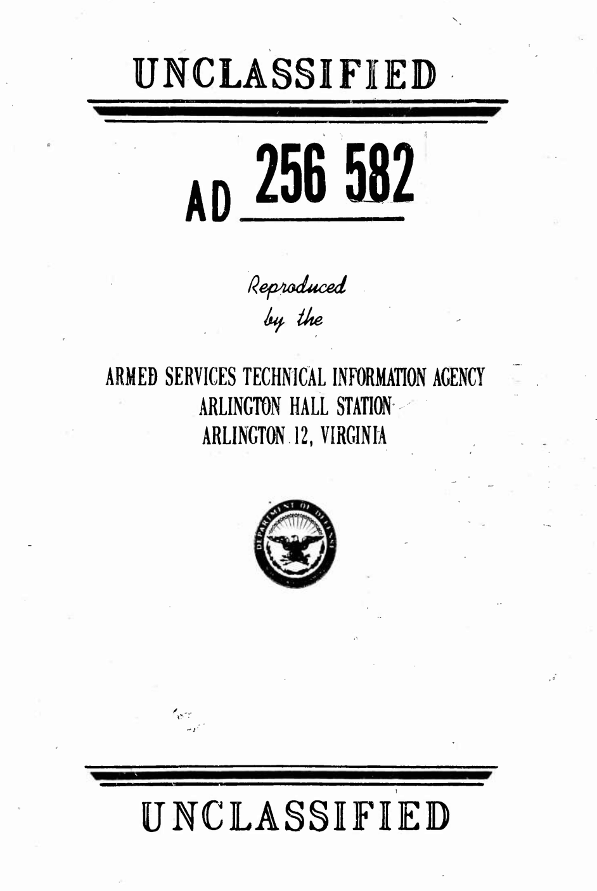
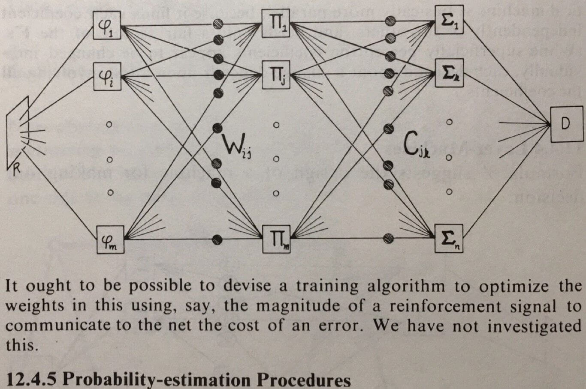
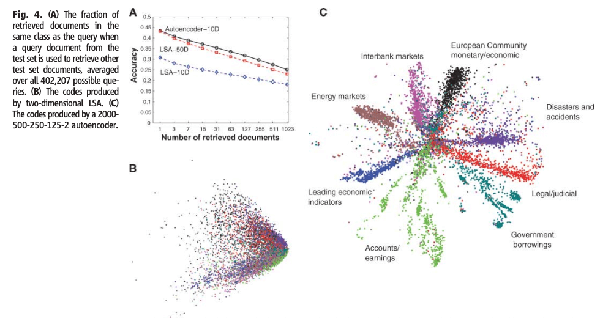
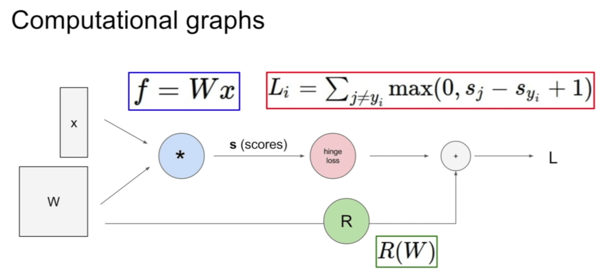
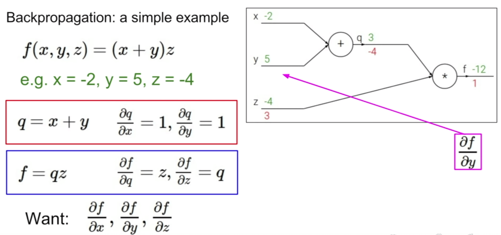

```{r setup, echo=FALSE}
knitr::opts_chunk$set(eval = FALSE)
library(nomnoml)
```

# Welcome

# Welcome

## Agenda

- Welcome!
- Introduction to Deep Learning
- Introduction to Tensorflow
- Introduction to Keras

## Intros

- Kevin Kuo @kevinykuo
- Javier Luraschi @javierluraschi

## Local Installation


## Workshop Notebook

[github.com/javierluraschi/deeplearning-sdss-2019](https://github.com/javierluraschi/deeplearning-sdss-2019).


## Why Deep Learning?

Why should I care about Deep Learning?

## IMageNet
## AlphaGo
## Dota
## Tesla

# Introduction to Deep Learning

## A Comprehensive Survey on Deep Learning Approaches


See [arXiv:1803.01164](https://arxiv.org/abs/1803.01164)

## [1943: McCulloch and Pitts](https://www.cs.cmu.edu/~./epxing/Class/10715/reading/McCulloch.and.Pitts.pdf)

McCulloch & Pitts show that neurons can be combined to construct a Turing machine (using ANDs, ORs, & NOTs).


## 1943: McCulloch and Pitts -- Turing Machines


## 1958: Rosenblatt -- The Perceptron

[The perceptron: A probabilistic model for information storage and organization in the brain](https://citeseerx.ist.psu.edu/viewdoc/download;jsessionid=4E9CF4E9BFB2696E709F82AE0555531A?doi=10.1.1.588.3775&rep=rep1&type=pdf)


## 1958: Rosenblatt -- The Perceptron

### Perceptron Diagram

```{nomnoml eval=TRUE, echo=FALSE, width='600px', height='200px'}
#lineWidth: 1
#fontSize: 8
#padding: 10 
#.fun: visual=ellipse 
#spacing: 20
[x1]->[w1]
[x2]->[w2]
[xN]->[wN]
[w1]->[<fun> Σ]
[w2]->[Σ]
[wN]->[Σ]
[b]->[Σ]
[<sum> Σ]->[<fun>T]
[T]->[<hidden>Next]
```

### Perceptron Model

$$
f(x) =
\begin{cases}
1 & \sum_{i=1}^m w_i x_i + b > 0\\
0 & \text{otherwise}
\end{cases}
$$

## 1958: Rosenblatt -- Exercise (OR)

$$
f(x) =
\begin{cases}
1 & \sum_{i=1}^m w_i x_i + b > 0\\
0 & \text{otherwise}
\end{cases}
$$

```{r}
tt_or <- tibble(
  a = c(0, 0, 1, 1),
  b = c(0, 1, 0, 1),
  r = c(0, 1, 1, 1)
) %>% print()
```

```{r}
x <- as.matrix(select(tt_or, a, b))

b <- __
w <- c(__, __)

ifelse(w %*% x + b > 0, 1, 0)
```

## 1958: Rosenblatt -- Exercise (AND)

$$
f(x) =
\begin{cases}
1 & \sum_{i=1}^m w_i x_i + b > 0\\
0 & \text{otherwise}
\end{cases}
$$

```{r}
library(tidyverse)
tt_and <- tibble(
  a = c(0, 0, 1, 1),
  b = c(0, 1, 0, 1),
  r = c(0, 0, 0, 1)
) %>% print()
```

```{r}
x <- as.matrix(select(tt_and, a, b))

b <- __
w <- c(__, __)

ifelse(w %*% x + b > 0, 1, 0)
```

## 1958: Rosenblatt -- Demo

[Rosenblatt, with the image sensor of the Mark I Perceptron](https://blogs.umass.edu/comphon/2017/06/15/did-frank-rosenblatt-invent-deep-learning-in-1962/) (...) it learned to differentiate between right and left after fifty attempts.


## 1958: Rosenblatt -- Predictions

[Expected to walk, talk, see, write, reproduce itself and be conscious of its existence, although (...) it learned to differentiate between right and left after fifty attempts.](https://www.nytimes.com/1958/07/08/archives/new-navy-device-learns-by-doing-psychologist-shows-embryo-of.html)


## 1958: Rosenblatt -- [Principles of Neurodynamics 1/3](https://apps.dtic.mil/dtic/tr/fulltext/u2/256582.pdf)


## 1958: Rosenblatt -- [Principles of Neurodynamics 2/3](https://apps.dtic.mil/dtic/tr/fulltext/u2/256582.pdf)


## 1958: Rosenblatt -- [Principles of Neurodynamics 3/3](https://apps.dtic.mil/dtic/tr/fulltext/u2/256582.pdf)



## 1969: Minsky and Papert -- Book (1/3)


## 1969: Minsky and Papert -- Book (2/3)


## 1969: Minsky and Papert -- Exercise (XOR)

$$
f(x) =
\begin{cases}
1 & \sum_{i=1}^m w_i x_i + b > 0\\
0 & \text{otherwise}
\end{cases}
$$

```{r}
tt_xor <- tibble(
  a = c(0, 0, 1, 1),
  b = c(0, 1, 0, 1),
  r = c(0, 1, 1, 0)
) %>% print()
```

```{r}
x <- as.matrix(select(tt_xor, a, b))

b <- __
w <- c(__, __)

ifelse(w %*% x + b > 0, 1, 0)
```

## 1969: Minsky and Papert -- Book (3/3)

[It ought to be possible to devise a training algorithm to optimize the weights in this using (...) we have not investigated this](https://www.quora.com/Why-did-Minsky-incorrectly-conjecture-the-inability-of-multi-layer-perceptrons-to-learn-non-linear-functions).



## 1969: Minsky and Papert -- Diagram (XOR)

```{nomnoml eval=TRUE, echo=FALSE, width='800px', height='500px', fig.align='center'}
#lineWidth: 1
#fontSize: 8
#padding: 10 
#.fun: visual=ellipse 
#spacing: 20
[x]->[Perceptron(1)|
  
[x1]->[w1]
[x2]->[w2]
[xN]->[wN]
[w1]->[<fun> Σ]
[w2]->[Σ]
[wN]->[Σ]
[b]->[Σ]
[<sum> Σ]->[<fun>T]
        
]
[x]->[Perceptron(2) | 

[x1]->[w1]
[x2]->[w2]
[xN]->[wN]
[w1]->[<fun> Σ]
[w2]->[Σ]
[wN]->[Σ]
[b]->[Σ]
[<sum> Σ]->[<fun>T]

]
[Perceptron(1)]->[Perceptron(3) |

[b1]->[w1]
[b2]->[w2]
[w1]->[<fun> Σ]
[w2]->[Σ]
[b]->[Σ]
[<sum> Σ]->[<fun>T]
                    
]
[Perceptron(2)]->[Perceptron(3)]
[Perceptron(3)]->[<hidden>Next]
```

## 1969: Minsky and Papert -- Solution (XOR)

```{r}
tt_xor <- tibble(
  a = c(0, 0, 1, 1),
  b = c(0, 1, 0, 1),
  c = c(1, 1, 1, 1),
  r = c(0, 1, 1, 0)
) %>% print()
```

```{r}
x <- as.matrix(select(tt_xor, a, b, c))
w <- matrix(c( 0.5,  0.5,    0,
              -0.5, -0.5,    1,
               0.5,  0.5, -0.5), ncol = 3, byrow = T)
              
yh1 <- ifelse(x %*% w[1,] > 0, 1, 0)
yh2 <- ifelse(x %*% w[2,] > 0, 1, 0)

x3 <- matrix(c(yh1, yh2, c(1,1,1,1)), ncol = 3)
ifelse(x3 %*% w[3,] > 0, 1, 0)
```

## 1985: Hinton -- Gradient Descent

[A Learning Algorithm for Boltzmann Machines](https://www.enterrasolutions.com/media/docs/2013/08/cogscibm.pdf)


## 1985: Hinton -- [Gradient Descent Today](https://en.wikipedia.org/wiki/Gradient_descent)

A function decreases fastest if one goes from in the direction of the negative gradient.

$$
a_{n+1} = a_n - \gamma \nabla F(a_n)
$$


## 1985: Hinton -- Gradient Descent


## 1985: Hinton -- Stochastic Gradient Descent


## 1985: Hinton -- Back-Propagation


## 1985: Hinton -- Exercise Differentiable

Gradient descent requires differentiable functions,

$$
f(x) =
\begin{cases}
1 & \sum_{i=1}^m w_i x_i + b > 0\\
0 & \text{otherwise}
\end{cases}
$$

So let's start with a differentiable perceptron,

$$
f(x_1, x_2) = w_1 x_1 + w_2 x_2 + b
$$

## 1985: Hinton -- Exercise Differentiate

Lets differentiate L2 over a perceptron to find optimal solutions,

$$
(f(w_1, w_2, b) - y)^2 = ((w_1 x_1 + w_2 x_2 + b) - y)^2
$$

$$
\frac{df(w_1, w_2, b)}{w_1} = 2 * (f(w_1, w_2, b) - y) * x_1 \\
\frac{df(w_1, w_2, b)}{w_2} = 2 * (f(w_1, w_2, b) - y) * x_2 \\
\frac{df(w_1, w_2, b)}{b} = 2 * (f(w_1, w_2, b) - y)
$$

## 1985: Hinton -- Exercise (AND)

```{r}
w_1=0.1; w_2=0.2; b=0.3; step=0.01;
f <- function(w_1, w_2, b, x_1, x_2) w_1 * x_1 + w_2 * x_2 + b
```

Approximate,

$$
a_{n+1} = a_n - \gamma \nabla F(a_n)
$$

$$
\frac{df(w_1, w_2, b)}{w_1} = 2 * (f(w_1, w_2, b) - y) * x_1 \\
\frac{df(w_1, w_2, b)}{w_2} = 2 * (f(w_1, w_2, b) - y) * x_2 \\
\frac{df(w_1, w_2, b)}{b} = 2 * (f(w_1, w_2, b) - y)
$$

## 1985: Hinton -- Algorithm Exercise

Initialize,

```{r}
w_1=0.1; w_2=0.2; b=0.3
x_1=1.0; x_2=0.0; y=0.0
step=0.01;

f <- function(w_1, w_2, b, x_1, x_2) w_1 * x_1 + w_2 * x_2 + b
```

Approximate,

```{r}
for (i in 1:10) {
  f_1 <- f(w_1, w_2, b, tt_and$a, tt_and$b)
  w_1 <- w_1 - ___
  w_2 <- w_2 - ___
  b <- b - ___
}
```

## 1985: Hinton -- Applications

1989: [ALVINN: An Autonomous Land Vehicle in a Neural Network](https://papers.nips.cc/paper/95-alvinn-an-autonomous-land-vehicle-in-a-neural-network.pdf)


[https://www.youtube.com/watch?v=ntIczNQKfjQ](https://www.youtube.com/watch?v=ntIczNQKfjQ)

## 1985: Hinton -- Deep Networks

The [vanishing gradient problem](https://en.wikipedia.org/wiki/Vanishing_gradient_problem) is when the gradient will be vanishingly small, effectively preventing the weight from changing its value.

```{nomnoml eval=TRUE, echo=FALSE, width='800px', height='500px', fig.align='center'}
#spacing: 30
#padding: 14
#bendSize: 0.7
#.p: visual=ellipse 
[<hidden>x1]->[<p>P1]
[<hidden>x2]->[<p>P2]
[<hidden>x3]->[<p>P3]
[P1]->[<p>P4]
[P2]->[P4]
[P3]->[P4]
[P1]->[<p>P5]
[P2]->[P5]
[P3]->[P5]
[P4]->[<p>P6]
[P5]->[P6]
[P4]->[<p>P7]
[P5]->[P7]
[P6]->[<p>P8]
[P7]->[P8]
[P6]->[<p>P9]
[P7]->[P9]
[P8]->[<p>P10]
[P9]->[P10]
[P10]->[<hidden>x]
```

## 2006: Hinton -- Train One Layer

[A fast learning algorithm for deep belief nets](https://www.cs.toronto.edu/~hinton/absps/fastnc.pdf)


## 2006: Hinton -- Autoencoders

[Reducing the dimensionality of data with neural networks](https://www.cs.toronto.edu/~hinton/science.pdf)


## 2006: Hinton -- Dimensionality

[Reducing the dimensionality of data with neural networks](https://www.cs.toronto.edu/~hinton/science.pdf)



## 2012: AlexNet -- 

[ImageNet Classification with Deep Convolutional Neural Networks](https://papers.nips.cc/paper/4824-imagenet-classification-with-deep-convolutional-neural-networks.pdf)


Used ReLU, dropout, augmentation, GPUs.

## 2016: Karpathy -- Computational Graphs

Computational graphs avoid manually computing gradients.



[CS231n Winter 2016: Lecture 4: Backpropagation, Neural Network](https://www.youtube.com/watch?v=i94OvYb6noo)

## 2016: Karpathy -- Simple Graph

Simple computational graph example.



## 2016: Karpathy -- Complex Graph

Can then combine into very complex graphs


# Introduction to Tensorflow

## Easy Intro

## 1

## 2 

## 3

## 4

## 5

# Introduction to Keras

## Installing Tensorflow -- Exercise 

```{r}
install.packages("tensorflow")
install_tensorflow()
```


## Installing Keras -- Exercise

```{r}
install.packages("keras")
install_keras()
```

## Kyphosis Dataset

We will use `Kyphosis` from the `rpart` package.

```{r}
download.file("https://github.com/bethatkinson/rpart/raw/master/data/kyphosis.tab.gz", "kyphosis.tab.gz")
kyphosis <- read.table("kyphosis.tab.gz", header = T)
```

```{r}
fit <- rpart(Kyphosis ~ Age + Number + Start, data = kyphosis)
fit2 <- rpart(Kyphosis ~ Age + Number + Start, data = kyphosis,
              parms = list(prior = c(0.65, 0.35), split = "information"))
fit3 <- rpart(Kyphosis ~ Age + Number + Start, data=kyphosis,
              control = rpart.control(cp = 0.05))

```

## Kyphosis Keras -- Exercise Model

Original analysis by [Derrick Mwiti](https://heartbeat.fritz.ai/binary-classification-using-keras-in-r-ef3d42202aaa).

```{r}
model <- keras_model_sequential() 

model %>% 
  layer_dense(units = 256, activation = 'relu', input_shape = ncol(X_train)) %>% 
  layer_dropout(rate = 0.4) %>% 
  layer_dense(units = 128, activation = 'relu') %>%
  layer_dropout(rate = 0.3) %>%
  layer_dense(units = 2, activation = 'sigmoid')
```

## Kyphosis Keras -- Exercise Compile

```{r}
history <- model %>% compile(
  loss = 'binary_crossentropy',
  optimizer = 'adam',
  metrics = c('accuracy')
)
```

## Kyphosis Keras -- Exercise Train

```{r}
model %>% fit(
  X_train, y_train, 
  epochs = 100, 
  batch_size = 5,
  validation_split = 0.3
)
```

## Kyphosis Keras -- Exercise Summary

```{r}
summary(model)
```

## Kyphosis Keras -- Exercise Accuracy

```{r}
model %>% evaluate(X_test, y_test)

plot(history$metrics$loss, main="Model Loss", xlab = "epoch", ylab="loss", col="orange", type="l")
lines(history$metrics$val_loss, col="skyblue")
legend("topright", c("Training","Testing"), col=c("orange", "skyblue"), lty=c(1,1))
```

## Kyphosis Keras -- Exercise Predict

```{r}
predictions <- model %>% predict_classes(X_test)
```

## JJ's Keynote

[beta.rstudioconnect.com/ml-with-tensorflow-and-r](https://beta.rstudioconnect.com/ml-with-tensorflow-and-r)

