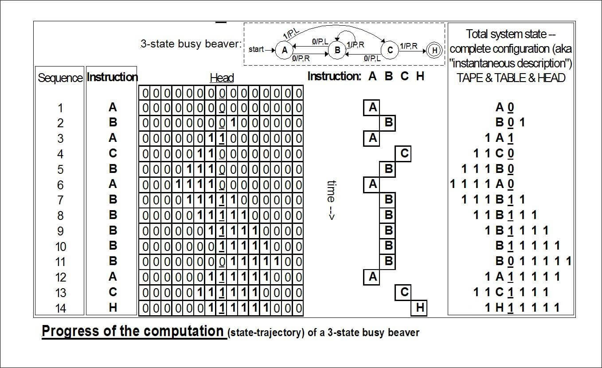
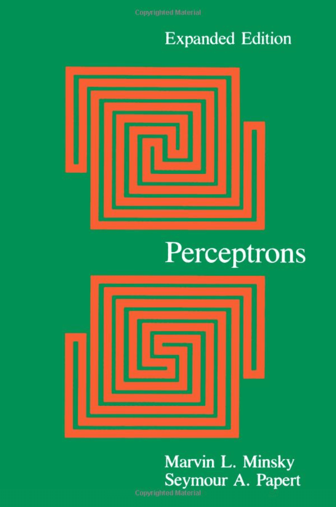

```{r setup, echo=FALSE}
knitr::opts_chunk$set(eval = FALSE)
```

# Agenda

## Agenda

- Introduction to Deep Learning
- Introduction to Tensorflow and Keras
- Hands-on with Keras
- Advanced Deep Learning Topics

# Introduction to Deep Learning

## A Comprehensive Survey on Deep Learning Approaches


See [arXiv:1803.01164](https://arxiv.org/abs/1803.01164)

## [1943: McCulloch and Pitts](https://www.cs.cmu.edu/~./epxing/Class/10715/reading/McCulloch.and.Pitts.pdf)

McCulloch & Pitts show that neurons can be combined to construct a Turing machine (using ANDs, ORs, & NOTs).


## 1943: McCulloch and Pitts -- Turing Machines



## 1958: Rosenblatt -- The Perceptron

[The perceptron: A probabilistic model for information storage and organization in the brain](https://citeseerx.ist.psu.edu/viewdoc/download;jsessionid=4E9CF4E9BFB2696E709F82AE0555531A?doi=10.1.1.588.3775&rep=rep1&type=pdf)


## 1958: Rosenblatt -- Exercise (OR)

$$
f(x) =
\begin{cases}
1 & \sum_{i=1}^m w_i x_i + b > 0\\
0 & \text{otherwise}
\end{cases}
$$

```{r}
tt_or <- tibble(
  a = c(0, 0, 1, 1),
  b = c(0, 1, 0, 1),
  r = c(0, 1, 1, 1)
) %>% print()
```

```{r}
w <- as.matrix(select(tt_or, a, b))

b <- __
x <- c(__, __)

ifelse(w %*% x + b > 0, 1, 0)
```

## 1958: Rosenblatt -- Exercise (AND)

$$
f(x) =
\begin{cases}
1 & \sum_{i=1}^m w_i x_i + b > 0\\
0 & \text{otherwise}
\end{cases}
$$

```{r}
library(tidyverse)
tt_and <- tibble(
  a = c(0, 0, 1, 1),
  b = c(0, 1, 0, 1),
  r = c(0, 0, 0, 1)
) %>% print()
```

```{r}
w <- as.matrix(select(tt_and, a, b))

b <- __
x <- c(__, __)

ifelse(w %*% x + b > 0, 1, 0)
```

## 1958: Rosenblatt -- Demo

[Rosenblatt, with the image sensor of the Mark I Perceptron](https://blogs.umass.edu/comphon/2017/06/15/did-frank-rosenblatt-invent-deep-learning-in-1962/) (...) it learned to differentiate between right and left after fifty attempts.


## 1958: Rosenblatt -- Predictions

[Expected to walk, talk, see, write, reproduce itself and be conscious of its existence, although (...) it learned to differentiate between right and left after fifty attempts.](https://www.nytimes.com/1958/07/08/archives/new-navy-device-learns-by-doing-psychologist-shows-embryo-of.html)


## 1958: Rosenblatt -- [Principles of Neurodynamics 1/3](https://apps.dtic.mil/dtic/tr/fulltext/u2/256582.pdf)


## 1958: Rosenblatt -- [Principles of Neurodynamics 2/3](https://apps.dtic.mil/dtic/tr/fulltext/u2/256582.pdf)


## 1958: Rosenblatt -- [Principles of Neurodynamics 3/3](https://apps.dtic.mil/dtic/tr/fulltext/u2/256582.pdf)


## 1969: Minsky and Papert -- Book (1/3)



## 1969: Minsky and Papert -- Book (2/3)


## 1969: Minsky and Papert -- Exercise (XOR)

$$
f(x) =
\begin{cases}
1 & \sum_{i=1}^m w_i x_i + b > 0\\
0 & \text{otherwise}
\end{cases}
$$

```{r}
tt_xor <- tibble(
  a = c(0, 0, 1, 1),
  b = c(0, 1, 0, 1),
  r = c(0, 1, 1, 0)
) %>% print()
```

```{r}
w <- as.matrix(select(tt_or, a, b))

b <- __
x <- c(__, __)

ifelse(w %*% x + b > 0, 1, 0)
```

## 1969: Minsky and Papert -- Book (3/3)

[It ought to be possible to devise a training algorithm to optimize the weights in this using (...) we have not investigated this](https://www.quora.com/Why-did-Minsky-incorrectly-conjecture-the-inability-of-multi-layer-perceptrons-to-learn-non-linear-functions).


