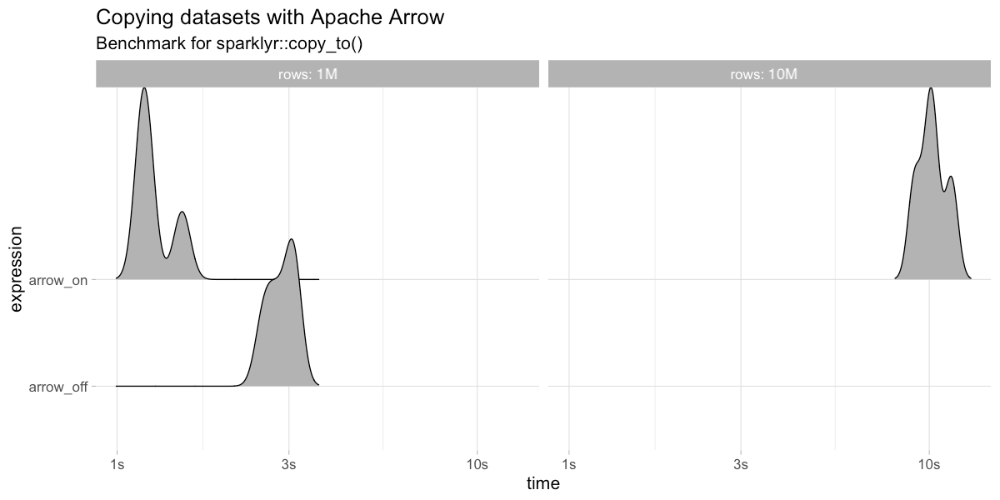

```{r setup, include=FALSE}
knitr::opts_chunk$set(eval = FALSE)
```

# Intro

## Outline

- Spark
- Streams
- Arrow

## What to do when code is slow?

```{r}
mtcars %>% lm(mpg ~ wt + cyl, .)
```

```{r}
# Sample
mtcars %>% dplyr::sample_n(10) %>% lm(mpg ~ wt + cyl, .)
```

```{r}
# Profile
profvis::profvis(mtcars %>% lm(mpg ~ wt + cyl, .))
```

```{r}
# Scale Up
cloudml::cloudml_train("train.R")
```

```{r}
# Scale Out
mtcars_tbl %>% sparklyr::ml_linear_regression(mpg ~ wt + cyl)
```

## Scaling Out with R and Spark


```{r}
# Scale Out
mtcars_tbl %>% sparklyr::ml_linear_regression(mpg ~ wt + cyl)
```

## Using Spark from R

```{r}
install.packages("sparklyr")                         # R interface to Spark
library(sparklyr)
```

```{r}
spark_install()                                      # Install Apache Spark
sc <- spark_connect(master = "local")                # Connect to Spark cluster
```

```{r}
cars <- spark_read_csv(sc, "cars", "mtcars/")        # Read data in Spark

dplyr::summarize(cars, n = n())                      # Count records with dplyr
DBI::dbGetQuery(sc, "SELECT count(*) FROM cars")     # Count records with DBI
```

```{r}
ml_linear_regression(cars, mpg ~ wt + cyl)           # Perform linear regression
```

```{r}
spark_context(sc) %>% invoke("version")              # Extend sparklyr with Scala
```

# Streams

## What about realtime data?


## Using Spark Streams

Spark **structured streams** provide parallel and fault-tolerant data processing,

```{r}
stream_read_text(sc, "s3a://your-s3-bucket/") %>%    # Define input stream
  spark_apply(~webreadr::read_s3(.x$line),) %>%      # Transform with R
  group_by(uri) %>%                                  # Group using dplyr
  summarize(n = n()) %>%                             # Count using dplyr
  arrange(desc(n)) %>%                               # Arrange using dplyr
  stream_write_memory("urls", mode = "complete")     # Define output stream
```

## What can you do with streams?

```{r}
cars_str <- stream_read_csv(sc, "mtcars/", "cars")     # Read stream in Spark
```

```{r}
out_str <- summarize(cars_str, n = n())                # Count records with dplyr
out_str <- dbGetQuery(sc, "SELECT count(*) FROM cars") # Count records with DBI
```

```{r}
out_str <- ml_transform(fitted, cars_str)              # Transform stream with model
```

```{r}
out_str <- spark_apply(cars_str, nrow)                 # Extend streams with R
```


```{r}
stream_write_csv(out_str, "output/")                   # Write as a CSV stream
reactiveSpark(out_str)                                 # Use as a Shiny reactive
```

## Streaming with Spark, Kafka and Shiny

> Apache Kafka is an open-source stream-processing software platform that provides a unified, high-throughput and low-latency for handling real-time data feeds.

--


# Arrow

## What is Arrow?

Apache Arrow is a **cross-language** development platform for **in-memory** data.


: Source: arrow.apache.org

## Memory Layout

**Columnar** memory layout allows applications to avoid **unnecessary IO** and accelerate analytical processing performance on modern CPUs and GPUs.


: Source: arrow.apache.org

## Requirements

To use Arrow with Spark and R you'll need:

- A **Spark 2.3.0**+ cluster.
- **Arrow 0.13**+ instealled in every node, Arrow 0.11+ usable.
- **R 3.5**+, next version is likely to support R 3.1+.
- **sparklyr 1.0**+.

## Implementation

R transformations in Spark **without** and **with Arrow**:

```{r echo=FALSE}
nomnoml::nomnoml("
#direction: right
#.left: align=left
[Spark|[a,1,10|b,2,20|c,3,30]] -> [Transform]
[Transform] -> [R]
[R] -> [Transform]
[Transform] -> [Spark]
[R|[a,1,10|b,2,20|c,3,30] -> [Transform]
[Transform] -> [<left>a,b,c|1,2,3|10,20,30]
[a,b,c] -> [Transform]
[Transform] -> [a,1,10]]", png = "images/transform-architecture.png")
```
```{r echo=FALSE}
nomnoml::nomnoml("
#direction: right
#.left: align=left
[Spark|[Scala|[a,1,10|b,2,20|c,3,30]] -> [Arrow|[<left>a,b,c|1,2,3|10,20,30]]
[Arrow] -> [Scala]
] -> [R]
[R|[Arrow|[<left>a,b,c|1,2,3|10,20,30]]] -> [Spark]", png = "images/transform-architecture-arrow.png")
```


## Copy with Arrow

Copy **10x larger** datasets and **3x faster** with Arrow and Spark.

```{r}
library(arrow)
copy_to(sc, data.frame(y = 1:10^6))
```



## Collect with Arrow

Collect **5x larger** datasets and **3x faster** with Arrow and Spark.

```{r}
library(arrow)
sdf_len(sc, 10^7) %>% collect()
```


## Transform with Arrow

Transform datasets **40x faster** with R, Arrow and Spark.

```{r}
library(arrow)
sdf_len(sc, 10^5) %>% spark_apply(~.x/2) %>% count()
```


# Thank You!

## Resources

- <div class="highlight">[spark.rstudio.com](https://spark.rstudio.com):</div> Main **documentation** site with examples and reference functions.
- <div class="highlight">[github.com/rstudio/sparklyr](https://github.com/rstudio/sparklyr):</div> Issues? Open a **GitHub** issue.
- <div class="highlight">[stackoverflow.com/tags/sparklyr](https://stackoverflow.com/tags/sparklyr):</div> General questions? **Stack Overflow** is a good place to start.
- <div class="highlight">[gitter.im/rstudio/sparklyr](https://gitter.im/rstudio/sparklyr):</div> Urgent issues? Chat with us in **Gitter**.
