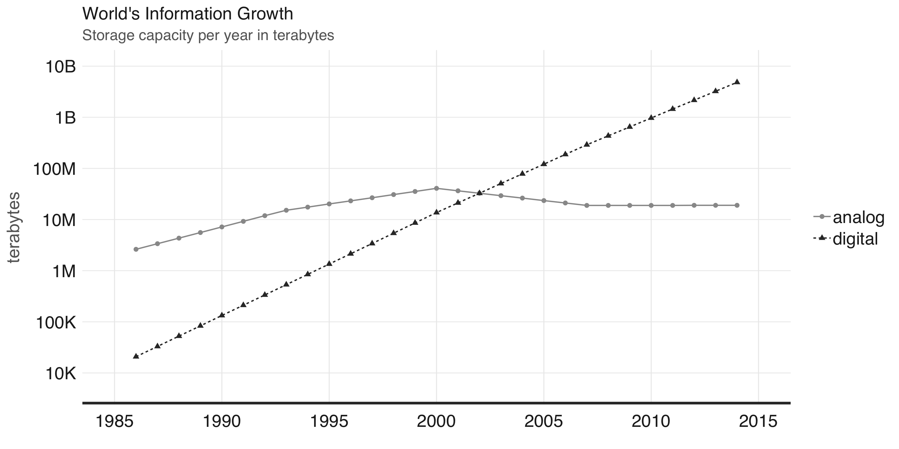
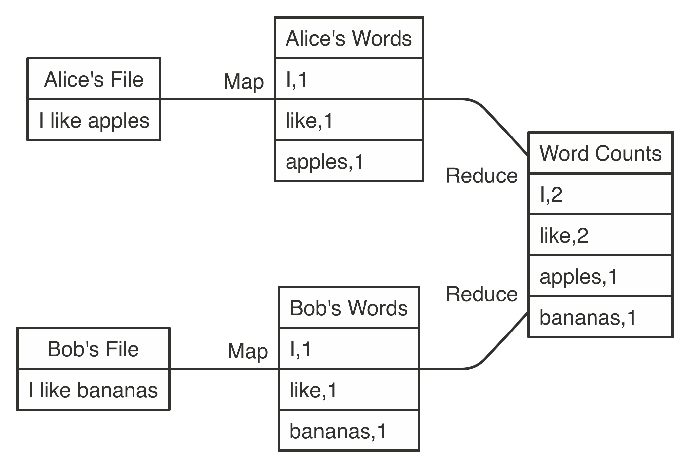
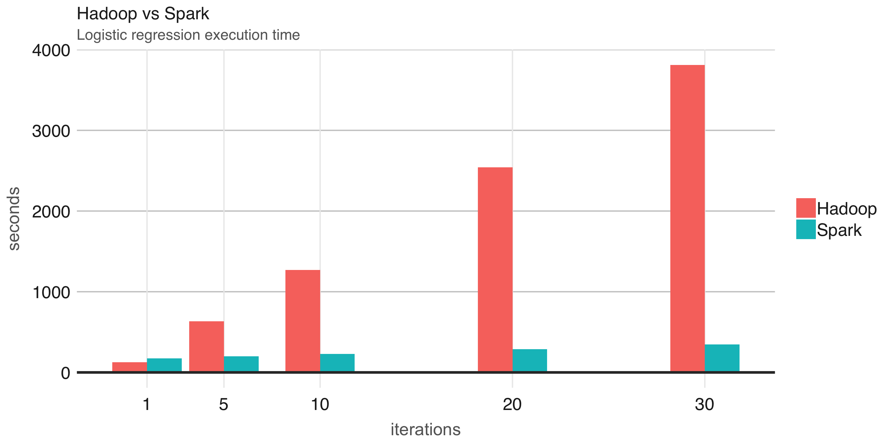

```{r setup, include=FALSE}
knitr::opts_chunk$set(eval = FALSE)
```

# Overview

## Technology Periods


## Stone Age: 3.4M BC - 5000 BC {data-background="images/intro-stone-age.jpeg"}

## Ancient History: 5000 BC - 500 {data-background="images/intro-ancient-history.jpg"}

## Machine Age: 1880 – 1945 {data-background="images/intro-machine-age.jpg"}

## Space Age: 1957 - Present {data-background="images/intro-space-age.jpg"}

## Selfie Age: 1970 - Present {data-background="images/intro-selfie-age.jpeg"}

## Information Age: 1970 - Present {data-background="images/intro-katie-bouman.jpg"}

## Information Age: Present {data-background="images/intro-katie-bouman-disks.png"}

## World's Capacity to Store Information



## Hadoop and Map Reduce



## Intro Spark



## Spark Record Sorting

|                  | Hadoop Record | Spark Record  |
|------------------|---------------|---------------|
| Data Size        | 102.5 TB      | 100 TB        |
| Elapsed Time     | 72 mins       | 23 mins       |
| Nodes            | 2100          | 206           |
| Cores            | 50400         | 6592          |
| Disk             | 3150 GB/s     | 618 GB/s      |
| Network          | 10Gbps        | 10Gbps        |
| Sort rate        | 1.42 TB/min   | 4.27 TB/min   |
| Sort rate / node | 0.67 GB/min   | 20.7 GB/min   |

# Intro

## What to do when code is slow?

```{r}
mtcars %>% lm(mpg ~ wt + cyl, .)
```

```{r class.source='fragment'}
# Sample
mtcars %>% dplyr::sample_n(10) %>% lm(mpg ~ wt + cyl, .)
```

```{r class.source='fragment'}
# Profile
profvis::profvis(mtcars %>% lm(mpg ~ wt + cyl, .))
```

```{r class.source='fragment'}
# Scale Up
cloudml::cloudml_train("train.R")
```

```{r class.source='fragment'}
# Scale Out
mtcars_tbl %>% sparklyr::ml_linear_regression(mpg ~ wt + cyl)
```

## Scaling Out with R and Spark


```{r}
# Scale Out
mtcars_tbl %>% sparklyr::ml_linear_regression(mpg ~ wt + cyl)
```

## Using Spark from R

```{r}
install.packages("sparklyr")                         # R interface to Spark
library(sparklyr)
```

```{r class.source='fragment'}
spark_install()                                      # Install Apache Spark
sc <- spark_connect(master = "local")                # Connect to Spark cluster
```

```{r class.source='fragment'}
cars <- spark_read_csv(sc, "cars", "mtcars/")        # Read data in Spark

dplyr::summarize(cars, n = n())                      # Count records with dplyr
DBI::dbGetQuery(sc, "SELECT count(*) FROM cars")     # Count records with DBI
```

```{r class.source='fragment'}
ml_linear_regression(cars, mpg ~ wt + cyl)           # Perform linear regression
```

```{r class.source='fragment'}
spark_context(sc) %>% invoke("version")              # Extend sparklyr with Scala
```

# Streams

## What about realtime data?


## Using Spark Streams

Spark **structured streams** provide parallel and fault-tolerant data processing,

```{r}
stream_read_text(sc, "s3a://your-s3-bucket/") %>%    # Define input stream
  spark_apply(~webreadr::read_s3(.x$line),) %>%      # Transform with R
  group_by(uri) %>%                                  # Group using dplyr
  summarize(n = n()) %>%                             # Count using dplyr
  arrange(desc(n)) %>%                               # Arrange using dplyr
  stream_write_memory("urls", mode = "complete")     # Define output stream
```

## What can you do with streams?

```{r}
cars_str <- stream_read_csv(sc, "mtcars/", "cars")     # Read stream in Spark
```

```{r class.source='fragment'}
out_str <- summarize(cars_str, n = n())                # Count records with dplyr
out_str <- dbGetQuery(sc, "SELECT count(*) FROM cars") # Count records with DBI
```

```{r class.source='fragment'}
out_str <- ml_transform(fitted, cars_str)              # Transform stream with model
```

```{r class.source='fragment'}
out_str <- spark_apply(cars_str, nrow)                 # Extend streams with R
```


```{r class.source='fragment'}
stream_write_csv(out_str, "output/")                   # Write as a CSV stream
reactiveSpark(out_str)                                 # Use as a Shiny reactive
```

## Streaming with Spark, Kafka and Shiny

> Apache Kafka is an open-source stream-processing software platform that provides a unified, high-throughput and low-latency for handling real-time data feeds.

--


# Thank You!

## Resources

- <div class="highlight">[spark.rstudio.com](https://spark.rstudio.com):</div> Main **documentation** site with examples and reference functions.
- <div class="highlight">[community.rstudio.com](https://community.rstudio.com/search?q=sparklyr):</div> sparklyr questions? Use the the **RStudio Community**.
- <div class="highlight">[github.com/rstudio/sparklyr](https://github.com/rstudio/sparklyr):</div> Something needs fixing? Open a **GitHub** issue.
- <div class="highlight">[stackoverflow.com/tags/sparklyr](https://stackoverflow.com/tags/sparklyr):</div> General questions? **Stack Overflow** is a good place to start.
- <div class="highlight">[gitter.im/rstudio/sparklyr](https://gitter.im/rstudio/sparklyr):</div> Anything urgent? Chat with us in **Gitter**!
- <div class="highlight">[rpubs.com/jluraschi](http://rpubs.com/jluraschi/sdss-2019-spark):</div> Want to review these **slides**?
- <div class="highlight">[github.com/javierluraschi/talks](https://github.com/javierluraschi/talks/tree/master/2019-05-31):</div> Want to run this **R Notebook** yourself?
