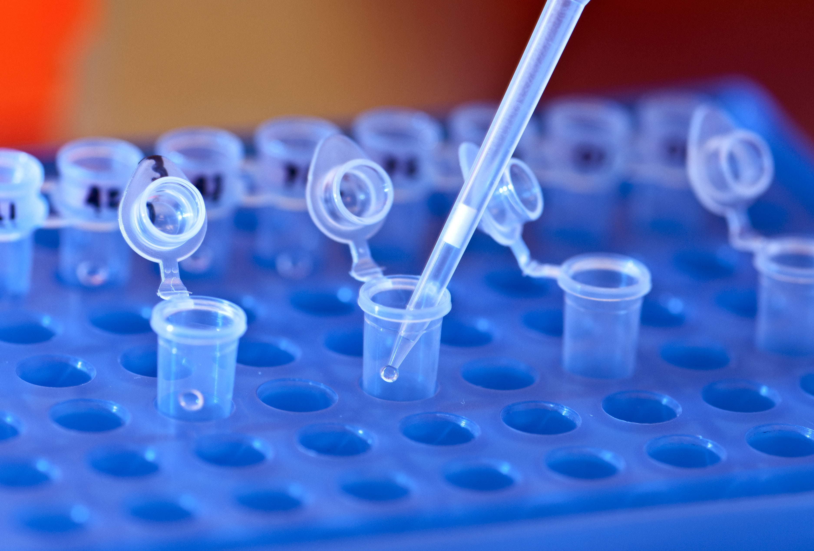

```{r setup, include=FALSE}
knitr::opts_chunk$set(eval = FALSE)
```

# Today

## mlflow

MLflow docs require manually downloading `win-quality.csv`.


## r2d3

The `r2d2` package docs require downloading `flare.csv`.


## readr

The `readr` package docs require downloading `challenge.csv`.


## Reproducible?



# Workarounds

## Download File

```{r}
data_url <- paste0("https://raw.githubusercontent.com/",
                   "rstudio/r2d3/master/vignettes/gallery/",
                   "bubbles/flare.csv")

download.file(data_url)
```

## Avoid Redownloading?

```{r}
if (!file.exists("flare.csv")) {
  download.file(data_url, "flare.csv")
}
```

## Support URL's in all packages?

```{r}
readr::read_csv(data_url)
```
```
# A tibble: 252 x 2
   id                                           value
   <chr>                                        <dbl>
 4 flare.analytics.cluster.AgglomerativeCluster  3938
 5 flare.analytics.cluster.CommunityStructure    3812
 6 flare.analytics.cluster.HierarchicalCluster   6714
 ```

## Is that enough?

- Add to `.gitignore`?
- Share across projects?
- Detect upstream changes?
- Update or share datasets?

# Pins

## Cache

With `pins` we can easily cache resource,

```{r}
pins::pin(data_url)
```
```
"/Users/javierluraschi/Library/Caches/pins/local/flare/flare.csv"
```

But wait, there is more!

## Intro


## Functionality

You can use the pins package to:

- **Pin** remote resources locally to work offline and cache results with ease, pin() stores resources in boards which you can then retrieve with pin_get().
- **Discover** new resources across different boards using pin_find().
- **Share** resources on GitHub, Kaggle or RStudio Connect by registering new boards with board_register().
- **Resources** can be anything from CSV, JSON, or image files to arbitrary R objects.

## What can I pin?

Anything!

```{r}
pins::pin(data_url)
```

```{r}
pins::pin(mtcars)
```

```{r}
pins::pin(lm(mpg ~ ., mtcars))
```

## Where can I store pins?

Anywhere! -- That implements the 'board' interface.

```{r}
library(pins)
board_register(board = "local", name = "local")

pin(data_url, board = "local")
```

## What is a board?

A storage location, like your local file systems, GitHub, Kaggle or RStudio Connect.


# RStudio Connect

## Pin

## Discover

## Share

## Resources

## Automation

