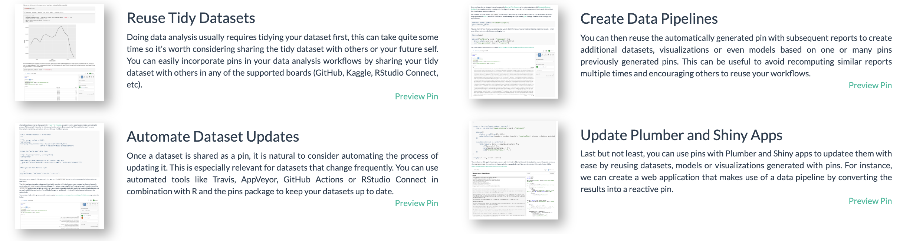

```{r setup, include=FALSE}
knitr::opts_chunk$set(eval = FALSE)
```

# Today

## mlflow

MLflow docs require manually downloading `win-quality.csv`.


## r2d3

The `r2d2` package docs require downloading `flare.csv`.


## readr

The `readr` package defines `readr_example()` to avoid downloads.


## R4DS

"R for Data Science" contains "data/heights.csv" in data import.


## Is this reproducible? {data-background="images/today-reproducuble.jpg"}

## Workarounds

```{r}
data_url <- paste0("https://raw.githubusercontent.com/",
                   "rstudio/r2d3/master/vignettes/gallery/",
                   "bubbles/flare.csv")

# automatically download
download.file(data_url)
```

```{r}
# automatically download only once
if (!file.exists("flare.csv"))
  download.file(data_url, "flare.csv")
```

Add to .gitignore? Upstream changes? Share across projects?

# Pins

## Caching with Pins

With `pins` we can easily cache resources,

```{r}
pins::pin(data_url)
```
```
"/Users/javierluraschi/Library/Caches/pins/local/flare/flare.csv"
```

But wait, there is more...

## Intro


## Functionality

You can use the pins package to:

- **Pin** remote resources locally to work offline and cache results with ease, pin() stores resources in boards which you can then retrieve with pin_get().
- **Discover** new resources across different boards using pin_find().
- **Share** resources on GitHub, Kaggle or RStudio Connect by registering new boards with board_register().
- **Resources** can be anything from CSV, JSON, or image files to arbitrary R objects.

## What can I pin?

Anything!

```{r}
# pin a remote file
pins::pin(data_url)
```

```{r}
# pin a local file
writeLines("Hello World!", "data.txt")
pins::pin("data.txt")
```

```{r}
# pin a data frame
pins::pin(mtcars)
```

```{r}
# pin a regression model
pins::pin(lm(mpg ~ ., mtcars))
```

## Where can I store pins?

Anywhere! -- That implements the 'board' interface.

```{r}
library(pins)
board_register(board = "local", name = "local")

pin(data_url, board = "local")
```

## What is a board?

A storage location, like your local file systems, GitHub, Kaggle or RStudio Connect.


# RStudio

## Pin

```{r}
pins::pin(iris, board = "rsconnect")
```


## Authentication

```{r}
library(pins)

# register from RStudio
board_register_rsconnect(server = "https://my-rsc.com", account = "my-user")

# register from RStudio Connect
board_register_rsconnect(server = "https://my-rsc.com", key = Sys.getenv("RSC_API"))
```


## Discover

```{r}
pin_find("iris", board = "rsconnect")
```


## Share

```{r}
# pin a remote file
pins::pin(data_url, board = "rsconnect")
```

```{r}
# pin a local file
pins::pin("data.txt", board = "rsconnect")
```

```{r}
# pin a data frame
pins::pin(mtcars, board = "rsconnect")
```

```{r}
# pin a regression model
pins::pin(lm(mpg ~ ., mtcars), board = "rsconnect")
```

## Resources

A pin can be anything,

```{r}
pins::pin(lm(mpg ~ ., mtcars), board = "rsconnect")
```


## Extensions

A pin can also be extended!


## Use Cases

There are many interesting use cases available for pins, from caching remote resources to creating data pipelines.



See [rstudio.github.io/pins/articles/use-cases](https://deploy-preview-70--rstudio-pins-website.netlify.com/articles/use-cases.html).