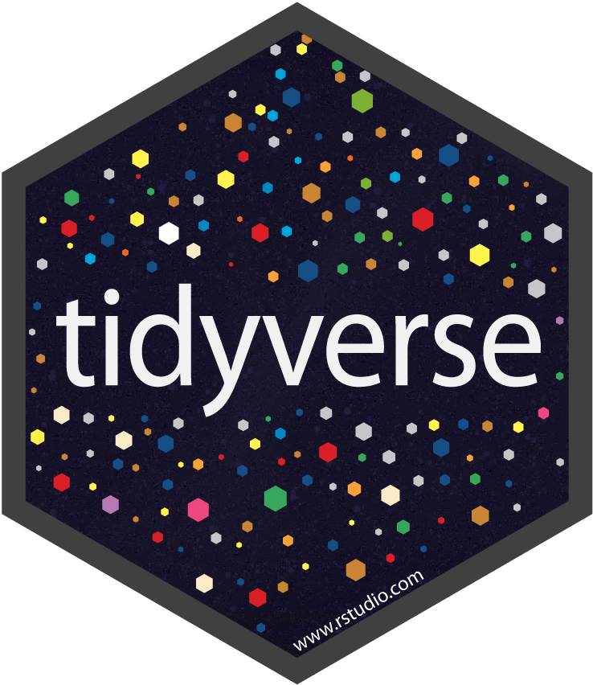

```{r setup, include=FALSE}
knitr::opts_chunk$set(eval = FALSE)
```

# Overview

## Why R?


## Modern R

> The tidyverse is an opinionated collection of R packages designed for data science. All packages share an underlying design philosophy, grammar, and data structures.



```{r}
library(tidyverse)
library(nycflights13)

flights %>%
  group_by(month, day) %>%
  summarise(count = n(), avg_delay = mean(dep_delay, na.rm = TRUE)) %>%
  filter(count > 1000)
```

