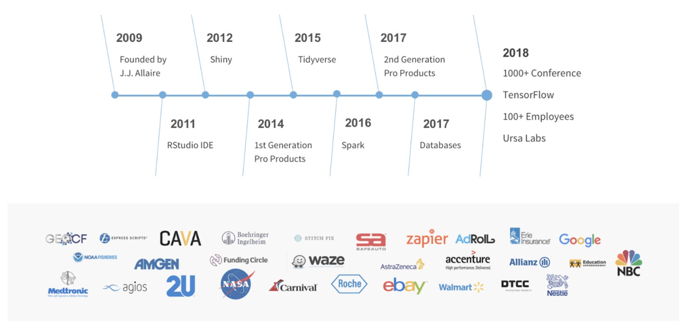
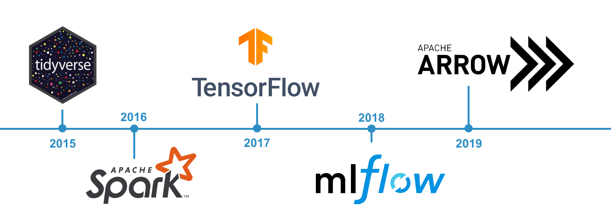
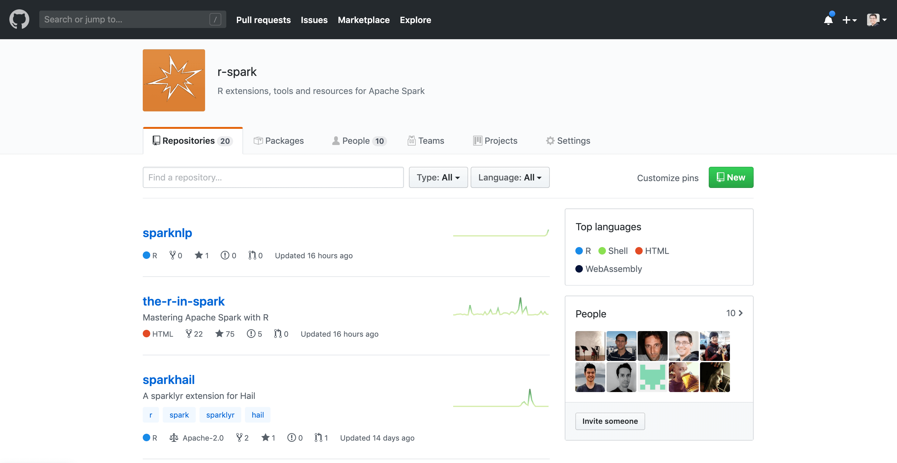
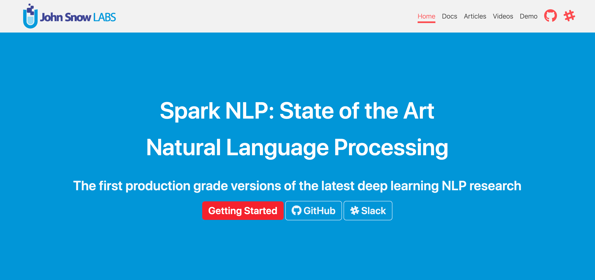
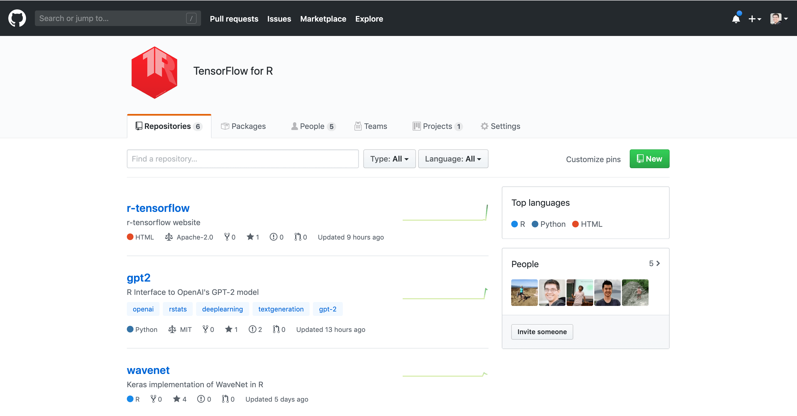
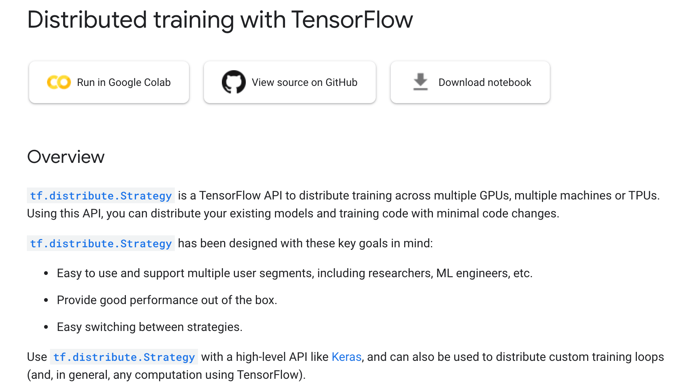
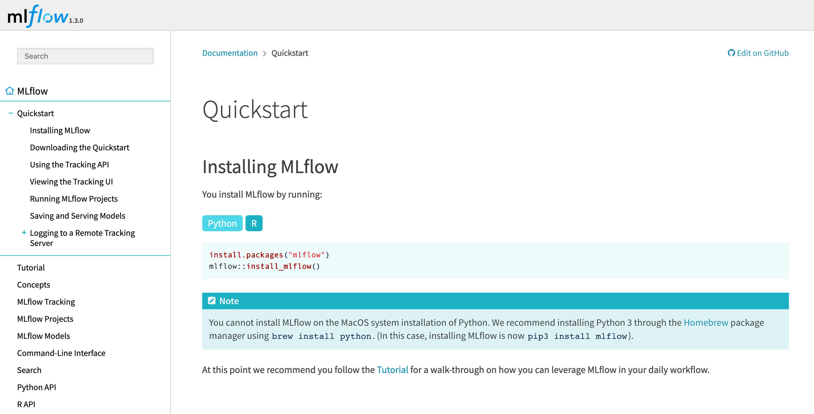
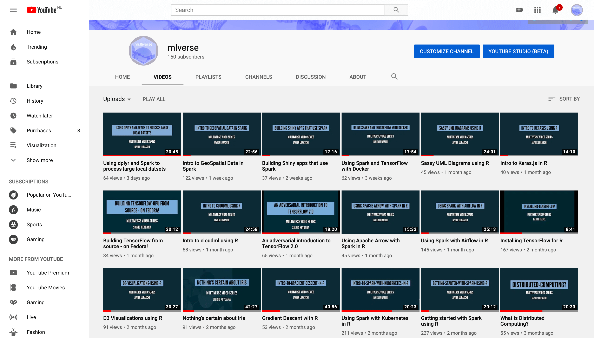

# Overview 

## Why R?


## Modern R

> The tidyverse is an opinionated collection of R packages designed for data science. All packages share an underlying design philosophy, grammar, and data structures.


```r
library(tidyverse)
library(nycflights13)

flights %>%
  group_by(month, day) %>%
  summarise(count = n(), avg_delay = mean(dep_delay, na.rm = TRUE)) %>%
  filter(count > 1000)
```

## About RStudio



## RStudio's Multiverse Team

Authors of R packages to support Apache Spark, TensorFlow and MLflow. Contributors to tidyverse and Apache Arrow.


## The Modern ML Stack with R



# Spark 

## Motivation

In an ideal world, all R packages work with Spark, like magic. Such is the case for `dplyr` and `sparklyr`.


```r
library(sparklyr)
library(nycflights13)

sc <- spark_connect(master = "local|yarn|mesos|spark|livy")
flights <- copy_to(sc, flights)
```


```r
library(tidyverse)
library(nycflights13)

flights %>%
  group_by(month, day) %>%
  summarise(count = n(), avg_delay = mean(dep_delay, na.rm = TRUE)) %>%
  filter(count > 1000)
```

## Timeline


## Master Spark with R


## What’s new? - Arrow


```r
install.packages("arrow")
library(arrow)
library(sparklyr)
```


## What’s new? - XGBoost

[sparkxgb](https://github.com/rstudio/sparkxgb) is a new sparklyr extension that can be used to train [XGBoost](https://xgboost.ai/) models in Spark.


```r
library(sparkxgb)
iris <- copy_to(sc, iris)

xgb_model <- xgboost_classifier(iris, Species ~ ., num_class = 3, num_round = 50, max_depth = 4)

xgb_model %>% ml_predict(iris) %>%
  select(Species, predicted_label, starts_with("probability_")) %>% glimpse()
```
```
#> Observations: ??
#> Variables: 5
#> Database: spark_connection
#> $ Species                <chr> "setosa", "setosa", "setosa", "setosa", "…
#> $ predicted_label        <chr> "setosa", "setosa", "setosa", "setosa", "…
#> $ probability_versicolor <dbl> 0.003566429, 0.003564076, 0.003566429, 0.…
#> $ probability_virginica  <dbl> 0.001423170, 0.002082058, 0.001423170, 0.…
#> $ probability_setosa     <dbl> 0.9950104, 0.9943539, 0.9950104, 0.995010…
```

## What’s new? - Broom

[broom](https://broom.tidyverse.org/) summarizes key information about models as data frames, the last `sparklyr` release marks the completion of all modeling functions.


```r
movies <- data.frame(user   = c(1, 2, 0, 1, 2, 0),
                     item   = c(1, 1, 1, 2, 2, 0),
                     rating = c(3, 1, 2, 4, 5, 4))

copy_to(sc, movies) %>%
  ml_als(rating ~ user + item) %>%
  augment()
```
```
# Source: spark<?> [?? x 4]
   user  item rating .prediction
  <dbl> <dbl>  <dbl>       <dbl>
1     2     2      5        4.86
2     1     2      4        3.98
3     0     0      4        3.88
4     2     1      1        1.08
5     0     1      2        2.00
6     1     1      3        2.80
```

## What’s new? - TF Records

[sparktf](https://github.com/rstudio/sparktf) is a new sparklyr extension allowing you to write TensorFlow records in Spark. This can be used to preprocess large amounts of data before processing them in GPU instances with Keras or TensorFlow.


```r
library(sparktf)
library(sparklyr)

sc <- spark_connect(master = "local")

copy_to(sc, iris) %>%
  ft_string_indexer_model(
    "Species", "label",
    labels = c("setosa", "versicolor", "virginica")
  ) %>%
  spark_write_tfrecord(path = "tfrecord")
```

## What’s new? - VariantSpark

[VariantSpark](https://github.com/aehrc/VariantSpark) is a framework based on scala and spark to analyze genome datasets. It is being developed by [CSIRO Bioinformatics](https://bioinformatics.csiro.au/) team in Australia. VariantSpark was tested on datasets with 3000 samples each one containing 80 million features in either unsupervised clustering approaches and supervised applications, like classification and regression.


```r
library(sparklyr)
library(variantspark)

sc <- spark_connect(master = "local")
vsc <- vs_connect(sc)
hipster <- vs_read_vcf(vsc, "inst/extdata/hipster.vcf.bz2")
labels <- vs_read_labels(vsc, "inst/extdata/hipster_labels.txt")

vs_importance_analysis(vsc, hipster, labels, n_trees = 100)
```

## What’s new? - SparkHail

[Hail](https://hail.is/) is an open-source, general-purpose, Python-based data analysis tool with additional data types and methods for working with genomic data. Hail is built to scale and has first-class support for multi-dimensional structured data, like the genomic data in a genome-wide association study (GWAS).


```r
library(sparkhail)
sc <- spark_connect(master = "local",
                    version = "2.4",
                    config = hail_config())

hl <- hail_context(sc)
mt <- hail_read_matrix(hl, system.file("extdata/1kg.mt", package = "sparkhail"))

hail_dataframe(mt)
```

## What’s new? - GitHub

New [github.com/r-spark](https://github.com/r-spark) organization to support ecosystem of Spark and R extensions.



## What’s next? - SparkNLP

Spark NLP: State of the Art Natural Language Processing. The first production grade versions of the latest deep learning NLP research.



# TensorFlow 

## Timeline


## What’s new? - tfdatasets

[tfdatasets](https://github.com/rstudio/tfdatasets) now supports feature specs:


```r
ft_spec <- training %>%
  select(-id) %>%
  feature_spec(target ~ .) %>%
  step_numeric_column(ends_with("bin")) %>%
  step_numeric_column(-ends_with("bin"),
                      -ends_with("cat"),
                      normalizer_fn = scaler_standard()) %>%
  step_categorical_column_with_vocabulary_list(ends_with("cat")) %>%
  step_embedding_column(ends_with("cat"),
                        dimension = function(vocab_size) as.integer(sqrt(vocab_size) + 1)) %>%
  fit()
```

[github.com/rstudio/tfdatasets](https://github.com/rstudio/tfdatasets)

## What’s new? - tfprobability

Allows you to combine probabilistic models and deep learning on modern hardware.


```r
# create a binomial distribution with n = 7 and p = 0.3
d <- tfd_binomial(total_count = 7, probs = 0.3)
# compute mean
d %>% tfd_mean()
# compute variance
d %>% tfd_variance()
# compute probability
d %>% tfd_prob(2.3)
```

[github.com/rstudio/tfprobability](https://github.com/rstudio/tfprobability)

## What’s new? - TensorFlow 2.0


## What’s new?- GitHub

New [github.com/r-tensorflow](https://github.com/r-tensorflow) organization to support ecosystem of TensorFlow and R extensions.



## What’s new?- GitHub - GPT-2

For instance, easily run Open AI's GPT-2 model in R:


```r
remotes::install_github("r-tensorflow/gpt2")
gpt2::install_gpt2(method = "conda", envname = "r-gpt2")

gpt2::gpt2("The Spark Summit Europe conference")
```
```
The Spark Summit Europe conference will begin this weekend. It will be held in the
United States and Hong Kong, where Spokane Organic GM Store and Electric Cigarettes
store will be featured.

The workshop will also contain a South African, producer, distributor and company
field visit.

Genetically Modified Organisms Association Sierra Nevada-Meconuts Work invite their
members to participate in Schulte Int'l's Connect the World.
```

[github.com/r-tensorflow/gpt2](https://github.com/r-tensorflow/gpt2)

## What’s next? - TF Distributed



# MLflow 

## Getting Started

Start with [mlflow.org/docs/latest/index.html](https://mlflow.org/docs/latest/index.html). docs site at a par with Python!



## Timeline

`mlflow` has been available on CRAN since v0.7.0.


## What's next?

- renv (packrat successor)
- Cloud Deployment Targets
- Keras Autolog

# Demo  

## Spark Resources

[spark.rstudio.com](https://spark.rstudio.com)


## TensorFlow Resources

[tensorflow.rstudio.com](https://tensorflow.rstudio.com)


## Multiverse Resources

[youtube.com/c/mlverse](https://youtube.com/c/mlverse)



## Thanks!


