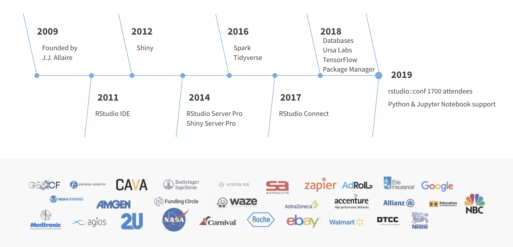
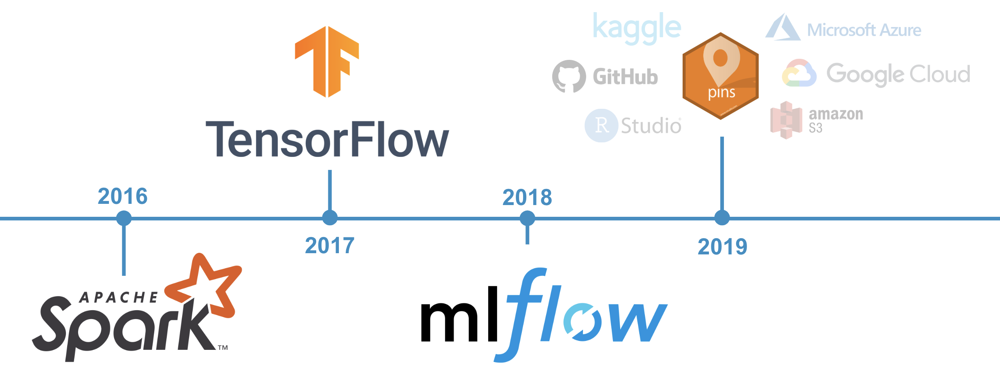

```{r setup, include=FALSE}
knitr::opts_chunk$set(eval = FALSE)
```

# Overview

## About RStudio



## RStudio's Multiverse Team

Authors of R packages to support Apache Spark, TensorFlow and MLflow.


## Multiverse Timeline

The multiverse team focuses on bringing relevant machine learning technologies to R users to empower and simplify data science workflows.



## What is Spark?

> "Apache Spark™ is a unified analytics engine for large-scale data processing."

> - **Unified**: Spark supports many libraries, clusters technologies and storage systems.
> - **Analytics**: Analytics is the discovery and interpretation of data to produce and communicate information.
> - **Engine**: Spark is expected to be efficient and generic.
> - **Large-Scale**: One can interpret large-scale as cluster-scale, a set of connected computers working together.

## Why Spark?

Information grows at exponential rates.


## What's next?

We see Spark supporting multiple projects: TensorFlow, MLflow, Tuning, etc.


## Why R?


## Modern R

> The tidyverse is an opinionated collection of R packages designed for data science. All packages share an underlying design philosophy, grammar, and data structures.


```{r}
library(tidyverse)
library(nycflights13)

flights %>%
  group_by(month, day) %>%
  summarise(count = n(), avg_delay = mean(dep_delay, na.rm = TRUE)) %>%
  filter(count > 1000)
```

## Spark and R

In an ideal world, all R packages work with Spark, like magic. Such is the case for `dplyr` and `sparklyr`.


```{r}
library(sparklyr)
library(nycflights13)

sc <- spark_connect(master = "local|yarn|mesos|spark|livy")
flights <- copy_to(sc, flights)
```


```{r}
library(tidyverse)
library(nycflights13)

flights %>%
  group_by(month, day) %>%
  summarise(count = n(), avg_delay = mean(dep_delay, na.rm = TRUE)) %>%
  filter(count > 1000)
```

# Timeline

## 2016-2019

Timeline from launch to sparklyr 1.0.


## Beyond 2020

Aspirational direction beyond 2020.


# Use Cases

## sparklyr: R interface for Apache Spark

```{r echo=FALSE, message=FALSE}
library(sparklyr)                                    # Load sparklyr
library(dplyr)                                       # Load dplyr
library(DBI)                                         # Load DBI

dir.create("input")                                  # Create cars folder
write.csv(mtcars, "input/cars.csv")                  # Write data in R
```

```{r class.source='fragment'}
spark_install()                                      # Install Apache Spark
sc <- spark_connect(master = "local")                # Connect to Spark cluster
```

```{r class.source='fragment'}
cars_tbl <- spark_read_csv(sc, "cars", "input/")     # Read data in Spark

summarize(cars_tbl, n = n())                         # Count records with dplyr
dbGetQuery(sc, "SELECT count(*) FROM cars")          # Count records with DBI
```

```{r class.source='fragment'}
ml_linear_regression(cars_tbl, mpg ~ wt + cyl)       # Perform linear regression

ml_pipeline(sc) %>%                                  # Define Spark pipeline
  ft_r_formula(mpg ~ wt + cyl) %>%                   # Add formula transformation
  ml_linear_regression()                             # Add model to pipeline
```

```{r class.source='fragment'}
spark_context(sc) %>% invoke("version")              # Extend sparklyr with Scala
```

```{r class.source='fragment'}
spark_apply(cars_tbl, nrow)                          # Extend sparklyr with R
```

```{r class.source='fragment'}
stream_read_csv(sc, "input/") %>%                    # Define Spark stream
  filter(mpg > 30) %>%                               # Add dplyr transformation
  stream_write_json("output/")                       # Start processing stream
```

## Modeling Algorithms

Some of the many modeling algorithms supported:

<div class="compactTable">
Algorithm | Function
----------|---------
Accelerated Failure Time Survival Regression | ml_aft_survival_regression()
Alternating Least Squares Factorization | ml_als()
Bisecting K-Means Clustering | ml_bisecting_kmeans()
Chi-square Hypothesis Testing | ml_chisquare_test()
Correlation Matrix | ml_corr()
Decision Trees | ml_decision_tree	()
Frequent Pattern Mining | ml_fpgrowth()
Gaussian Mixture Clustering | ml_gaussian_mixture()
Generalized Linear Regression | ml_generalized_linear_regression()
Gradient-Boosted Trees | ml_gradient_boosted_trees()
Isotonic Regression | ml_isotonic_regression()
K-Means Clustering | ml_kmeans()
Latent Dirichlet Allocation | ml_lda()
Linear Regression | ml_linear_regression()
Linear Support Vector Machines | ml_linear_svc()
Logistic Regression | ml_logistic_regression()
Multilayer Perceptron | ml_multilayer_perceptron()
Naive-Bayes | ml_naive_bayes()
One vs Rest | ml_one_vs_rest()
Principal Components Analysis | ml_pca()
Random Forests | ml_random_forest()
Survival Regression | ml_survival_regression()
</div>

## Feature Engineering

Some of the many feature engineering transformers:

<div class="compactTable">
Transformer | Function
------------|---------
Binarizer | ft_binarizer()
Bucketizer | ft_bucketizer()
Chi-Squared Feature Selector | ft_chisq_selector()
Vocabulary from Document Collections | ft_count_vectorizer()
Discrete Cosine Transform  | ft_discrete_cosine_transform()
Transformation using dplyr | ft_dplyr_transformer()
Hadamard Product | ft_elementwise_product()
Feature Hasher | ft_feature_hasher()
Term Frequencies using Hashing | export(ft_hashing_tf)
Inverse Document Frequency | ft_idf()
Imputation for Missing Values | export(ft_imputer)
Index to String | ft_index_to_string()
Feature Interaction Transform | ft_interaction()
Rescale to [-1, 1] Range | ft_max_abs_scaler()
Rescale to [min, max] Range | ft_min_max_scaler()
Locality Sensitive Hashing | ft_minhash_lsh()
Converts to n-grams | ft_ngram()
Normalize using the given P-Norm | ft_normalizer()
One-Hot Encoding | ft_one_hot_encoder()
Feature Expansion in Polynomial Space | ft_polynomial_expansion()
Maps to Binned Categorical Features | ft_quantile_discretizer()
SQL Transformation | ft_sql_transformer()
Standardizes Features using Corrected STD | ft_standard_scaler()
Filters out Stop Words | ft_stop_words_remover()
Map to Label Indices | ft_string_indexer()
Splits by White Spaces | export(ft_tokenizer)
Transform Word into Code | ft_word2vec()
</div>

## Gaussian Mixture Clustering

```{r echo=FALSE}
devtools::install_github("hadley/fueleconomy")

library(sparklyr)
sc <- spark_connect(master = "local", version = "2.3.0")
vehicles_tbl <- copy_to(sc, fueleconomy::vehicles, overwrite = TRUE)

predictions <- vehicles_tbl %>%
  ml_gaussian_mixture(~ hwy + cty, k = 3) %>%
  ml_predict() %>%
  collect()

saveRDS(predictions, "data/03-gaussian-mixture-prediction.rds")
```
```{r}
predictions <- copy_to(sc, fueleconomy::vehicles) %>%
  ml_gaussian_mixture(~ hwy + cty, k = 3) %>%
  ml_predict() %>% collect()

predictions %>%
  ggplot(aes(hwy, cty)) +
  geom_point(aes(hwy, cty, col = factor(prediction)), size = 2, alpha = 0.4) + 
  scale_color_discrete(name = "", labels = paste("Cluster", 1:3)) +
  labs(x = "Highway", y = "City") + theme_light()
```
```{r echo=FALSE, message=FALSE, fig.cap="Fuel economy data for 1984-2015 from the US EPA"}
library(ggplot2, warn.conflicts = FALSE, quietly = TRUE)
library(magrittr)
predictions <- readRDS("data/03-gaussian-mixture-prediction.rds")
predictions %>%
  ggplot(aes(hwy, cty)) +
  geom_point(aes(hwy, cty, col = factor(prediction)), size = 2, alpha = 0.4) + 
  scale_color_discrete(name = "", labels = paste("Cluster", 1:3)) +
  labs(x = "Highway", y = "City") +
  theme_light() +
  ggsave("images/use-cases-gaussian-plot.png", width = 6, height = 2)
```


# Community

## Extensions

About ~20 community extensions developed for sparklyr in the [r-spark](https://github.com/r-spark) repo.


## GitHub Stars

Steady growth of GitHub stars over time.


## Past Contributors

Over 50+ contributors to the sparklyr repo.


## Current Contributors

6+ organizations contributing in the last 3 months.


# Technical

## CRAN Releases

Releasing to CRAN about every two months with major releases twice a year.


## GitHub Repo

The sparklyr repo codebase is split into R (client) and Scala (server):


## Architecture Overview

sparklyr is mostly an interface to Spark's driver node:

```{r echo=FALSE, eval=TRUE}
nomnoml::nomnoml("
#direction: right
#padding: 10
#spacing: 10
#gutter: 0
#lineWidth: 1
#.high: fill=#f6ffaf
[R|
  [<high>sparklyr (client)]
  [spark-submit]
  [socket (client)]
]->[Driver|
  [socket (server)]
  [Spark (server)]
  [<high>sparklyr (backend)]
]
[Driver]->[Worker (1)|
[Spark Worker]]
[Driver]->[Worker (2)|
[Spark Worker]]
[Driver]->[Worker (3)|
[Spark Worker]]", png = "images/tech-sparklyr-comps.png", width = 600, height = 200)
```


## Architecture Overview

Except for `spark_apply()` which enables distributing arbitrary R code:

```{r echo=FALSE}
nomnoml::nomnoml("
#direction: right
#padding: 10
#spacing: 10
#gutter: 0
#lineWidth: 1
#.high: fill=#f6ffaf
[R|
  [<high>sparklyr (client)]
  [spark-submit]
  [socket (client)]
]->[Driver|
  [socket (server)]
  [Spark (server)]
  [<high>sparklyr (backend)]
]
[Driver]->[Worker (1)|
[Spark Worker]
[<high>sparklyr (worker)]]
[Driver]->[Worker (2)|
[Spark Worker]
[<high>sparklyr (worker)]]
[Driver]->[Worker (3)|
[Spark Worker]
[<high>sparklyr (worker)]]", png = "images/tech-sparklyr-distributed.png", width = 600, height = 200)
```


# Thanks!

## Next Steps

- Trademark
- GitHub Repo


