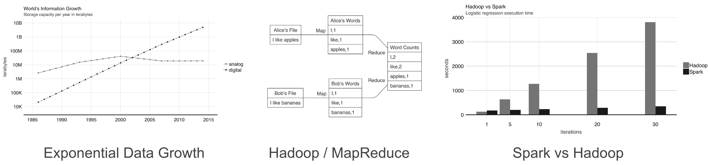
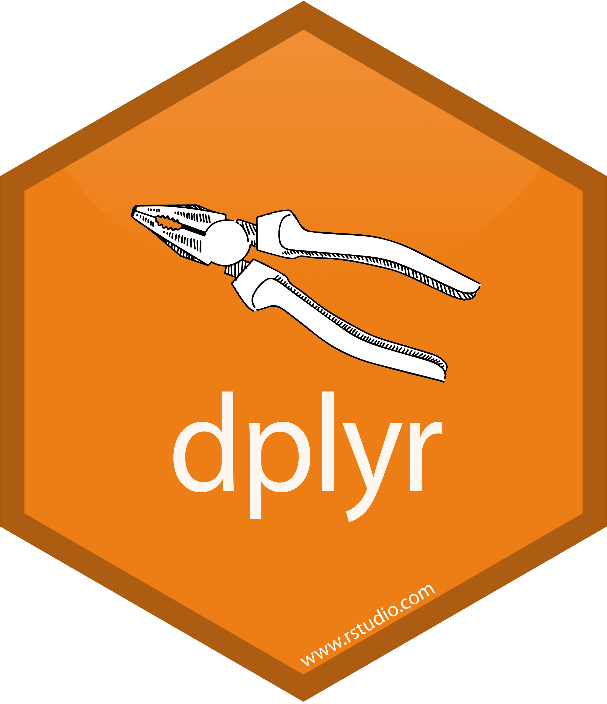
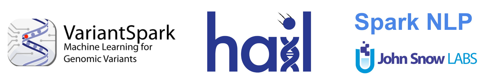

```{r setup, include=FALSE}
knitr::opts_chunk$set(eval = FALSE)
```

# Spark

## Introduction

- World Bank report finds out data is growing exponentially.
- We can distribute data across multiple machines using Hadoop storage.
- Apache Spark improves over Hadoop speed and flexibility.



## sparklyr

R Interface to Apache Spark compatible with dplyr, broom, rlang, DBI, etc.

<div class="fragment">

```{r}
library(sparklyr)
sc <- spark_connect(master = "local|yarn|mesos|spark|livy")
flights <- copy_to(sc, flights)
```
</div>
<div>

```{r}
library(dplyr)
flights %>%
  group_by(month, day) %>%
  summarise(count = n(), avg_delay = mean(dep_delay)) %>%
  filter(count > 1000)
```
</div>

## Usage


```{r echo=FALSE, message=FALSE}
library(sparklyr)                                # Load sparklyr
library(dplyr)                                   # Load dplyr
library(DBI)                                     # Load DBI

dir.create("input")                              # Create cars folder
write.csv(mtcars, "input/cars.csv")              # Write data in R
```

```{r}
spark_install()                                  # Install local Spark
sc <- spark_connect(master = "local")            # Connect to Spark cluster
```

```{r class.source='fragment'}
cars <- spark_read_csv(sc, "cars", "input/")     # Read data in Spark
```

```{r class.source='fragment'}
summarize(cars, n = n())                         # Count records with dplyr
dbGetQuery(sc, "SELECT count(*) FROM cars")      # Count records with DBI
```

```{r class.source='fragment'}
ml_linear_regression(cars, mpg ~ wt + cyl)       # Perform linear regression
```

```{r class.source='fragment'}
ml_pipeline(sc) %>%                              # Define Spark pipeline
  ft_r_formula(mpg ~ wt + cyl) %>%               # Add formula transformation
  ml_linear_regression()                         # Add model to pipeline
```

```{r class.source='fragment'}
spark_context(sc) %>% invoke("version")          # Extend sparklyr with Scala
spark_apply(cars, nrow)                          # Extend sparklyr with R
```

```{r class.source='fragment'}
stream_read_csv(sc, "input/") %>%                # Define Spark stream
  filter(mpg > 30) %>%                           # Add dplyr transformation
  stream_write_json("output/")                   # Start processing stream
```

## Timeline


## Delta Lake

Delta Lake is an open-source storage layer that brings ACID transactions to Apache Spark™ and big data workloads.


Enables time-travel, mixing streams with data frames and better consistency.

## Delta Lake

To use Delta Lake add set the new packages parameter to delta and use the new `spark_read/write_delta()` and `stream_read/write_delta()` functions.

```{r}
library(sparklyr)
sc <- spark_connect(master = "local", version = "2.4", packages = "delta")

sdf_len(sc, 3) %>% spark_write_delta(path = "/tmp/delta-1")
sdf_len(sc, 1) %>% spark_write_delta(path = "/tmp/delta-1", mode = "overwrite")

spark_read_delta(sc, "/tmp/delta-1")
```
```{text class.source='sourceCode fragment'}
# Source: spark<delta1> [?? x 1]
     id
  <int>
1     1
```

```{r class.source='fragment'}
spark_read_delta(sc, "/tmp/delta-1", version = 0L)
```
```{text class.source='sourceCode fragment'}
# Source: spark<delta1> [?? x 1]
     id
  <int>
1     1
2     2
3     3
```

## Extensions

- **VariantSpark** is a scalable toolkit for genome-wide association studies.
- **Hail** is an open-source library for working with genomic data.
- **Spark NLP** is an open-source text processing library for advanced natural language processing.



Learn more at [github.com/r-spark](https://github.com/r-spark).

## Qubole

sparklyr 1.1 adds support for Qubole connections, similar to existing Databricks connections method.

```{r}
library(sparklyr)
sc <- spark_connect(method = "qubole")
```


## Spark 3.0 Preview

- Scala 2.12 and JDK 11
- GPU scheduling
- Headers in Kafka streaming
- Performance Improvements
- Binary Files

```{r class.source='fragment'}
library(sparklyr)
spark_install("3.0.0-preview")
sc <- spark_connect(master = "local", version = "3.0.0-preview")

tiny_imagenet <- pins::pin("http://cs231n.stanford.edu/tiny-imagenet-200.zip")
spark_read_source(sc, dirname(tiny_imagenet[1]), source = "binaryFile")
```
```{text class.source='sourceCode fragment'}
# Source: spark<images> [?? x 4]
   path                       modificationTime    length content   
   <chr>                      <dttm>               <dbl> <list>    
 1 file:images/test_2009.JPEG 2020-01-08 20:36:41   3138 < [3,138]>
 2 file:images/test_8245.JPEG 2020-01-08 20:36:43   3066 < [3,066]>
 3 file:images/test_4186.JPEG 2020-01-08 20:36:42   2998 < [2,998]>
# … with more rows
```

## Barrier Execution

Enables proper embedding of distributed training jobs from AI frameworks as Spark jobs.


```{r class.source='sourceCode fragment'}
library(sparklyr)
sc <- spark_connect(master = "local", version = "2.4")

sdf_len(sc, 1, repartition = 1) %>%
  spark_apply(~ .y$address, barrier = TRUE, columns = c(address = "character")) %>%
  collect()
```
```{text class.source='sourceCode fragment'}
# A tibble: 1 x 1
  address        
  <chr>          
1 localhost:50693
```

# MLflow

## Introduction

The toolchain for the (software) 2.0 stack does not exist -- Andrej Karpathy

```{r echo=FALSE, eval=TRUE}
knitr::raw_html('
<div style="display: flex; flex-direction: column; width:900px; height: 400px;">
    <div style="flex-direction: row; display: flex; width: 100%; height: 25%;">
        <div style="width: 30%; align-items: center;justify-content: center;display: flex;">
            
        </div>
        <div style="width: 40%; align-items: center;justify-content: center;display: flex;" class="fragment" data-fragment-index=1>
            
        </div>
        <div style="width: 30%; align-items: center;justify-content: center;display: flex;" class="fragment" data-fragment-index=1>
            
        </div>
    </div>
    <div style="flex-direction: row; display: flex; height: 50%;">
        <div style="width: 30%; align-items: center;justify-content: center;display: flex;" class="fragment" data-fragment-index=4>
            
        </div>
        <div style="width: 40%; align-items: center;justify-content: center;display: flex;" class="fragment" data-fragment-index=4>
        </div>
        <div style="width: 30%; align-items: center;justify-content: center;display: flex;" class="fragment" data-fragment-index=2>
            
        </div>
    </div>
    <div style="flex-direction: row; display: flex; width: 100%; height: 25%;">
        <div style="width: 30%; align-items: center;justify-content: center;display: flex;" class="fragment" data-fragment-index=3>
            
        </div>
        <div style="width: 40%; align-items: center;justify-content: center;display: flex;" class="fragment" data-fragment-index=3>
            
        </div>
        <div style="width: 30%; align-items: center;justify-content: center;display: flex;" class="fragment" data-fragment-index=2>
            
        </div>
    </div>
</div>
')
```

<p class="fragment">MLflow is an open source platform to manage the ML lifecycle, including experimentation, reproducibility and deployment.</p>

## Usage

- **Track** experiments to record and compare parameters and results.
- Package code as **projects** to share and deploy to production.
- Manage and deploy **models** to serving and inference platforms.

```{r}
library(mlflow)
with(mlflow_start_run(), {
  # set experiments tags
  mlflow_set_tag("project", "wines")

  # log parameters
  mlflow_log_param("lambda", 0.5)
  
  # compute model
  lm(train, quality ~ .)
 
  # log metrics
  mlflow_log_metric("aic", metrics$aic())
})
```

# Demo

## Mastering Spark with R

Published new Spark with R book with O’Reilly media and also free-to-use online.


Learn more at [therinspark.com](https://therinspark.com)

## Community

Need to scale the sparklyr community:

- About ~20 community extensions developed in the r-spark repo.
- Over 50+ contributors to the sparklyr repo.
- 6+ organizations contributing in the last 3 months.


## Linux Foundation

Today, **sparklyr becomes an incubation project** in LF AI within the Linux Foundation, a neutral entity to hold the project assets and open governance, and join projects like Linux, Kubernetes, Delta Lake, Horovod and many others.


Learn more at [sparklyr.ai](htts://sparklyr.org)

# Thanks!


